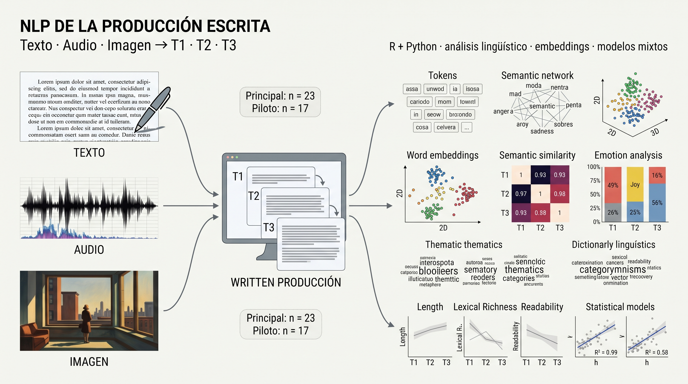
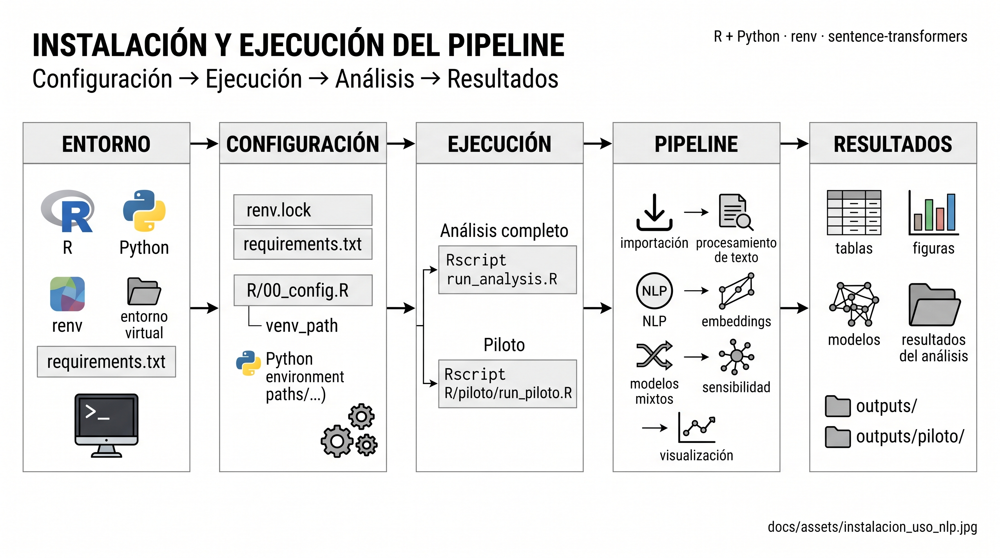
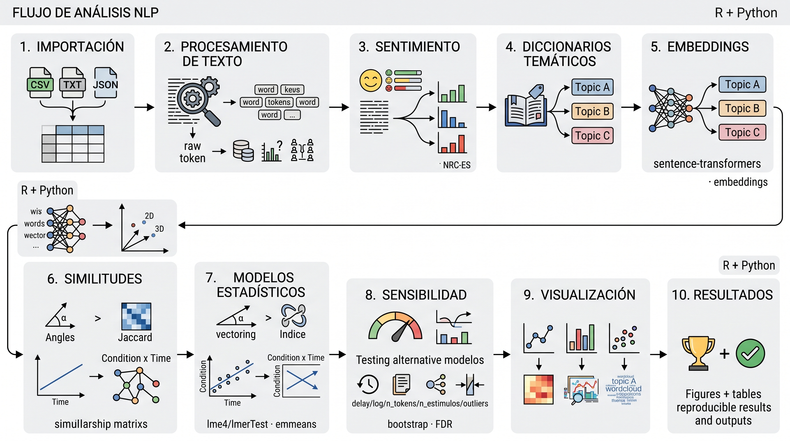

# Análisis NLP de textos en 3 tiempos 
**paquete de análisis**


> **Estado del paquete.** Este repositorio publica **método, código y resultados agregados**.
> No contiene datos de participantes. Los resultados son los de la corrida auditada: el código
> ha sido verificado sintácticamente (`parse()`), **no** re-ejecutado de punta a punta para este
> empaquetado. Ver `docs/decisiones.md` (decisiones y pendientes) y `docs/integridad.md` (hashes).

## Qué es el estudio

Es un diseño longitudinal de escritura en tres iteraciones: **T1** sin estímulo, **T2** un estímulo,
**T3** tres estímulos acumulados, con tres condiciones de estímulo: **Texto**, **Audio**,
**Imagen** (el estímulo de audio y el texto son el poema "Habitación de hotel").
## Cohortes: son dos muestras distintas, no dos olas de un estudio

| Cohorte | Participantes | Observaciones | Texto / Audio / Imagen | `demora` |
|---|---|---|---|---|
| Piloto | 17 | 51 | 6 / 6 / 5 | no se capturó |
| Principal | 23 | 69 | 8 / 8 / 7 | D / ND |

La suma (n = 40) solo es legítima con la columna `fuente` presente. La cabecera del script
histórico declara otro reparto para el piloto (5 / 6 / 6); el real se lee de los datos.

## Qué se mide y qué se puede concluir

- Modelado: `n_palabras_calculado` (conteo desde el texto) con modelos lineales mixtos;
  en el piloto es la **única** medida de extensión disponible (`n_palabras` está vacía).
- Se calculan además métricas lingüísticas (TTR, longitud media, oraciones), emociones (NRC-ES),
  diccionarios temáticos, similitudes y proximidad a prototipos semánticos.
- **Lo que no se puede afirmar**: el piloto no tiene prototipos, semántica ni diccionarios
  calculados en la versión auditada; la extracción de esos objetos quedó **vacía** y por eso no
  se publica.
- La interacción condición × tiempo **no** resultó significativa en el análisis auditado; el efecto
  de tiempo sí. Ver `docs/glosario_para_lectores.md` para la lectura sin jerga.

## Cómo se reproduce

```cmd
git clone https://github.com/zarakaeldiosdelcaos-byte/experimento-nlp
cd experimento-nlp
"C:/Program Files/R/R-4.6.1/bin/Rscript.exe" --vanilla code/run_analysis.R
```

- R 4.6.1; paquetes en `code/R/00_config.R` (tidyverse, lme4/lmerTest, emmeans, performance,
  text2vec, syuzhet, reticulate…).
- Python 3.11 con `torch` (CPU) y `sentence-transformers`; ver `requirements.txt`.
  El intérprete se resuelve en cascada (`NLP_PYTHON` → `C:/venvs/renv-nlp` → `renv311` → PATH).
- Modelo de embeddings: `paraphrase-multilingual-MiniLM-L12-v2` (384 dimensiones, normalización L2).
- El script histórico del estudio, con sus correcciones, es `code/01_pipeline_nlp.R`.

## Datos no incluidos

Los archivos de captura contienen narrativas de personas en contexto clínico y **no se
distribuyen**. Para solicitarlos hay que dirigirse al autor del estudio, indicando el uso previsto
y el aval del comité de ética correspondiente. Ver `docs/decisiones.md` (D4).

## Verificación en un comando

```bash
bash tests/check_hashes.sh     # microdatos fuera del control de versiones + integridad + CSV
```

---

<!-- A partir de aquí, el documento original del repositorio, sin modificar. -->

# Análisis NLP de textos en 3 tiempos

[](https://www.r-project.org/)
[](https://www.python.org/)
[](https://opensource.org/licenses/MIT)

**Análisis de la influencia de estímulos visuales, auditivos y textuales en la producción escrita mediante NLP en español**

Este repositorio contiene el código completo y reproducible del experimento que evalúa cómo diferentes estímulos (una imagen de Hopper, un poema en audio y su lectura en texto) afectan el contenido, la emoción, la estructura y la semántica de textos producidos en tres iteraciones (T1 = línea base, T2 = un estímulo, T3 = tres estímulos acumulados).

El análisis se realiza sobre dos conjuntos de datos:
- **Estudio principal**: 23 participantes (grupos desbalanceados por condición y demora).
- **Estudio piloto**: 17 participantes (utilizado como base para un artículo independiente).

El pipeline integra **R** (para preprocesamiento, análisis lingüístico, sentimiento, diccionarios temáticos, modelos mixtos y visualización) con **Python** (para embeddings semánticos mediante `sentence-transformers`).



---

## Estructura del repositorio

```
experimento-nlp/
├── README.md                 # Este archivo
├── .gitignore
├── renv.lock                 # Dependencias de R (renv)
├── requirements.txt          # Dependencias de Python
├── run_analysis.R            # Script principal (análisis completo)
├── run_piloto.R              # Script para ejecutar solo el análisis piloto
├── R/                        # Módulos de análisis en R
│   ├── 00_config.R           # Configuración global, librerías, logging, Python
│   ├── 01_import_data.R      # Importación y normalización de datos
│   ├── 02_text_processing.R  # Limpieza, tokenización, métricas lingüísticas
│   ├── 03_sentiment.R        # Léxico NRC‑ES y análisis de sentimiento
│   ├── 04_dictionaries.R     # Diccionarios temáticos de Hopper
│   ├── 05_embeddings.R       # Orquestación de embeddings y prototipos
│   ├── 06_similarity.R       # Similitudes textuales (coseno y Jaccard)
│   ├── 07_models.R           # Modelos mixtos, pruebas inferenciales, bootstrap
│   ├── 08_visualization.R    # Figuras científicas (temas, funciones)
│   ├── 09_sensitivity.R      # Análisis de sensibilidad y robustez
│   └── piloto/               # Pipeline independiente para el piloto
│       ├── 00_piloto_config.R
│       ├── 01_piloto_import.R
│       ├── 02_piloto_analysis.R
│       ├── 03_piloto_models.R
│       ├── 04_piloto_figures.R
│       ├── 05_piloto_results.R
│       └── run_piloto.R
├── python/                   # Módulos Python (embeddings)
│   └── embeddings_setup.py   # Carga del modelo, función de codificación
├── data/                     # Datos (no versionados, solo estructura)
│   ├── raw/                  # Archivos Excel originales
│   └── processed/            # Datos intermedios generados
└── outputs/                  # Resultados generados
    ├── piloto/               # Resultados específicos del piloto
    ├── figuras/
    ├── tablas/
    ├── modelos/
    └── diagnosticos/
```

---

## Instalación y configuración

### Requisitos previos

- **R** >= 4.0
- **Python** >= 3.8 (con `pip`)
- Entorno virtual de Python (recomendado)

### Paso 1: Clonar el repositorio

```bash
git clone https://github.com/tu-usuario/experimento-nlp.git
cd experimento-nlp
```

### Paso 2: Configurar el entorno de R

Se utiliza `renv` para gestionar las dependencias de R de forma reproducible.

```bash
Rscript -e "install.packages('renv')"
Rscript -e "renv::restore()"
```

Si `renv.lock` no está disponible, instala los paquetes manualmente con:

```r
install.packages(c("tidyverse", "tidytext", "readxl", "lme4", "lmerTest", "emmeans", "ggplot2", "cowplot", "reticulate", ...))
```

### Paso 3: Configurar el entorno de Python

Se recomienda crear un entorno virtual para Python.

```bash
python -m venv venv
source venv/bin/activate      # En Windows: venv\Scripts\activate
pip install -r requirements.txt
```

El archivo `requirements.txt` incluye:

```
sentence-transformers
torch
numpy
```

### Paso 4: Ajustar rutas

El script `R/00_config.R` define la ruta al entorno virtual de Python (`venv_path`).  
Asegúrate de que apunte a la ubicación correcta de tu entorno virtual (por defecto `"C:/venvs/renv311"`). Puedes modificarlo o usar variables de entorno.

---

## Uso

### Análisis completo (principal + piloto)

```bash
Rscript run_analysis.R
```

Este script orquesta todo el pipeline:
1. Importación y normalización de ambos datasets.
2. Procesamiento lingüístico, sentimiento y diccionarios.
3. Generación de embeddings y prototipos (requiere Python).
4. Modelos mixtos y pruebas inferenciales.
5. Generación de figuras y tablas.
6. Análisis de sensibilidad.

### Análisis piloto independiente

```bash
Rscript R/piloto/run_piloto.R
```

Este script ejecuta únicamente el análisis piloto, generando resultados separados en `outputs/piloto/`. Es útil para preparar un artículo científico basado exclusivamente en el piloto.



---

## Flujo de análisis

1. **Importación** → Datos en formato largo normalizados.
2. **Procesamiento de texto** → Limpieza, tokenización, métricas (TTR, nº oraciones, etc.).
3. **Sentimiento** → Léxico NRC‑ES (8 emociones básicas).
4. **Diccionarios Hopper** → 10 temas estético‑narrativos (soledad, espera, etc.), enriquecidos empíricamente.
5. **Embeddings** → Modelo `paraphrase-multilingual-MiniLM-L12-v2` (384 dims), prototipos semánticos (Hopper + clínicos), PCA.
6. **Similitudes** → Coseno y Jaccard basados en tokens.
7. **Modelos** → Modelos lineales mixtos (condición × tiempo + (1|participante)), pruebas pareadas, bootstrap, FDR.
8. **Sensibilidad** → Modelos con demora, log, n_tokens, n_estimulos, sin outliers.
9. **Visualización** → 15 figuras científicas en español e inglés, paneles combinados.
10. **Resultados** → Tablas en CSV y Excel, objetos RDS.



---

## Resultados principales

Los resultados se almacenan en:

- `outputs/` – análisis completo.
- `outputs/piloto/` – análisis piloto.

Dentro de estas carpetas encontrarás:

- **Figuras**: PNG y PDF de alta resolución (español/inglés).
- **Tablas**: descriptivos, efectos de modelos, contrastes, correlaciones.
- **Modelos**: objetos RDS de los modelos mixtos, bootstrap y prototipos.
- **Diagnósticos**: gráficos de residuos, Q‑Q, etc.

---

## Personalización

- **Parámetros de los diccionarios**: ajusta `min_freq`, `min_doc`, `min_part` en `R/04_dictionaries.R`.
- **Modelos de embeddings**: cambiar `MODEL_NAME` en `python/embeddings_setup.py` (requiere re-ejecución).
- **Análisis de sensibilidad**: activar/desactivar en `R/piloto/03_piloto_models.R`.

---

## Contribuir

Las contribuciones son bienvenidas. Por favor:

1. Haz un fork del repositorio.
2. Crea una rama para tu funcionalidad (`git checkout -b feature/nueva-funcionalidad`).
3. Realiza los cambios y escribe pruebas si corresponde.
4. Envía un pull request con una descripción clara.

---

## Licencia

Este proyecto se distribuye bajo la licencia **MIT**. Consulta el archivo `LICENSE` para más detalles.

---

## Referencias

- Mohammad, S. M. (2016). *NRC Emotion Lexicon*. https://saifmohammad.com/WebPages/NRC-Emotion-Lexicon.htm
- Reimers, N., & Gurevych, I. (2019). *Sentence-BERT: Sentence Embeddings using Siamese BERT-Networks*. https://www.sbert.net/
- Bates, D., Mächler, M., Bolker, B., & Walker, S. (2015). *Fitting Linear Mixed-Effects Models Using lme4*. Journal of Statistical Software.

---

## Contacto

Para cualquier duda o sugerencia, abre un issue en el repositorio o contacta a los autores del experimento.

---
