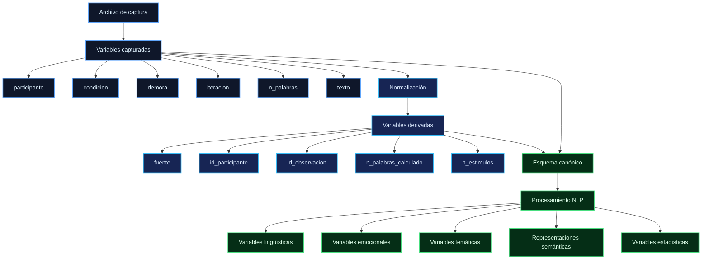
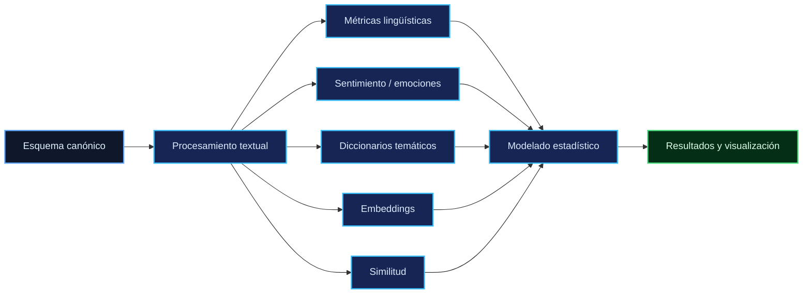

# Codebook

Especificación de las variables capturadas y del esquema de datos utilizado por el pipeline. La definición original procede de la hoja **`Codebook`** del archivo de captura `datos_experimento.xlsx`, que contiene seis variables de captura.

Los microdatos no forman parte de la distribución pública del repositorio. Este documento establece el significado de las variables, su procedencia y las transformaciones aplicadas para construir el esquema canónico empleado en los análisis.

---

## 1. Variables capturadas

La siguiente tabla reproduce la especificación del `Codebook` de origen:

| Variable       | Tipo             | Valores posibles             | Descripción                                                                           |
| -------------- | ---------------- | ---------------------------- | ------------------------------------------------------------------------------------- |
| `participante` | Factor           | `P1` – `P23`                 | Identificador del participante en el archivo de captura.                              |
| `condicion`    | Factor           | `Texto` / `Audio` / `Imagen` | Tipo de estímulo recibido; corresponde a una variable entre sujetos.                  |
| `demora`       | Factor           | `D` / `ND`                   | `D` = condición con valencia de demora; `ND` = condición sin valencia de demora.      |
| `iteracion`    | Numérico ordinal | `1` / `2` / `3`              | Número de iteración: 1 = sin estímulo, 2 = un estímulo, 3 = texto–audio–imagen.       |
| `n_palabras`   | Numérico, conteo | Entero ≥ 0                   | Número de palabras registrado para la redacción; variable dependiente cuantitativa.   |
| `texto`        | Caracter         | Texto libre                  | Redacción completa proporcionada por el participante en la iteración correspondiente. |

### Hojas del archivo de captura

El archivo de origen contiene las siguientes hojas:

```text
Datos_Largo
Datos_Ancho
Codebook
Codigo_R
```

Las dos primeras corresponden a representaciones de los datos:

* `Datos_Largo`: una fila por participante × iteración.
* `Datos_Ancho`: una fila por participante, con columnas `texto_it1` … `texto_it3`.
* `Codebook`: definición de las variables capturadas.
* `Codigo_R`: código asociado al procesamiento en R.

La estructura larga constituye la representación natural para análisis longitudinales, mientras que la estructura ancha facilita determinadas operaciones y transformaciones por iteración.

---

## 2. Esquema canónico del pipeline

Antes de cualquier análisis, las cohortes son normalizadas a un esquema canónico común. Este esquema incorpora tanto variables procedentes directamente de la captura como variables derivadas durante el procesamiento.

| Columna                | Procedencia | Descripción                                                                                                                                          |
| ---------------------- | ----------- | ---------------------------------------------------------------------------------------------------------------------------------------------------- |
| `fuente`               | Derivada    | Identificador de cohorte: `"principal"` (23 participantes) o `"piloto"` (17 participantes).                                                          |
| `participante`         | Capturada   | Identificador tal como aparece en el archivo de origen.                                                                                              |
| `id_participante`      | Derivada    | Identificador global construido como `fuente + "_" + participante`, por ejemplo `principal_P3` o `piloto_P3`.                                        |
| `id_observacion`       | Derivada    | Identificador único de observación construido a partir de `id_participante` e `iteracion`.                                                           |
| `condicion`            | Capturada   | Condición experimental: `Texto`, `Audio` o `Imagen`.                                                                                                 |
| `demora`               | Capturada   | Variable de demora; presenta `NA` en toda la cohorte piloto porque no fue capturada en dicha cohorte.                                                |
| `iteracion`            | Capturada   | Iteración longitudinal: `1`, `2` o `3`.                                                                                                              |
| `texto`                | Capturada   | Narrativa producida por el participante.                                                                                                             |
| `n_palabras`           | Capturada   | Conteo de palabras registrado en el archivo de origen; presenta `NA` en toda la cohorte piloto porque la columna correspondiente se encuentra vacía. |
| `n_palabras_calculado` | Derivada    | Conteo calculado directamente a partir de `texto` mediante `str_count(texto, "\\S+")`; constituye la medida disponible para la cohorte piloto.       |
| `n_estimulos`          | Derivada    | Número de estímulos asociado con la iteración: `0` en T1, `1` en T2 y `3` en T3.                                                                     |

### Distinción entre variables capturadas y derivadas

La distinción es relevante para la trazabilidad:

```text
ARCHIVO DE CAPTURA
        │
        ├── Variables capturadas
        │      ├── participante
        │      ├── condicion
        │      ├── demora
        │      ├── iteracion
        │      ├── n_palabras
        │      └── texto
        │
        ▼
NORMALIZACIÓN
        │
        ├── fuente
        ├── id_participante
        ├── id_observacion
        ├── n_palabras_calculado
        └── n_estimulos
        │
        ▼
ESQUEMA CANÓNICO
        │
        ▼
ANÁLISIS LONGITUDINAL
```

Esta separación permite identificar qué información procede directamente del instrumento de captura y qué información fue generada por el pipeline.

---

## 3. Diferencias estructurales entre cohortes

Las dos cohortes se mantienen diferenciadas durante la normalización y el análisis. El conjunto combinado no debe interpretarse como una muestra homogénea de 40 participantes, sino como la integración de dos cohortes independientes con diferencias documentadas en la captura y disponibilidad de variables.

| Característica                       |           Principal (n = 23) |                       Piloto (n = 17) |
| ------------------------------------ | ---------------------------: | ------------------------------------: |
| Observaciones                        |                           69 |                                    51 |
| Condiciones                          | Texto 8 · Audio 8 · Imagen 7 |          Texto 6 · Audio 6 · Imagen 5 |
| `demora`                             |                       D / ND |                         No disponible |
| `n_palabras`                         |                    Informada |                         Columna vacía |
| Medida utilizable de extensión       |                 `n_palabras` |                `n_palabras_calculado` |
| Prototipos, semántica y diccionarios |                    Presentes | No disponibles en la versión auditada |

### Nota sobre la composición del piloto

La cabecera de la versión histórica del script indicaba la siguiente distribución nominal:

```text
Texto  P1–P5
Audio  P6–P11
Imagen P12–P17
```

Sin embargo, la composición efectiva obtenida directamente del archivo de datos es:

```text
Texto  = 6
Audio  = 6
Imagen = 5
```

Por tanto, la condición utilizada por el pipeline se determina a partir de los valores efectivamente registrados en los datos y no a partir de rangos de identificadores consignados en documentación histórica.

Esta distinción se conserva para mantener separadas la especificación originalmente prevista y la estructura efectivamente observada.

---

## 4. Reglas de identificación y unicidad

La normalización incorpora identificadores derivados destinados a garantizar la separación de cohortes y la unicidad de las observaciones.

### Identificador de participante

Se define como:

$$
id_{\text{participante}}
=
fuente\;+\;"\_"\;+\;participante
$$

Ejemplos:

```text
principal_P3
piloto_P3
```

Esta construcción evita que participantes con el mismo identificador local en cohortes distintas compartan un identificador global.

### Identificador de observación

Se construye a partir de:

```text
id_participante + iteracion
```

y permite distinguir cada registro longitudinal individual.

La estructura esperada es:

```text
principal_P3_1
principal_P3_2
principal_P3_3

piloto_P3_1
piloto_P3_2
piloto_P3_3
```

La validación del pipeline exige que dichos identificadores sean únicos y que no existan identificadores de participante compartidos entre las cohortes.

---

## 5. Convenciones temporales

Las tres iteraciones se representan de manera uniforme:

| Iteración | Convención | `n_estimulos` |
| --------- | ---------- | ------------: |
| `1`       | T1         |             0 |
| `2`       | T2         |             1 |
| `3`       | T3         |             3 |

En formato ancho, una variable temporal se representa mediante el sufijo:

```text
*_t1
*_t2
*_t3
```

Por ejemplo:

```text
n_tokens_t1
n_tokens_t2
n_tokens_t3
```

En formato largo, la dimensión temporal se conserva en la variable:

```text
iteracion
```

Esta correspondencia permite transformar de manera determinista entre las representaciones larga y ancha.

---

## 6. Convenciones de nomenclatura

Las variables derivadas siguen reglas específicas para mantener la trazabilidad entre el cálculo original y las representaciones resultantes.

### Variables por iteración

```text
*_t1
*_t2
*_t3
```

Indican el valor de una variable en cada momento temporal.

### Cambios longitudinales

```text
cambio_*_t1t2
cambio_*_t2t3
cambio_*_t1t3
```

representan diferencias entre las iteraciones indicadas.

### Proximidad a prototipos

```text
proto_<constructo>_t<k>
```

representa la similitud coseno entre la observación y el centroide del prototipo correspondiente en la iteración \(k\).

La definición de los prototipos se documenta en:

```text
data_spec/prototipos.csv
```

### Variables temáticas

```text
score_<tema>
rate_<tema>
```

donde:

* `score_<tema>` representa el conteo bruto de términos asociados con el diccionario;
* `rate_<tema>` representa la tasa normalizada por 1000 palabras.

---

## 7. Reglas específicas para variables con datos ausentes

La ausencia de información se conserva como `NA` cuando la variable original no fue capturada o no se encuentra disponible.

En particular:

```text
demora
→ NA en toda la cohorte piloto

n_palabras
→ NA en toda la cohorte piloto
```

El pipeline no sustituye retroactivamente el valor ausente de `n_palabras` en el piloto. En su lugar, calcula:

```text
n_palabras_calculado
```

directamente a partir de la narrativa disponible.

Esta distinción permite preservar la diferencia entre:

1. un valor originalmente registrado;
2. un valor ausente;
3. un valor posteriormente calculado por el pipeline.

---

## 8. Regla de procedencia de las variables

La procedencia puede resumirse en tres niveles:



---

## 9. Relación entre representaciones larga y ancha

El pipeline utiliza dos representaciones complementarias:

```text
FORMATO LARGO
una fila = participante × iteración

        ↕ transformación

FORMATO ANCHO
una fila = participante
variables separadas por iteración
```

La representación larga es la estructura de referencia para los análisis longitudinales, mientras que la representación ancha se utiliza cuando las operaciones requieren disponer simultáneamente de T1, T2 y T3 como columnas separadas.

La transformación entre ambas representaciones debe conservar:

* identificador de participante;
* cohorte;
* condición;
* iteración;
* texto;
* variables derivadas;
* correspondencia temporal.

---

## 10. Relación con las etapas posteriores del pipeline

El esquema canónico constituye la base común para las etapas posteriores:



De esta forma, el `Codebook` no solo documenta las variables de captura, sino que establece la correspondencia entre el instrumento de origen y el esquema utilizado por las etapas posteriores del pipeline.

---

## 11. Principios de interpretación del esquema

Para preservar la trazabilidad de los datos, deben distinguirse los siguientes niveles:

**Variable capturada**

Información registrada directamente en el archivo de origen.

**Variable derivada**

Información calculada durante la normalización o el procesamiento.

**Variable transformada**

Representación alternativa de una variable existente, por ejemplo mediante transformación entre formato largo y ancho.

**Variable analítica**

Medida generada en etapas posteriores del pipeline, como métricas lingüísticas, scores temáticos, embeddings o variables estadísticas.

Esta clasificación evita interpretar una medida derivada como si hubiese sido registrada directamente en el instrumento de captura.

---

## 12. Estado documental

El presente `Codebook` documenta:

* las variables originalmente capturadas;
* la estructura de los archivos de origen;
* el esquema canónico utilizado por el pipeline;
* las reglas de identificación y unicidad;
* las convenciones temporales;
* las diferencias estructurales entre las cohortes;
* el tratamiento explícito de valores ausentes;
* las convenciones de nomenclatura de variables derivadas;
* la procedencia hacia las etapas posteriores del análisis.

Los microdatos de los participantes no forman parte de este documento ni de la distribución pública del repositorio.

La interpretación de cualquier variable derivada debe realizarse conjuntamente con la documentación metodológica y con los scripts que implementan su cálculo.
