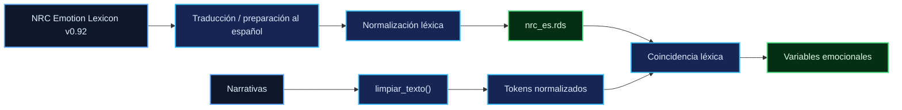
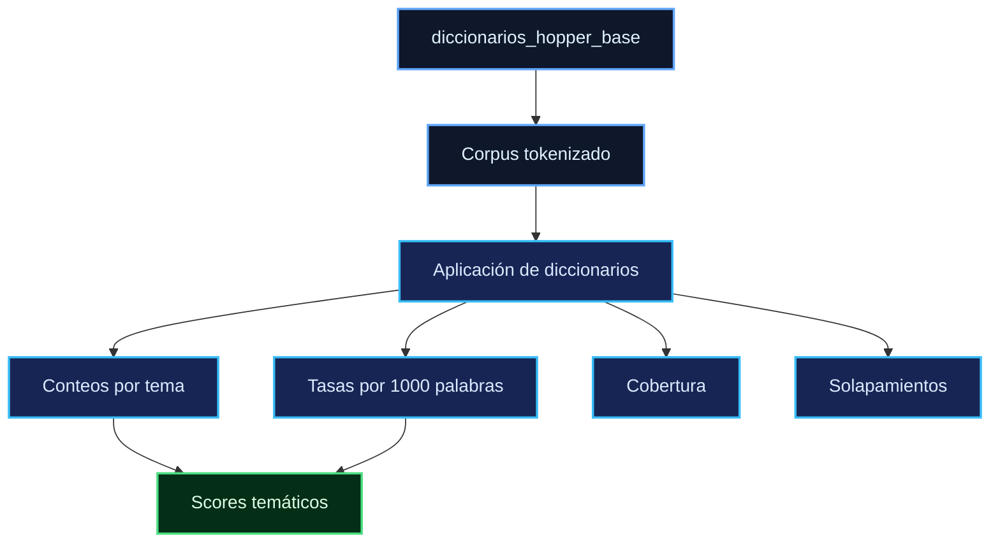

# Diccionarios y léxicos

Especificación de los recursos léxicos utilizados por el pipeline. Los recursos descritos en este documento corresponden exclusivamente a materiales lingüísticos y **no contienen datos personales ni narrativas de participantes**.

El documento distingue entre el léxico emocional NRC-ES, los diccionarios temáticos definidos como parte del estudio y el procedimiento de enriquecimiento empírico implementado en el script.

---

## 1. Léxico emocional NRC-ES

El pipeline utiliza una versión en español del **NRC Emotion Lexicon v0.92**, empleada para obtener indicadores léxicos de categorías emocionales.

### Características

* **Fuente:** NRC Emotion Lexicon v0.92, asociado a Saif M. Mohammad, con traducciones al español.
* **Categorías emocionales utilizadas:**

```text
joy
sadness
fear
anger
anticipation
trust
surprise
disgust
```

* **Número de categorías:** 8.
* **Artefacto versionado:**

```text
data/raw/lexicons/nrc_es.rds
```

* **Tamaño registrado:** 30 661 bytes.

### Normalización

Las entradas del léxico se normalizan mediante la siguiente secuencia:

```text
tolower
    ↓
iconv(to = "ASCII//TRANSLIT")
    ↓
conservación de caracteres [a-z]
```

La misma transformación se aplica a las narrativas mediante `limpiar_texto()`.

Esta correspondencia es necesaria para que la coincidencia entre las unidades léxicas del recurso y los tokens del corpus sea consistente. Una diferencia entre ambos procedimientos de normalización podría modificar la cobertura efectiva del léxico y, en consecuencia, los conteos emocionales obtenidos.

### Implementación

El procesamiento se encuentra en:

```text
code/R/03_sentiment.R
```

El módulo carga preferentemente el recurso almacenado localmente y contempla su descarga cuando el archivo requerido no se encuentra disponible.

### Regla de procedencia



---

## 2. Diccionarios temáticos

El pipeline incorpora diez diccionarios temáticos asociados con una organización conceptual basada en la estética de Hopper.

En conjunto, los diccionarios contienen:

$$
190
$$

términos semilla.

Los términos corresponden a la definición de `diccionarios_hopper_base` presente en el script del estudio.

### 2.1 `soledad`

**17 términos**

```text
solo, sola, soledad, solitario, solitaria, aislado, aislada, aislamiento, abandonado,
abandonada, unico, unica, sin compania, apartado, apartada, desvinculado, desvinculada
```

### 2.2 `espera`

**16 términos**

```text
espera, esperar, espero, esperaba, aguarda, aguardar, quietud, quieto, quieta, inmovilidad,
inmovil, paciencia, paciente, detenido, parado, parada
```

### 2.3 `incomunicacion`

**13 términos**

```text
silencio, silenciosa, silencioso, mudo, muda, callado, callada, calla, incomunicacion,
incomunicado, monologo, espaldas, sin voz
```

### 2.4 `objetos`

**23 términos**

```text
bolsa, maletin, sombrero, ropa, vestido, prenda, cama, habitacion, cuarto, hotel, piso, suelo,
equipaje, maleta, cartera, bolso, mueble, silla, ventana, cortina, puerta, mesilla, almohada
```

### 2.5 `emociones_negativas`

**31 términos**

```text
tristeza, triste, angustia, angustiado, angustiada, melancolia, melancolico, melancolica,
desolacion, desolado, desolada, dolor, doloroso, dolorosa, duele, pena, penoso, penosa,
desaliento, depresion, deprimido, deprimida, ansiedad, ansioso, ansiosa, inquietud, inquieto,
inquieta, infeliz, tormento, atormentado
```

### 2.6 `luz_sombra`

**19 términos**

```text
luz, luminoso, luminosa, iluminado, iluminada, sombra, sombras, sombrio, sombria, claro,
claridad, oscuro, oscuridad, oscura, penumbra, brillo, brillante, destello, radiante
```

### 2.7 `pasividad`

**21 términos**

```text
sentado, sentada, quieto, quieta, quietud, inmovil, inmovilidad, estatico, estatica, recostado,
recostada, acostado, acostada, tumbado, tumbada, reposa, reposaba, descansa, descansaba, yace,
yacia
```

### 2.8 `desconexion`

**17 términos**

```text
alejado, alejada, distancia, distante, lejos, lejano, lejana, separado, separada, desvinculado,
desvinculada, ignorado, ignorada, olvidado, olvidada, invisible, espaldas
```

### 2.9 `duda`

**17 términos**

```text
duda, dudaba, dudar, incierto, incierta, incertidumbre, interrogante, pregunta, indecision,
indeciso, indecisa, vacilacion, vacila, dilema, ambiguedad, ambiguo, ambigua
```

### 2.10 `espacio`

**16 términos**

```text
habitacion, cuarto, hotel, piso, pared, techo, suelo, ventana, puerta, interior, exterior,
frontera, limite, espacio, lugar, ambito
```

### Resumen de la estructura

| Tema                  | Términos semilla |
| --------------------- | ---------------: |
| `soledad`             |               17 |
| `espera`              |               16 |
| `incomunicacion`      |               13 |
| `objetos`             |               23 |
| `emociones_negativas` |               31 |
| `luz_sombra`          |               19 |
| `pasividad`           |               21 |
| `desconexion`         |               17 |
| `duda`                |               17 |
| `espacio`             |               16 |
| **Total**             |          **190** |

---

## 3. Procedencia de los diccionarios temáticos

Los diccionarios base se encuentran definidos en el código mediante:

```text
diccionarios_hopper_base
```

Su función es proporcionar una estructura léxica inicial para el cálculo de cobertura, scores temáticos y tasas normalizadas.

La relación entre los diccionarios y el pipeline es:



---

# 4. Enriquecimiento empírico mediante PMI

El script del estudio incluye un procedimiento para explorar posibles términos adicionales mediante:

* frecuencia;
* frecuencia documental;
* frecuencia por participante;
* información mutua puntual (PMI).

El procedimiento se utiliza para obtener candidatos susceptibles de incorporación a los diccionarios base.

Conceptualmente:

```text
Diccionarios base
        ↓
Corpus tokenizado
        ↓
Extracción de candidatos
        ↓
Filtros de frecuencia
        ↓
PMI
        ↓
Candidatos potenciales
        ↓
Selección de términos
        ↓
Diccionarios enriquecidos
```

La función correspondiente se encuentra documentada en `04_dictionaries.R`.

---

# 5. Estado de reproducibilidad del enriquecimiento

La lista de términos aceptados utilizada por el script aparece en el código con la indicación:

```text
Selección manual (simulada con un vector de aceptados)
```

Por tanto, dicha lista **no constituye una decisión editorial consolidada ni un diccionario enriquecido formalmente versionado**.

Además, algunos términos contenidos en esa lista no corresponden directamente a la forma normalizada que utiliza el léxico NRC-ES. Entre los ejemplos documentados se encuentran:

```text
vacío
desolación
claro-oscuro
```

Esta diferencia debe mantenerse explícita al interpretar los resultados.

### Consecuencia metodológica

Se distinguen dos niveles de resultados:

```text
DICCIONARIO BASE
        ↓
Definido explícitamente
        ↓
Reproducible a partir del código
```

frente a:

```text
DICCIONARIO ENRIQUECIDO
        ↓
Incluye términos derivados + selección manual
        ↓
La selección no está consolidada como decisión editorial versionada
```

Por consiguiente, **los resultados que dependan exclusivamente de los diccionarios base son reproducibles a partir de la especificación disponible**, mientras que aquellos que dependan de términos añadidos mediante el procedimiento de enriquecimiento deben declararlo expresamente y no deben presentarse como si provinieran de una lista editorial definitiva.

---

# 6. Regla de uso e interpretación

Los resultados derivados de los diccionarios deben identificar, cuando corresponda, cuál de las siguientes configuraciones fue utilizada:

```text
base
```

o:

```text
enriquecido
```

Esta distinción es necesaria porque una modificación en el conjunto de términos puede alterar:

* cobertura;
* frecuencia de coincidencias;
* scores temáticos;
* tasas normalizadas;
* variables derivadas;
* resultados estadísticos posteriores.

La trazabilidad del resultado requiere, por tanto, conservar la relación entre el artefacto analítico y la versión del diccionario utilizada.

---

# 7. Artefactos y módulos relacionados

### NRC-ES

```text
data/raw/lexicons/nrc_es.rds
code/R/03_sentiment.R
```

### Diccionarios Hopper

```text
code/R/04_dictionaries.R
```

### Especificación de prototipos semánticos

```text
data_spec/prototipos.csv
```

Los prototipos semánticos constituyen un recurso diferente de los diccionarios léxicos y no deben interpretarse como parte del inventario de términos de este documento.

---

# 8. Principios de trazabilidad

La gestión de estos recursos se basa en cuatro principios:

**Procedencia.** Cada recurso debe poder vincularse con su fuente o con el código que lo define.

**Normalización consistente.** El procedimiento aplicado al léxico debe ser compatible con el utilizado sobre el corpus cuando el análisis depende de coincidencias léxicas.

**Separación de versiones.** Los diccionarios base y los enriquecidos deben tratarse como configuraciones analíticas distintas.

**Reproducibilidad.** Toda modificación del conjunto de términos que pueda afectar los resultados debe quedar documentada y versionada.

---

## 9. Estado documental

Este documento establece:

* el recurso emocional NRC-ES utilizado por el pipeline;
* las ocho categorías emocionales procesadas;
* su ubicación y normalización;
* los diez diccionarios temáticos;
* los 190 términos semilla;
* la procedencia de los diccionarios base;
* el procedimiento de enriquecimiento mediante frecuencia y PMI;
* el estado no consolidado de la selección manual de términos;
* la distinción entre resultados basados en diccionarios base y enriquecidos.

Los recursos descritos aquí son exclusivamente léxicos y no incorporan datos de participantes.
