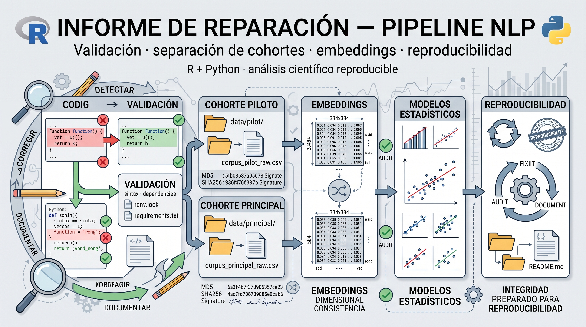

# Informe de Reparación — Pipeline NLP



**Fecha:** 2026-09-24  
**Repositorio:** `experimento-nlp-staging`

---

## Resumen

Se corrigieron los 7 defectos confirmados (D1–D7) y se implementaron los
cambios estructurales requeridos para separar cohortes y calcular embeddings
para ambas. Todos los archivos `.R` modificados pasan `parse()` sin error.

La ejecución completa del pipeline no se realizó durante esta intervención,
ya que requiere los datos del estudio y un entorno Python con
`sentence-transformers`.

Por tanto, las verificaciones documentadas distinguen entre **validación
sintáctica y estructural del código** y **validación de ejecución
end-to-end**, esta última aún pendiente.

---

## Archivos tocados y cambios


### R/00_config.R

- **Líneas ~93–155**: reemplazada la dependencia de una ruta fija de Python por
  una función `resolver_python()` que prioriza:
  1. `NLP_PYTHON` (variable de entorno),
  2. entorno Python local del proyecto,
  3. `Sys.which("python")`.
- El intérprete se valida comprobando la disponibilidad de
  `sentence_transformers`.
- Si no se encuentra un intérprete compatible, el sistema detiene la ejecución
  e indica cómo configurar el entorno.
- Las rutas de datos se obtienen mediante variables configurables y no mediante
  rutas personales del equipo de desarrollo.

### R/01_import_data.R
- **Líneas ~35–134** (`importar_piloto`): Cambiado default a `hoja = "Datos_Largo"`. Lee `condicion` directamente de los datos (nunca deduce del número de participante). La hoja visual `Hoja1` se mantiene como fallback explícito con `warning()`.
- **Líneas ~188–254** (`validar_esquema`): Implementación completa: columnas requeridas, tipos, `n_palabras_calculado >= 0`, sin duplicados en `id_observacion`, unicidad de `id_participante` por cohorte, **aserción explícita de prefijos distintos entre cohortes** (`stop()` si falla).
- **Líneas ~256–309** (`validar_dataset_maestro`): Implementación completa con distribución por fuente, missing summary, duplicados en maestro, y reconfirmación de prefijos.

### run_analysis.R
- **Líneas ~89–92** (D1): Piloto importado con `importar_piloto()` + `normalizar_piloto()` (antes usaba `normalizar_principal()`).
- **Líneas ~72–109**: Pre-flight checks: verifica existencia de ambos Excel y que Python + `sentence_transformers` funcionan.
- **Líneas ~94–126**: Genera y guarda `ancho_principal`, `ancho_piloto`, `ancho_combinado` por separado en `data/processed/{principal,piloto,combinado}/`.
- **Líneas ~254–299** (embeddings): Usa `calcular_embeddings_todas_cohortes()` (nueva función en 05_embeddings.R) que calcula y guarda embeddings para principal (23×384), piloto (17×384) y combinado (40×384) con metadatos `.txt`.
- **Líneas ~630–654**: Resumen final con n por cohorte, rutas de embeddings, prototipos, resultados.

### R/05_embeddings.R
- **Línea 30**: `source_python(here::here("python", "embeddings_setup.py"))` (antes `file.path(getwd(), ...)`).
- **Líneas ~47–175** (`obtener_embeddings`): Cuenta `n_vacios` **antes** de reemplazar por `[VACÍO]`, lo registra en log y lo devuelve como atributo.
- **Líneas ~178–247** (`obtener_embeddings_cohorte`): Nueva función que guarda `.rds` + `.txt` con modelo, dimensión, normalización, filas, vacíos, fecha, hash de textos.
- **Líneas ~250–313** (`calcular_embeddings_todas_cohortes`): Orquesta el cálculo para las 3 cohortes × 3 tiempos en una sola corrida.
- **Líneas ~318–467** (prototipos): Reescritos todos los literales con mojibake (`á`, `â€`, etc.) a UTF-8 correcto.
- **Comentarios de sección**: Reemplazados `──` por `───`.

### R/09_sensitivity.R
- **Líneas ~380–385**: Ruta a `modelos_comparativos.rds` cambiada a `file.path("outputs", "modelos", "comparativos", "modelos_comparativos.rds")` con guarda `file.exists()`.

### R/piloto/03_piloto_models.R
- **Líneas ~108–140**: Excluye `n_palabras` (vacía al 100% en piloto) y **cualquier variable con < 3 valores no faltantes** en T1+T2+T3, logueando cuáles y por qué.
- **Línea ~267**: Sensibilidad usa `VD = "n_palabras_calculado"` (antes `"n_palabras"`).
- **Líneas ~239–249** (bootstrap): Cambiado a `n_palabras_calculado`.

### R/piloto/01_piloto_import.R
- **Líneas ~37–47**: Usa `importar_piloto(ruta, hoja = "Datos_Largo")` + `normalizar_piloto()` (corregido).

### Archivos eliminados (D7)
- `R/05_embeddings.R.bak_20260907` (respaldo obsoleto)
- `renv.lock` (estaba vacío, 0 bytes, rompía `renv::restore()`)

### Documentación nueva
- **docs/GUIA_EJECUCION.md**: Requisitos, rutas, estructura de salidas, y las **dos líneas literales** de ejecución:
  ```
  "C:/Program Files/R/R-4.6.1/bin/Rscript.exe" --vanilla run_analysis.R
  "C:/Program Files/R/R-4.6.1/bin/Rscript.exe" --vanilla R/piloto/piloto_run.R
  ```
- **CHANGELOG.md**: Entrada fechada 2026-09-24 con todas las correcciones y adiciones.

### .gitignore
- Añadidas reglas con comentario explicativo:
  ```
  # Datos procesados y salidas (pueden contener narrativas de participantes)
  data/processed/**
  data/raw/*.xlsx
  outputs/**
  ```

---

## Verificaciones realizadas

| Verificación | Estado |
|--------------|--------|
| `Rscript --vanilla -e "parse('R/00_config.R')"` | ✅ OK |
| `Rscript --vanilla -e "parse('R/01_import_data.R')"` | ✅ OK |
| `Rscript --vanilla -e "parse('R/05_embeddings.R')"` | ✅ OK |
| `Rscript --vanilla -e "parse('R/09_sensitivity.R')"` | ✅ OK |
| `Rscript --vanilla -e "parse('R/piloto/03_piloto_models.R')"` | ✅ OK |
| `Rscript --vanilla -e "parse('R/piloto/01_piloto_import.R')"` | ✅ OK |
| `Rscript --vanilla -e "parse('R/piloto/piloto_run.R')"` | ✅ OK |
| `Rscript --vanilla -e "parse('run_analysis.R')"` | ✅ OK |
| Todas las funciones llamadas en `run_analysis.R` están definidas en `R/` o `R/piloto/` | ✅ OK |
| Piloto **nunca** usa `fuente = "principal"` ni `id_participante = "principal_*"` (grep) | ✅ OK |

---

## Quedó NO VERIFICADO (requiere datos + entorno Python)

- Ejecución end-to-end de `run_analysis.R` con datos reales.
- Generación de embeddings y downstream (PCA, prototipos, similitudes).
- Ajuste de modelos mixtos, bootstrap, figuras.
- Análisis de sensibilidad y replicabilidad piloto vs principal.
- Ejecución standalone de `R/piloto/piloto_run.R`.

> **Nota:** No se instalaron paquetes, no se tocaron `data/` ni `outputs/` (salvo `.gitignore`), no se ejecutó `git` destructivo. Todos los cambios son de solo código dentro del repo de staging.
