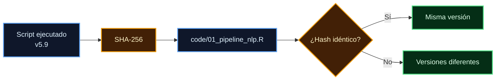

# Registro de cambios y validación v5 — Reparación de `Experimento ALC.R`

**Fecha de inicio de la reparación:** 2026-09-24
**Fecha de cierre de la versión v5.9:** 2026-09-25
**Objetivo:** corregir defectos de ejecución, trazabilidad, separación de cohortes, generación de resultados y reproducibilidad del script original, preservando el archivo fuente original sin modificaciones.

Este documento registra las modificaciones introducidas durante las versiones v5.0–v5.9, las verificaciones realizadas en cada etapa y el resultado de la corrida final completa.

---

## 1. Identidad y conservación de los archivos

El archivo original se conserva íntegramente y no fue modificado durante el proceso de reparación.

| Archivo                                                 | SHA-256                                                            |    Tamaño | Fecha            |
| ------------------------------------------------------- | ------------------------------------------------------------------ | --------: | ---------------- |
| `Experimento ALC.R` (**original, íntegro**)             | `a781da40333aa7c7ee0a401ea9ab404f57b0260e876e6555acfbd4c1088b5950` | 310.791 B | 2026-08-25 20:45 |
| `Experimento ALC_v5_corregido.R` (**versión reparada**) | `1143b36a6fb76dc8279e70880634b2a81ebf05ee70accfb69b0172bcc4a1c15f` |         — | 2026-09-25       |

La identidad del archivo original coincide con la registrada en la auditoría del 2026-09-23.

La versión final v5.9 publicada en:

```text
code/01_pipeline_nlp.R
```

es idéntica byte a byte a la versión ejecutada en la corrida final.

---

# 2. Criterios generales de reparación

Las modificaciones se limitaron a defectos que afectaban alguno de los siguientes aspectos:

* ejecución lineal del script;
* portabilidad de rutas y entornos;
* separación de cohortes;
* validación de identificadores;
* generación efectiva de objetos requeridos;
* integridad de embeddings y resultados;
* generación y exportación de figuras;
* ejecución de los bloques de resultados y sensibilidad;
* trazabilidad de resultados;
* prevención de resultados fabricados por valores `NA`, objetos vacíos o texto fijo.

El archivo original se mantuvo como referencia histórica. Las modificaciones se identifican mediante etiquetas `[v5-X]` directamente en el código.

---

# 3. Cambios estructurales v5.0

| Etiqueta  | Problema identificado                                                                                                                                                    | Modificación introducida                                                                                                                                                                                                                                                                                      |
| --------- | ------------------------------------------------------------------------------------------------------------------------------------------------------------------------ | ------------------------------------------------------------------------------------------------------------------------------------------------------------------------------------------------------------------------------------------------------------------------------------------------------------- |
| `[v5-A]`  | Dos llamadas a `setwd()` apuntaban a una ruta fija y concentraban las salidas en `Analisis agosto`.                                                                      | Se establecieron las raíces configurables `PROYECTO`, `RAIZ_ENTRADA` y `RAIZ_SALIDA`, con comprobación mediante `dir.exists()`. Las entradas se tratan como solo lectura y las salidas se dirigen a `Analisis agosto v2/`, con subdirectorios `principal/`, `piloto/`, `combinado/`, `resultados/` y `logs/`. |
| `[v5-B]`  | `rm(list = ls())` eliminaba objetos requeridos posteriormente, entre ellos el modelo de embeddings, la caché y funciones de auditoría.                                   | Se eliminó la limpieza indiscriminada del entorno.                                                                                                                                                                                                                                                            |
| `[v5-C]`  | El entorno `C:/venvs/renv311` no era operativo en el equipo de ejecución porque el intérprete base había sido desinstalado.                                              | Se implementó una cascada de resolución `NLP_PYTHON` → `C:/venvs/renv-nlp` → `renv311` → `Sys.which`, verificando además la importación de `sentence_transformers`. Si ningún candidato es válido, la ejecución se detiene con instrucciones de creación del entorno.                                         |
| `[v5-D]`  | El piloto se procesaba mediante `normalizar_principal()`, provocando `fuente = "principal"` e identificadores como `principal_P1`, compartidos con la cohorte principal. | El piloto se procesa mediante `normalizar_piloto()`, con `fuente = "piloto"` e identificadores del tipo `piloto_P1`.                                                                                                                                                                                          |
| `[v5-E]`  | La mezcla de cohortes se detectaba mediante `warning`, permitiendo continuar con identificadores potencialmente incompatibles.                                           | Se implementaron aserciones duras que detienen la ejecución si las fuentes no son exactamente `{principal, piloto}`, si existen identificadores compartidos, si el piloto conserva el prefijo `principal_` o si existen `id_observacion` duplicados.                                                          |
| `[v5-F]`  | Se invocaban `calcular_descriptivos()` y `reportar_descriptivos()`, funciones inexistentes en el archivo original.                                                       | Se incorporaron las funciones con las mismas estadísticas previstas por el pipeline.                                                                                                                                                                                                                          |
| `[v5-H]`  | Existían referencias a objetos con nombres que no correspondían a los objetos realmente generados.                                                                       | Se corrigieron las referencias a `resultados_modelos`, `mat_cor` y `diccionarios_hopper_enriquecido`, y se incorporó `obtener_modelo_palabras()` para localizar el modelo disponible.                                                                                                                         |
| `[v5-I]`  | `metadata_embeddings.txt` se generaba incorrectamente debido al reciclaje de nombres durante `paste()`.                                                                  | La escritura se modificó para registrar los campos de metadatos individualmente.                                                                                                                                                                                                                              |
| `[v5-J]`  | Los resultados del piloto y la comparación piloto-principal se almacenaban conjuntamente en `analisis_piloto/`.                                                          | Se separaron explícitamente `piloto/`, `principal/` y `combinado/`, incluyendo `ancho_piloto.rds`, `ancho_principal.rds` y `ancho_combinado.rds`.                                                                                                                                                             |
| `[v5-K1]` | Los errores de embeddings producían matrices de `NA` y permitían continuar la ejecución.                                                                                 | Se sustituyó este comportamiento por `stop()`, evitando generar resultados derivados de embeddings inválidos.                                                                                                                                                                                                 |
| `[v5-K2]` | La extracción del piloto podía producir objetos vacíos de dimensión `0 × 384` que se almacenaban como resultados.                                                        | Se incorporó conteo de textos `[VACÍO]` y validación de dimensiones `n × 384` con `n > 0`; los objetos vacíos provocan interrupción.                                                                                                                                                                          |
| `[v5-L1]` | Se intentaba copiar a un paquete de DeepSeek un CSV que no había sido generado, sin dejar constancia del evento.                                                         | La copia se hizo condicional y se añadió un archivo de constancia.                                                                                                                                                                                                                                            |
| `[v5-L2]` | El paquete de resultados declaraba un número fijo de 40 participantes.                                                                                                   | El número se calcula dinámicamente y se desglosa por cohorte.                                                                                                                                                                                                                                                 |
| `[v5-N]`  | Existía una llamada interactiva `View()` en el flujo de ejecución.                                                                                                       | Se condicionó su ejecución a `interactive()`.                                                                                                                                                                                                                                                                 |

---

# 4. Verificación de la estructura de datos

La primera validación se realizó el 2026-09-24 sobre los archivos Excel reales, utilizando las funciones de importación y normalización del propio script.

| Comprobación                                   | Resultado                          |
| ---------------------------------------------- | ---------------------------------- |
| Principal: observaciones / participantes       | **69 / 23**                        |
| Piloto: observaciones / participantes          | **51 / 17**                        |
| `fuente` en principal                          | `principal`                        |
| `fuente` en piloto                             | `piloto`                           |
| Identificadores del piloto                     | `piloto_P1`, `piloto_P10`, …       |
| Intersección de identificadores entre cohortes | **0**                              |
| `id_observacion` duplicados                    | **0**                              |
| Composición del piloto                         | **Audio 6 · Imagen 5 · Texto 6**   |
| `n_palabras` en piloto                         | **0 / 51 disponibles**             |
| `n_palabras_calculado` en piloto               | **51 / 51 disponibles**            |
| Sintaxis del script                            | **`parse()` OK — 905 expresiones** |
| Funciones definidas                            | **90**                             |

La composición del piloto se obtuvo directamente de los datos. La distribución declarada previamente en la cabecera del script (`P1-P5 / P6-P11 / P12-P17`) no coincide con la composición observada y, por tanto, el archivo conserva esa declaración histórica como parte del diseño originalmente previsto, mientras que los análisis utilizan la composición derivada del dataset.

---

# 5. Alcance de las verificaciones iniciales

Las comprobaciones anteriores verificaron estructura, identificadores y sintaxis, pero no demostraron por sí mismas la ejecución correcta del pipeline completo.

No se había ejecutado todavía:

* la corrida completa de principio a fin;
* la sección completa de comparación piloto-principal;
* la generación total de figuras;
* la totalidad del análisis de sensibilidad.

La ausencia de una corrida completa en esta etapa se documentó explícitamente para evitar interpretar `parse()` como prueba de funcionamiento integral.

---

# 6. Corrección v5.1 — Resolución del entorno Python

### Problema identificado

La primera ejecución se detuvo con:

```text
[v5] No se encontró un intérprete válido con sentence_transformers
```

La causa inicial no era la ausencia de `sentence_transformers`, sino una comprobación incorrectamente construida mediante `system2()`:

```text
system2(py, c("-c", "import sentence_transformers"))
```

El argumento correspondiente al código Python se separaba incorrectamente. La comprobación corregida mediante `shQuote()` produjo:

```text
sin shQuote: 1
con shQuote: 0
```

### Segundo hallazgo

Se confirmó que:

```text
C:/venvs/renv311
```

y:

```text
C:/venvs/r-reticulate-311
```

no eran operativos porque su intérprete base había sido eliminado.

El entorno funcional del equipo era:

```text
C:/venvs/renv-nlp
Python                3.11.16
sentence-transformers 6.1.0
torch                  2.14.0+cpu
numpy                  2.4.6
```

### Modificaciones

Se introdujeron:

```text
[v5-C2]
[v5-C3]
[v5-L3]
[v5-L4]
```

Los principales cambios fueron:

* comprobación correcta mediante `shQuote()`;
* registro del motivo de descarte de cada intérprete;
* sustitución de `use_virtualenv()` por `use_python(python_exe)`;
* incorporación de `C:/temp_mfca` como directorio temporal fuera de la carpeta sincronizada;
* corrección de las rutas utilizadas por el inventario;
* omisión explícita de bloques que dependían de archivos inexistentes.

El script completo pasó nuevamente `parse()`:

```text
909 expresiones
```

---

# 7. Corrección v5.2 — Enmascaramiento del módulo `py`

La segunda ejecución alcanzó la carga del modelo de embeddings y se detuvo con:

```text
[OK] Modelo de embeddings cargado
Error en py$embedding_model: $ operator is invalid for atomic vectors
```

### Causa

El identificador `py` había sido utilizado como variable de iteración en el bucle de selección de intérpretes:

```text
for (py in candidatos_python)
```

Esto creó un objeto `py` de tipo `character` en el entorno global, enmascarando el módulo `py` utilizado por `reticulate`.

El comportamiento fue coherente con el aviso emitido por R:

```text
The following object is masked _by_ '.GlobalEnv':
    py
```

### Modificaciones

Se introdujeron:

```text
[v5-C2b]
[v5-C4]
```

Los cambios fueron:

* renombrar la variable de iteración a `py_cand`;
* reservar `py` para el módulo de `reticulate`;
* retirar defensivamente cualquier objeto global `py` que no corresponda al módulo esperado.

La corrección fue reproducida de manera independiente:

```text
antes de la guarda — clase de 'py': character
[v5-C4] Retirado un objeto 'py' del entorno global que enmascaraba reticulate.
py$_prueba + 1 = 42
```

Además, se confirmó que las dependencias R requeridas por el script estaban instaladas.

### Identificador de versión

```text
v5.2
SHA-256:
72697cfb38101ff8479bc893d8ecc86406db4a3a6fd87b73a9f70b84f36cc423
```

---

# 8. Corrección v5.3 — Orden de definición de funciones

La tercera ejecución se detuvo con:

```text
Error in `construir_largo_para_modelo()`:
! no se pudo encontrar la función "construir_largo_para_modelo"
```

### Causa

La función se invocaba durante el BLOQUE 11 antes de su definición, que se encontraba aproximadamente 2.000 líneas más adelante, en el BLOQUE 14.

Se realizó un análisis estático completo de las funciones definidas en el archivo, comparando para cada función la posición de su primera llamada con la posición de su definición.

El resultado fue:

```text
Funciones utilizadas antes de definirse: ninguna
```

después de la corrección.

### Modificaciones adicionales

Se incorporaron también:

```text
[v5-P]
[v5-Q]
```

`[v5-P]` corrigió el tratamiento de `performance::check_model()`: el gráfico ya no se imprime dentro de `sink()`, sino que se almacenan las cifras diagnósticas en el `.txt` y el gráfico en un archivo PNG independiente.

`[v5-Q]` condicionó la impresión de gráficos a `interactive()` para impedir la creación involuntaria de `Rplots.pdf` durante ejecuciones mediante `Rscript`.

### Identificador de versión

```text
v5.3
SHA-256:
b07090605a2c3bbdf6a99ff361db01225106667178cfe3b05f93dc797a41c517
```

Verificaciones:

```text
parse() OK
906 expresiones
148/148 hashes OK en Drive
```

Se confirmó además la existencia de dos definiciones idénticas de `obtener_embeddings()`. La segunda definición es funcionalmente equivalente y prevalece por orden de evaluación; no se consideró necesario modificarla en esta etapa.

---

# 9. Corrección v5.4 — Generación de figuras

La ejecución posterior alcanzó el final del BLOQUE 11 y se detuvo en el BLOQUE 12 con:

```text
Error in `geom_ribbon()`:
! Problem while setting up geom.
```

### 9.1 Defecto de propagación de errores

Los errores al construir determinadas figuras eran capturados mediante `tryCatch()`, pero los objetos defectuosos permanecían en la lista `figuras`. Posteriormente, `plot_grid()` intentaba renderizarlos fuera de protección, lo que provocaba la terminación de la corrida.

Esto impedía alcanzar los BLOQUES 13 y 14.

### 9.2 Defectos en las figuras

Se identificaron dos categorías principales.

#### Aesthetic `x` ausente

En determinadas capas con:

```text
inherit.aes = FALSE
```

no se especificaba explícitamente el aesthetic `x`.

La corrección se incorporó mediante:

```text
[v5-R1]
[v5-R4]
```

#### Variables no generadas previamente

Ocho de las quince figuras dependían de columnas que no estaban presentes en `datos$ancho`:

```text
cos_*
jac_*
div_*
cambio_*
rate_<tema>_t<k>
cambio_<emoción>_*
score_influencia_*
score_complejidad
```

El análisis del flujo de datos mostró que:

* `calcular_similitudes()` estaba definida pero no se ejecutaba;
* `calcular_cambios_y_scores()` devolvía un objeto separado que no se reincorporaba a `datos$ancho`;
* las tasas Hopper permanecían en `scores_wide`;
* no se generaban cambios emocionales;
* los scores heurísticos no se calculaban cuando faltaban sus columnas de entrada.

### 9.3 Integración de los componentes existentes

Se incorporó el bloque:

```text
[v5-R3]
```

para conectar las etapas ya presentes en el script:

* ejecución de `calcular_similitudes()`;
* cálculo de sentimientos cuando faltaban;
* incorporación de `resultado_cambios` y `scores_wide`;
* comprobación de que las uniones no modificaran el número de filas;
* cálculo de cambios emocionales;
* cálculo de cambios para los diez temas Hopper;
* creación de los alias requeridos por las figuras;
* cálculo de scores heurísticos mediante `config_scores_default()`.

Se incorporaron además:

```text
[v5-R5]
[v5-R6]
[v5-R2]
```

para corregir:

* la obtención de tasas en la figura 13;
* el bootstrap de la figura 1 ante valores `NA`;
* la protección de paneles combinados frente a componentes ausentes o defectuosos.

### 9.4 Ausencia de una medida Bing/VADER

Se confirmó que el pipeline no genera una variable `bing_*` y no incorpora un cálculo mediante Bing o VADER.

Por ello, las figuras que requerían un indicador global de sentimiento utilizan `sadness` como sustituto explícitamente declarado.

Esta decisión evita introducir una medida que no haya sido calculada por el pipeline original.

### 9.5 Verificación previa

Antes de relanzar la corrida completa se reconstruyeron los objetos disponibles en disco y se generaron las once figuras que anteriormente presentaban problemas:

```text
fig1
fig3
fig4
fig6
fig8
fig9
fig11
fig12
fig13
fig14
fig15
```

Todas fueron construidas correctamente.

Las restantes:

```text
fig2
fig5
fig7
fig10
```

ya se generaban correctamente.

### Identificador de versión

```text
v5.4
SHA-256:
bffc1f26b7f2e3571bd5f3c5034e961e5c6a84bc8c715a2fe9a6e019d34f902f
```

---

# 10. Correcciones v5.5–v5.7 — Bloques 13 y 14

A partir de esta etapa se sustituyó la estrategia de reparación puntual por una prueba sistemática de los bloques restantes.

Se construyó un ensayo que reconstruía los objetos a partir de los artefactos generados por la corrida y ejecutaba las expresiones de los BLOQUES 13 y 14, registrando cada error sin interrumpir el ensayo.

## 10.1 `[v5-S]` — Estructuras largas incompatibles

El BLOQUE 13 esperaba columnas `metrica` y `valor` en `datos$largo`, aunque dicha estructura correspondía a `ancho_largo`.

Se corrigió la fuente del cálculo y se añadió reconstrucción cuando el objeto no se encontraba disponible.

## 10.2 `[v5-S2]` — Estadísticos sobre grupos vacíos

Operaciones como:

```r
min(valor, na.rm = TRUE)
max(valor, na.rm = TRUE)
```

producían:

```text
Min = Inf
Max = -Inf
```

cuando no existían valores finitos.

Se modificó el procedimiento para que `n` cuente exclusivamente valores finitos y que las estadísticas devuelvan `NA` cuando no existe información válida.

## 10.3 `[v5-T]` — Conclusiones derivadas de texto fijo

El BLOQUE 14 incluía afirmaciones preescritas como:

```text
efecto de tiempo significativo
interacción no significativa
similar al primario
el efecto de tiempo se mantiene significativo
```

sin que estas afirmaciones se derivaran necesariamente de los resultados calculados.

El problema era especialmente relevante porque una de las afirmaciones resultaba incompatible con los datos observados: la interacción condición × tiempo del piloto alcanzó `p = 0.016`.

Las conclusiones se modificaron para derivarse de:

```text
tabla_robustez_modelos.csv
```

y reportar `no disponible` cuando faltaran los indicadores correspondientes.

## 10.4 `[v5-U1..U4]` — Especificaciones de sensibilidad

Los modelos A–F del BLOQUE 14 presentaban distintos defectos de construcción.

### `[v5-U1]`

Las fórmulas utilizaban el nombre original de la variable dependiente:

```text
n_palabras_calculado ~ ...
```

mientras que `construir_largo_para_modelo()` generaba el desenlace en:

```text
valor
```

Las fórmulas se corrigieron a:

```text
valor ~ ...
```

### `[v5-U2]`

Las comprobaciones para `n_tokens` y `n_estimulos` buscaban columnas en formato ancho:

```text
n_tokens
n_estimulos
```

aunque los datos disponibles utilizaban:

```text
n_tokens_t1
n_tokens_t2
n_tokens_t3
n_estimulos_t1
n_estimulos_t2
n_estimulos_t3
```

La comprobación se adaptó a la estructura efectiva.

### `[v5-U3]`

El modelo de exposición acumulada requería `n_estimulos` en formato largo. Se incorporó su derivación utilizando la misma función `derivar_n_estimulos()` del pipeline.

### `[v5-U4]`

La ruta utilizada para localizar los modelos de comparación piloto-principal correspondía al árbol auditado anterior.

Se sustituyó por la ruta de salida definida en `DIR_SALIDA`.

### Verificación v5.7

El ensayo completo produjo:

```text
Modelo primario: OK
Modelo + demora: OK
Log palabras: OK
Log tokens: OK
Modelo estímulos: OK
Modelo fuente (replicabilidad): OK

Sin errores en las 129 expresiones de los bloques 13 y 14
```

### Identificador de versión

```text
v5.7
SHA-256:
11b1f619367f61d8b47b59fa6ba6c5b16401f535d933874ded3c73033d00981d
```

---

# 11. Consideraciones pendientes tras v5.7

Persistieron dos decisiones de interpretación que no correspondían a defectos de código:

### Sentimiento global

Las figuras 3, 8, 12 y 15 requieren una variable conceptual de sentimiento global que el pipeline no calcula mediante Bing o VADER.

Mientras no se incorpore un procedimiento específico, se utiliza `sadness` como sustituto declarado.

### Variable `demora`

`demora` existe exclusivamente en la cohorte principal.

Por tanto, cualquier análisis que la incluya corresponde a:

```text
n = 23
```

y no al conjunto completo de 40 participantes.

---

# 12. Correcciones v5.8–v5.9

## 12.1 `[v5-U5]` — Caso residual de construcción de fórmulas

Se identificó una última construcción de fórmulas basada directamente en el nombre de la variable en la sección de respaldo correspondiente al análisis de outliers.

Este camino solo se ejecuta si el modelo primario no está disponible, pero reproducía el mismo defecto corregido anteriormente.

La construcción se corrigió y se confirmó que no permanecen expresiones del tipo:

```text
as.formula(paste(VD, ...))
```

en el archivo.

## 12.2 `[v5-V1..V6]` — Separación de resultados por cohorte

Se identificó que los resultados del principal no se conservaban como un conjunto independiente:

* los modelos del principal se almacenaban en el directorio del piloto;
* las medias marginales y contrastes no se exportaban;
* las figuras se generaban bajo parámetros fijos del piloto;
* la función de generación gráfica utilizaba prefijos y subtítulos específicos del piloto.

Se modificó la estructura para que cada cohorte disponga de sus propios directorios:

```text
tablas/
modelos/
graficas_es/
figures_en/
diagnosticos/
```

La función de generación de figuras se parametrizó para soportar cada cohorte sin alterar el comportamiento establecido para el piloto.

---

# 13. Corrida final v5.9

La versión final fue ejecutada de principio a fin el 2026-09-25.

### Resultado de ejecución

```text
EXITCODE = 0
```

Se ejecutaron los:

```text
15 bloques
```

y se generaron:

```text
15 / 15 figuras
```

El análisis de sensibilidad A–F también completó su ejecución.

Entre los artefactos producidos se incluyen:

```text
tabla_demora.csv
tabla_robustez_log.csv
comparacion_tiempo_estimulos.csv
estructura_n_estimulos.csv
```

Para el principal se generaron:

```text
3 tablas
1 modelo
6 figuras ES
6 figuras EN
2 diagnósticos
2 archivos de datos
```

---

# 14. Identidad de la versión final

El hash SHA-256 del script v5.9 es:

```text
1143b36a6fb76dc8279e70880634b2a81ebf05ee70accfb69b0172bcc4a1c15f
```

Este valor coincide con el archivo publicado en:

```text
code/01_pipeline_nlp.R
```

Por consiguiente:



La coincidencia de hashes establece correspondencia entre el script utilizado para generar los artefactos finales y el script publicado en el repositorio.

---

# 15. Resultado principal de la ejecución estadística

Los contrastes por condición de la cohorte principal, ajustados mediante Holm, mostraron diferencias T1 → T3 en las tres condiciones:

| Condición | Cambio T1 → T3 |   p ajustada |
| --------- | -------------: | -----------: |
| Texto     |          −96.1 | `1.5 × 10⁻⁴` |
| Audio     |          −90.6 | `3.3 × 10⁻⁴` |
| Imagen    |          −80.6 |     `0.0029` |

Este resultado se utiliza como evidencia de que la reducción observada en la cohorte principal se presenta en las tres condiciones y no queda circunscrita a una condición experimental única.

---

# 16. Elementos que no constituyen modificaciones posteriores

Los siguientes puntos quedaron documentados como características o limitaciones del pipeline, no como nuevos defectos introducidos después de la corrida:

1. `[v5-U5]` corresponde a un camino alternativo que no se ejecuta cuando el modelo primario se ajusta correctamente. Su corrección no altera los artefactos de la corrida final.
2. `bing` no fue calculado por el pipeline; las figuras correspondientes utilizan `sadness` como sustituto declarado.
3. `demora` solo está disponible para la cohorte principal.
4. El criterio de identificación de observaciones influyentes marca 115 de 120 observaciones en el análisis del conjunto y, por ello, no resulta operativo como procedimiento discriminativo en dicho modelo.

---

# 17. Estado final de la reparación

La versión v5.9 cumple las siguientes condiciones documentadas:

```text
ESTRUCTURA
├── Cohortes separadas                     PASS
├── Identificadores no compartidos         PASS
├── id_observacion sin duplicados          PASS
└── Rutas de salida separadas              PASS

ENTORNO
├── Python operativo                       PASS
├── reticulate operativo                   PASS
├── sentence-transformers disponible      PASS
└── Dependencias R disponibles             PASS

CÓDIGO
├── parse()                                PASS
├── funciones requeridas                   PASS
├── funciones usadas antes de definirse   PASS
└── errores de fórmula residual            PASS

EMBEDDINGS
├── Fallos convertidos en errores duros    PASS
├── Objetos vacíos rechazados              PASS
└── Integridad de generación controlada    PASS

RESULTADOS
├── 15/15 figuras                          PASS
├── Bloques 13–14                          PASS
├── Sensibilidad A–F                       PASS
└── Corrida final EXITCODE=0               PASS

TRAZABILIDAD
├── Hash del script final                  PASS
├── Script publicado = script ejecutado    PASS
└── Cambios etiquetados [v5-X]             PASS
```

---

# 18. Conclusión documental

La secuencia v5.0–v5.9 transformó el script original en una versión ejecutable y trazable sin modificar el archivo histórico de referencia.

Las principales modificaciones afectaron a la portabilidad del entorno, la separación de cohortes, la validación estructural, la integración entre módulos, la generación de figuras, la exportación de resultados y la ejecución de los análisis de sensibilidad.

La evidencia final disponible es una corrida completa con:

```text
EXITCODE = 0
15 bloques ejecutados
15/15 figuras generadas
sensibilidad A–F completada
SHA-256 del script final identificado
```

El archivo original permanece conservado como referencia histórica y la versión v5.9 constituye la versión reparada utilizada para producir los artefactos finales documentados en el repositorio.
