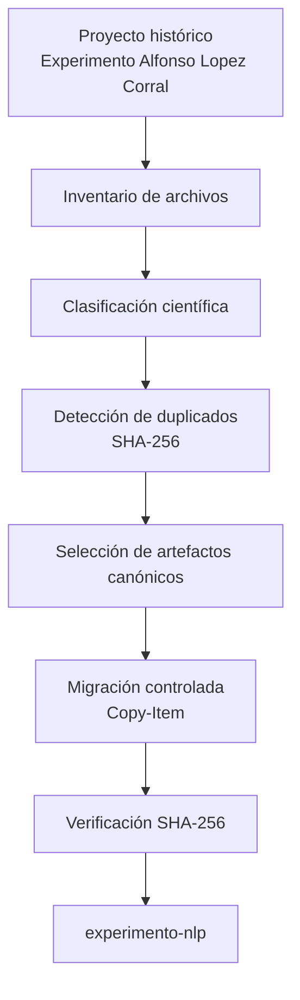
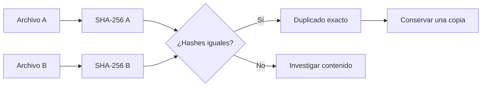
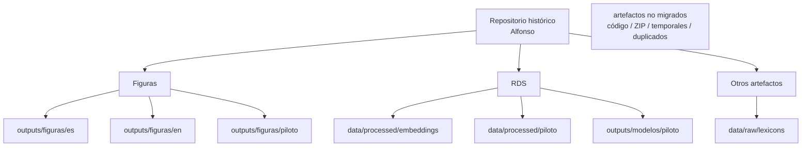
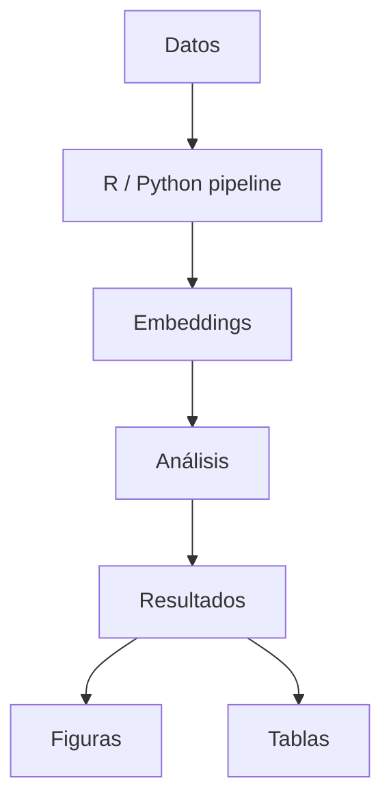

# Migración controlada de artefactos
## Proyecto: experimento-nlp

**Fecha:** 2026-09-07

---

### 1. Propósito

Este documento registra la **migración controlada de artefactos científicos y resultados** desde el proyecto histórico:

```text
[...]\Experimento Alfonso Lopez Corral
```

hacia el repositorio de trabajo:

```text
[...]\experimento-nlp
```

La migración se realizó bajo los siguientes criterios:

* **NO se copió el árbol completo** del proyecto histórico.
* **NO se migró código** del proyecto histórico.
* **NO se utilizaron archivos ZIP** como mecanismo de transporte.
* **El directorio histórico de Alfonso permanece intacto.**

La finalidad de esta migración es **recuperar y trasladar únicamente los artefactos científicos y resultados necesarios**, manteniendo separado el proyecto histórico del repositorio de trabajo actual.

---

### 2. Principio de migración

#### Regla general de migración

> **“Conservar la información científica útil, eliminar duplicaciones físicas y separar los artefactos reproducibles de los resultados históricos.”**

La migración **NO se basó únicamente en las extensiones de los archivos**.

Cada grupo de archivos fue clasificado considerando tres criterios principales:

* **Función científica**
* **Procedencia**
* **Duplicación**

Por tanto, la decisión de conservar, migrar o excluir un artefacto se realizó según su **valor y función dentro del proyecto científico**, y no únicamente según su formato o extensión.


---

## 3. Arquitectura general


---

### 4. Lo que NO se migró

El **código del proyecto histórico NO fue migrado**.

El repositorio nuevo ya dispone de **su propia arquitectura modular e infraestructura validada**, por lo que el código histórico no se incorporó como parte de esta migración.

Tampoco se migraron los siguientes tipos de artefactos:

* `.RData`
* `.Rhistory`
* `.RDataTmp`
* **archivos ZIP**
* auxiliares de LaTeX (`.aux`, `.log`, `.out`, `.synctex.gz`)
* **matrices de embeddings vacías `0 × 384`**
* **duplicados exactos**
* **modelos correspondientes al análisis histórico anterior (`Script en R`)**

En particular, **NO se copiaron los archivos ZIP**:

```text
files.zip
files (1).zip
```

La exclusión de estos elementos **no implica que el material histórico haya sido eliminado**. El proyecto histórico de origen permanece intacto; simplemente estos artefactos **no forman parte del repositorio de trabajo resultante de la migración**.

> **Principio de separación:** el repositorio nuevo contiene los artefactos científicos seleccionados para continuar el trabajo, mientras que el proyecto histórico conserva su contexto y estructura originales.

---

### 5. Inventario de figuras

El proyecto histórico contenía **120 archivos de imagen/PDF** dentro del universo auditado.

La inspección mediante **SHA-256** evidenció una **fuerte duplicación física** entre distintas ubicaciones del proyecto.

Por ello, el inventario de figuras se trató como un problema de **deduplicación y selección de fuentes canónicas**, no como una copia indiscriminada de archivos.

#### 5.1 Figuras principales

La familia principal está compuesta por:

```text
figura_02_linguistica
figura_03_hopper
figura_04_similitud
figura_05_prototipos
figura_06_pca
figura_07_cambio_semantico
figura_08_correlaciones
```

Existen versiones correspondientes a **español e inglés**.

Se identificaron copias en:

```text
Analisis agosto\resultados\
Analisis agosto\para_articulos\
Analisis agosto\articulo_1\
```

Cuando dos archivos presentaban **SHA-256 idéntico**, fueron considerados copias físicas del mismo artefacto.

En esos casos, **solamente se migró una copia**, evitando introducir duplicaciones innecesarias en el repositorio nuevo.

La **fuente canónica seleccionada** fue:

```text
Analisis agosto\para_articulos\resultados\
```

> **Criterio de deduplicación:** un archivo idéntico por SHA-256 no constituye un artefacto científico adicional; constituye otra copia física del mismo contenido.

#### 5.2 Figuras piloto

Se conservaron las siguientes familias:

```text
PILOTO_n_palabras_calculado_ES_*
PILOT_n_palabras_calculado_EN_*
COMPARACION_n_palabras_calculado_ES
COMPARISON_n_palabras_calculado_EN
```

La **fuente canónica** fue:

```text
Analisis agosto\para_articulos\analisis_piloto\
```

Estas figuras se mantienen identificadas como **material correspondiente al análisis piloto**, evitando confundirlas con resultados de la muestra o análisis posteriores.

#### 5.3 Figuras del análisis anterior

Las figuras ubicadas en:

```text
Script en R\resultados\
```

**NO fueron mezcladas con las figuras actuales**.

Estos archivos corresponden a una **generación analítica anterior** y, por tanto, quedaron fuera de la migración principal.

Esta separación es deliberada: **no se descartó el antecedente histórico, pero tampoco se incorporó al repositorio nuevo como si perteneciera al mismo análisis**.

> **Principio de trazabilidad:** las figuras históricas deben conservar su procedencia y generación analítica. Una figura no se considera “actual” únicamente por ser científicamente relevante; también debe poder identificarse **de qué análisis procede y bajo qué contexto fue generada**.

---

### 6. Inventario y clasificación de RDS

Los archivos `.rds` fueron inspeccionados a nivel **físico y estructural**, considerando:

```text
SHA-256
tamaño
clase R
tipo interno
dimensión
nombres de componentes
estructura interna
```

La auditoría mostró que **la mayoría de los archivos RDS eran duplicados exactos**.

Por esta razón, la migración no consistió en copiar todos los `.rds` encontrados, sino en **identificar los objetos científicamente relevantes, eliminar duplicaciones físicas y conservar una representación canónica de cada artefacto**.

> **Criterio:** la identidad de un RDS se determinó mediante su contenido y estructura, no únicamente mediante su nombre de archivo.

---

### 7. Artefactos principales migrados

#### 7.1 Embeddings

Se migraron:

```text
embeddings_t1.rds
embeddings_t2.rds
embeddings_t3.rds
```

Cada matriz presenta una dimensión de:

**40 × 384**

Estos archivos corresponden a **artefactos procesados del análisis principal** y contienen las representaciones vectoriales utilizadas en las etapas posteriores del análisis semántico.

Destino:

```text
data/processed/embeddings/
```

> **Importante:** las matrices vacías `0 × 384` identificadas durante la auditoría **no fueron migradas**, ya que no contienen observaciones utilizables.

#### 7.2 PCA

Se migró:

```text
pca_embeddings.rds
```

El objeto contiene:

```text
list
├── pca
├── var_exp
└── casos_completos
```

El componente `pca` es un objeto **`prcomp`**.

El objeto registra:

**`casos_completos = 40`**

Destino:

```text
data/processed/embeddings/
```

Este artefacto se conserva como **resultado estructurado del procesamiento de embeddings**, manteniendo tanto el objeto PCA como la información asociada a la varianza explicada y los casos utilizados.

#### 7.3 Prototipos semánticos

Se migró:

```text
prototipos_semanticos.rds
```

Contiene:

**20 prototipos × 384 dimensiones**

Los nombres de los prototipos corresponden a los **20 constructos semánticos definidos en `05_embeddings.R`**.

Destino:

```text
data/processed/embeddings/
```

Estos prototipos se consideran **artefactos derivados del diseño semántico del análisis**, no datos brutos.

---

### 8. Diccionario NRC

Se migró:

```text
nrc_es.rds
```

El diccionario contiene **ocho categorías emocionales**:

```text
anger
anticipation
disgust
fear
joy
sadness
surprise
trust
```

Destino:

```text
data/raw/lexicons/nrc_es.rds
```

El archivo se clasifica como **insumo del procesamiento lingüístico**, no como resultado analítico.

> **Distinción importante:** `nrc_es.rds` es un recurso utilizado para transformar o caracterizar los textos; no representa resultados obtenidos de la muestra.

---

### 9. Artefactos del piloto

Se migraron **tres matrices de embeddings**:

```text
embeddings_piloto_t1.rds
embeddings_piloto_t2.rds
embeddings_piloto_t3.rds
```

Cada matriz presenta una dimensión de:

**17 × 384**

Estos objetos corresponden a los **embeddings longitudinales del análisis piloto**.

Destino:

```text
data/processed/piloto/
```

Se mantienen separados de los embeddings del análisis principal para **preservar la distinción entre generaciones y muestras analíticas**.

> **No deben interpretarse como parte de la misma matriz de datos que los embeddings principales.** El tamaño `17 × 384` identifica la estructura correspondiente al piloto, mientras que `40 × 384` corresponde al análisis principal.

---

### 10. Dos versiones de ancho del piloto

La auditoría encontró dos objetos históricos con el mismo nombre:

```text
ancho_piloto_completo.rds
```

Sin embargo, **NO eran duplicados ni objetos equivalentes**.

La diferencia se determinó mediante la **estructura interna y las dimensiones de los objetos**, no mediante el nombre ni la fecha del archivo.

#### 10.1 Versión base

Dimensión:

**17 × 17**

Variables principales:

```text
fuente
participante
id_participante
condicion
demora
texto_t1
texto_t2
texto_t3
n_palabras_t1
n_palabras_t2
n_palabras_t3
n_palabras_calculado_t1
n_palabras_calculado_t2
n_palabras_calculado_t3
n_estimulos_t1
n_estimulos_t2
n_estimulos_t3
```

Destino:

```text
data/processed/piloto/ancho_piloto_base.rds
```

#### 10.2 Versión procesada

Dimensión:

**17 × 20**

Además de las variables de la versión base, contiene:

```text
t1_limpio
t2_limpio
t3_limpio
```

Destino:

```text
data/processed/piloto/ancho_piloto_procesado.rds
```

#### 10.3 Corrección semántica del inventario

Para evitar conservar la ambigüedad histórica del mismo nombre de archivo, los objetos fueron renombrados de acuerdo con **su estructura y función efectiva**:

```text
ancho_piloto_base.rds
    → 17 × 17

ancho_piloto_procesado.rds
    → 17 × 20
```

Por tanto, **el cambio de nombre no representa una modificación del contenido de los objetos**. Se trata de una normalización documental para hacer explícita una diferencia que ya existía en los datos.

> **Regla de trazabilidad:** cuando dos archivos históricos comparten nombre pero contienen estructuras diferentes, **no se deben tratar como duplicados**. Se conservan por separado y se les asigna un nombre descriptivo que permita identificar su función.

> **Resultado:** quedan diferenciados tres niveles de procedencia: **datos/artefactos del análisis principal, artefactos del piloto e insumos del procesamiento lingüístico**. Esta separación evita mezclar muestras, etapas de procesamiento o tipos de artefactos dentro del repositorio nuevo.

--- 

### 11. Modelos migrados

Se migraron los siguientes tres objetos:

* `modelos_piloto.rds`
* `modelos_principal.rds`
* `modelos_comparativos.rds`

Los tres objetos fueron encontrados como **duplicados exactos en tres ubicaciones históricas**. La deduplicación se realizó entre las copias físicas mediante **SHA-256**; esto **no significa que los tres objetos sean equivalentes entre sí**, sino que cada objeto tenía múltiples copias idénticas dentro del proyecto histórico.

Los objetos incluyen estructuras correspondientes a:

* modelos **`lmerModLmerTest`**
* resultados de **ANOVA**
* **R²**
* estimaciones marginales
* contrastes
* diagnósticos

Estos elementos se conservaron como **artefactos de resultados del análisis estadístico histórico**, manteniendo su procedencia y evitando duplicar físicamente las mismas copias.

Destino:

```text id="n0v9fl"
outputs/modelos/piloto/
```

> **Nota de trazabilidad:** los modelos migrados representan resultados de análisis ya ejecutados. **No se interpretan como código fuente ni como sustitutos de los scripts que los generaron.**

---

### 12. Proceso de deduplicación

El método utilizado para identificar duplicados exactos fue **SHA-256**.

El criterio fue:

* **Hash idéntico → mismo contenido físico → conservar una sola copia.**
* **Hash diferente → no asumir duplicación → investigar el contenido y la estructura.**

Conceptualmente:



**SHA-256 se utilizó para determinar identidad física del contenido**, no para determinar equivalencia científica entre archivos diferentes.

Cuando los hashes no coincidían, el archivo **no fue descartado automáticamente**. Se procedió a revisar su estructura, contenido, procedencia y función científica antes de decidir su clasificación.

> **Regla de deduplicación:** un nombre de archivo igual no implica necesariamente que dos archivos sean iguales; del mismo modo, un nombre diferente no implica necesariamente que representen artefactos científicos diferentes.

---

### 13. Proceso de copia

Los artefactos seleccionados fueron copiados mediante:

```powershell
Copy-Item
```

La operación fue realizada **sin modificar el directorio histórico de origen**.

Conceptualmente:

```text
ORIGEN
    |
    | Copy-Item
    v
DESTINO
```

La migración fue, por tanto, una operación de **copia controlada**, no de traslado ni de reorganización destructiva.

**El directorio de origen permaneció intacto.**

No se utilizó compresión ni archivos ZIP como mecanismo de transporte.

En consecuencia:

* **No se movieron archivos (`Move-Item`).**
* **No se eliminaron archivos del proyecto histórico.**
* **No se modificó la estructura del proyecto histórico.**
* **No se utilizaron ZIP como intermediario de migración.**
* **Los artefactos seleccionados se copiaron directamente al repositorio de trabajo.**

> **Principio de integridad:** la migración debía producir una copia utilizable en el repositorio nuevo **sin alterar ni destruir la fuente histórica**.

### 14. Verificación post-migración

Después de copiar cada artefacto se calcularon:

* **`SHA256_Origen`**
* **`SHA256_Destino`**

La condición de aceptación fue:

**`SHA256_Origen == SHA256_Destino`**

También se verificó:

**`Bytes_Origen == Bytes_Destino`**

Un archivo se consideró correctamente migrado únicamente cuando **el contenido binario y el tamaño coincidieron entre origen y destino**.

> **Alcance de esta verificación:** esta comprobación garantiza la **integridad física de la copia**. No constituye, por sí misma, una validación de la metodología estadística, del contenido científico ni de la validez de los resultados.

---

### 15. Resultado de la migración

El manifiesto:

```text id="0a6b2x"
docs/auditorias/MIGRATION_MANIFEST_20260907.csv
```

registra:

* **58 artefactos migrados**
* **58 PASS**
* **0 FAIL**

Por tanto:

> **INTEGRIDAD DE ARCHIVOS = VALIDADA**

El manifiesto registra, para cada artefacto:

* estado de la verificación;
* **SHA-256 de origen**;
* **SHA-256 de destino**;
* tamaño de origen;
* tamaño de destino;
* ruta de origen;
* ruta de destino.

El resultado `58 PASS / 0 FAIL` significa que **todos los artefactos incluidos en la migración fueron copiados íntegramente y pudieron ser verificados contra su fuente**.

> **Importante:** “integridad validada” significa que los archivos del destino son copias íntegras de los archivos seleccionados del origen. **No significa que los 58 artefactos hayan sido considerados científicamente equivalentes ni que todos representen resultados actuales.** Su procedencia y clasificación están documentadas en las secciones anteriores.

---

### 16. Composición de los 58 artefactos

Los **58 artefactos migrados** se distribuyen de la siguiente manera:

* **28** figuras principales
* **16** figuras piloto
* **1** diccionario NRC
* **5** artefactos principales de embeddings/PCA/prototipos
* **3** embeddings piloto
* **2** objetos de datos estructurados del piloto
* **3** objetos de modelos piloto/principal/comparativos

**Total: 58 artefactos**

La composición anterior describe **qué fue efectivamente migrado**, no el número total de archivos existentes en el proyecto histórico. El inventario histórico era mayor debido a **duplicaciones, archivos auxiliares, artefactos temporales, código y otros elementos excluidos mediante los criterios definidos en esta auditoría**.

> **Criterio de conteo:** cada entrada contabilizada corresponde a un artefacto que fue seleccionado, copiado y posteriormente verificado mediante el manifiesto de migración.

---

### 17. Arquitectura resultante



La arquitectura resultante establece una **separación explícita entre el repositorio histórico y el repositorio de trabajo**.

Los artefactos seleccionados fueron distribuidos según su función:

* **Figuras:** resultados visuales organizados por idioma y generación analítica.
* **Embeddings, PCA y prototipos:** artefactos procesados del análisis semántico.
* **Piloto:** objetos correspondientes específicamente a la muestra y procesamiento piloto.
* **Modelos:** resultados estructurados del análisis estadístico.
* **NRC:** insumo léxico utilizado durante el procesamiento lingüístico.

Los elementos excluidos —**código histórico, ZIP, temporales y duplicados**— no forman parte de esta arquitectura.

> **Principio arquitectónico:** el repositorio nuevo no reproduce el árbol histórico. **Reconstruye una colección controlada de artefactos científicos seleccionados, preservando su procedencia y separando datos, resultados e insumos.**

# 18. Relación con la infraestructura de embeddings

La migración de artefactos se realizó **después de validar la nueva infraestructura Python/R para embeddings**.

La infraestructura validada utiliza:

* **`paraphrase-multilingual-MiniLM-L12-v2`**
* **384 dimensiones**
* Sentence Transformers
* Python 3.11
* R 4.6.1
* `reticulate`

La **equivalencia entre el pipeline legacy y el nuevo pipeline fue comprobada antes de utilizar los resultados migrados como referencia**.

La discrepancia inicialmente observada se explicó por una diferencia en la representación de valores ausentes durante la comunicación entre R y Python:

```text
R NA_character_
      ↓
reticulate
      ↓
Python "NA"
```

La **normalización previa en R hacia `[VACÍO]`** permitió restablecer la equivalencia esperada entre ambos pipelines.

La equivalencia final fue considerada válida bajo tolerancia numérica:

* **Diferencia absoluta máxima ≈ `8.47 × 10⁻⁹`**
* **Coseno mínimo = `1.0`**

Estos resultados indican una **coincidencia numérica prácticamente exacta bajo la tolerancia establecida** entre las representaciones comparadas.

> **Distinción importante:** esta comprobación valida la **equivalencia del procesamiento de embeddings** bajo las condiciones evaluadas. No implica que todos los resultados históricos sean metodológicamente válidos ni que los artefactos migrados sustituyan al pipeline reproducible.

---

# 19. Principio de reproducibilidad

Los artefactos migrados **NO sustituyen al pipeline reproducible**.

Su función principal es preservar **resultados y artefactos históricos seleccionados**, de modo que puedan ser inspeccionados, comparados y utilizados como referencia dentro del nuevo repositorio.

La arquitectura objetivo es:



El flujo establece que la **fuente de reproducibilidad** debe ser el procesamiento documentado:

**Datos → Pipeline R/Python → Embeddings → Análisis → Resultados → Figuras/Tablas**

Los artefactos `.rds`, figuras y modelos históricos migrados funcionan como **productos intermedios o resultados preservados**, pero no como sustitutos del proceso que permite generarlos.

> **Principio central:** un resultado migrado demuestra qué se obtuvo históricamente; un pipeline reproducible permite demostrar **cómo puede volver a obtenerse**.

Por ello, la migración preserva los resultados históricos sin convertirlos en la única fuente de verdad del análisis futuro.

Los archivos `.rds`, las figuras y los modelos migrados cumplen las siguientes funciones:

* **Referencia histórica**
* **Verificación de resultados**
* **Recuperación de resultados previamente generados**
* **Comparación contra futuras ejecuciones del pipeline**
* **Insumos para nuevos análisis cuando su utilización esté científicamente justificada**

Estos artefactos constituyen **evidencia y material de referencia del trabajo histórico**, pero no deben convertirse automáticamente en la única fuente de verdad del análisis.

La fuente de verdad para futuros análisis debe establecerse mediante **datos identificados, código reproducible, parámetros documentados y resultados regenerables**, manteniendo los artefactos históricos como referencia trazable.

---

### 20. Separación entre código y artefactos

El **código del proyecto histórico NO fue incorporado** al repositorio de trabajo.

La separación conceptual resultante es:

```text
experimento-nlp
│
├── R/
│   └── código analítico actual
│
├── python/
│   └── infraestructura Python actual
│
├── data/
│   └── datos e insumos procesados
│
├── outputs/
│   └── resultados
│
└── docs/
    └── trazabilidad y documentación
```

El proyecto histórico:

```text
Experimento Alfonso Lopez Corral
```

**permanece intacto y separado del repositorio de trabajo**, funcionando como **fuente histórica de referencia**.

Esta separación evita:

* mezclar código de distintas generaciones del proyecto;
* confundir resultados históricos con resultados generados por el pipeline actual;
* introducir dependencias innecesarias sobre la infraestructura legacy;
* perder la procedencia de los artefactos recuperados;
* convertir una copia histórica en sustituto del proceso reproducible actual.

> **Principio de separación:** el repositorio `experimento-nlp` contiene la infraestructura y los artefactos seleccionados para el trabajo actual; el proyecto histórico conserva su contexto original y funciona como referencia independiente.

---

### 21. Estado final de la migración

| Control                    | Estado   |
| -------------------------- | -------- |
| **Inventario**             | **PASS** |
| **Deduplicación**          | **PASS** |
| **Clasificación**          | **PASS** |
| **Copia controlada**       | **PASS** |
| **Verificación SHA-256**   | **PASS** |
| **Integridad de archivos** | **PASS** |

### **MIGRACIÓN DE ARTEFACTOS = VALIDADA**

La migración concluyó con:

* **58 artefactos migrados**
* **58 verificaciones PASS**
* **0 verificaciones FAIL**
* **SHA-256 de origen y destino coincidente**
* **Tamaño en bytes de origen y destino coincidente**
* **Proyecto histórico de origen sin modificaciones**

Además:

* **NO se modificó el proyecto histórico.**
* **NO se migró código histórico.**
* **NO se migraron archivos ZIP.**
* **NO se migraron archivos temporales o auxiliares excluidos.**
* **NO se incorporaron duplicados exactos.**
* **NO se mezclaron automáticamente generaciones analíticas diferentes.**

La migración, por tanto, debe entenderse como una **recuperación controlada y trazable de artefactos científicos**, no como una reproducción del proyecto histórico ni como una copia completa de su árbol de archivos.

La integridad de los artefactos seleccionados quedó comprobada mediante **identidad criptográfica y tamaño**, mientras que su clasificación se realizó atendiendo a **función científica, procedencia, estructura y duplicación**.

El resultado es un repositorio de trabajo que **preserva los resultados históricos necesarios sin absorber indiscriminadamente el proyecto legacy**, manteniendo separadas la infraestructura actual, los artefactos recuperados y la fuente histórica original.

> **Cierre de auditoría:** la migración preservó los artefactos científicos seleccionados, mantuvo intacta la fuente histórica y estableció una separación explícita entre **reproducibilidad futura** y **recuperación histórica**.
