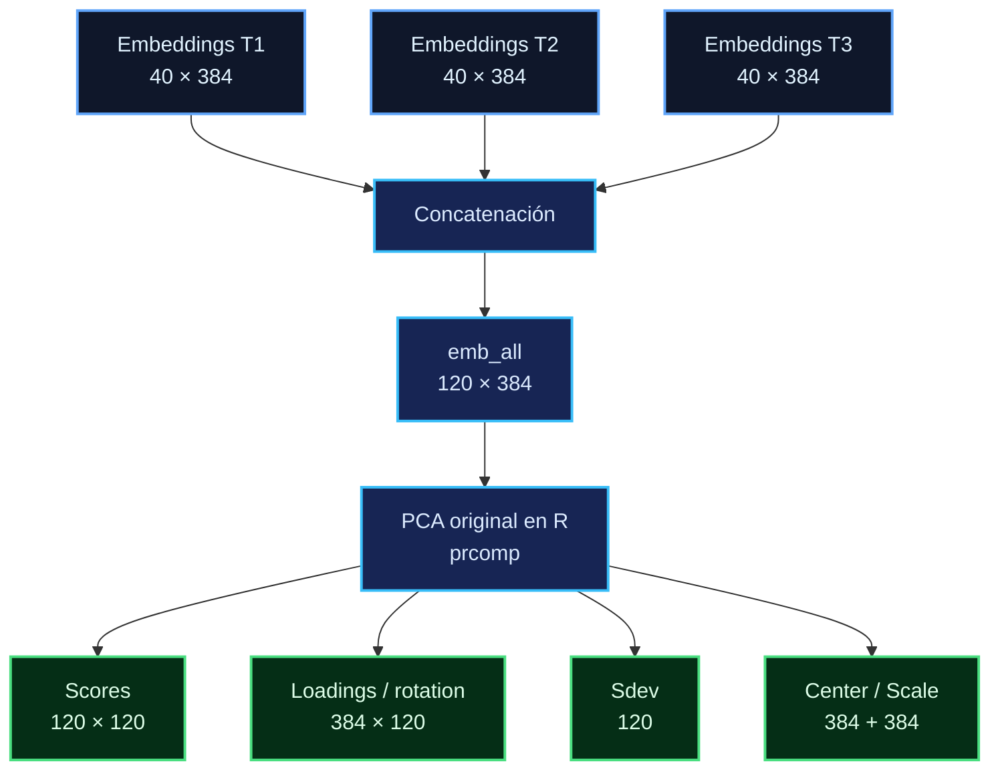
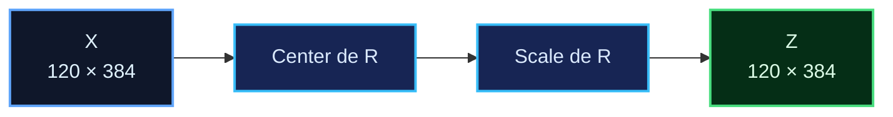
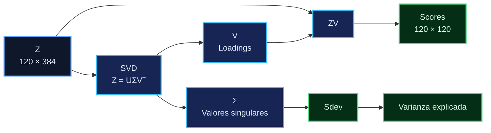
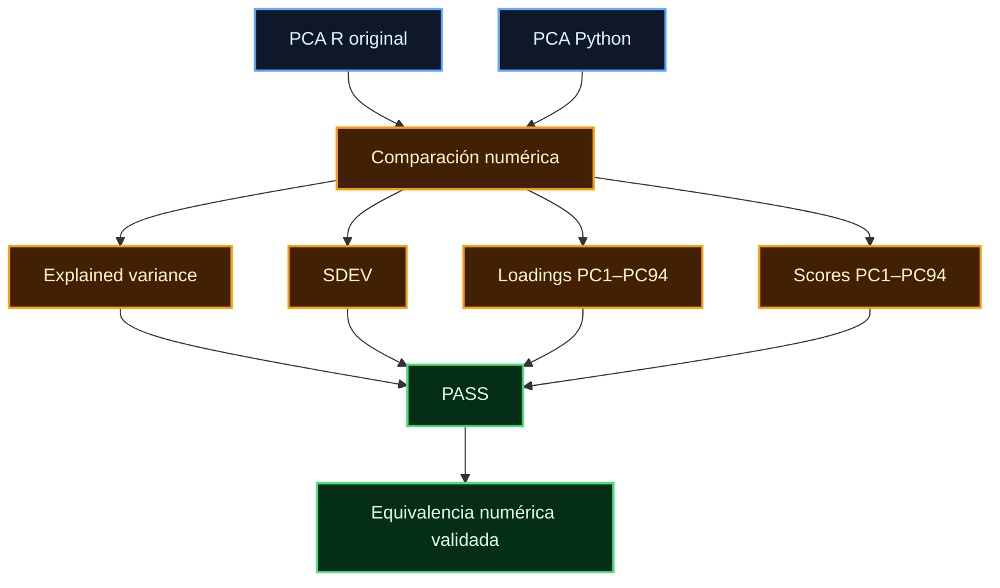
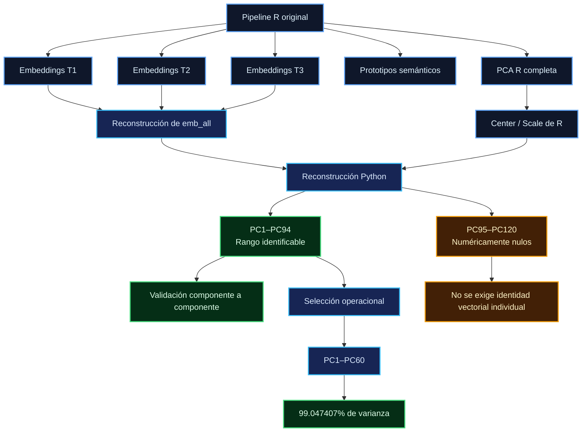
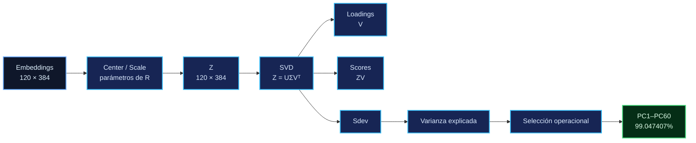
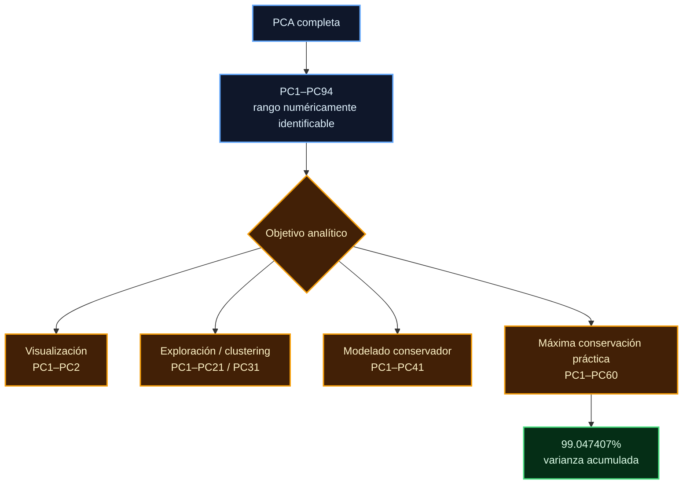

# PCA R → Python: documentación técnica de migración y validación

**Proyecto:** `experimento-nlp`
**Fecha de auditoría:** 2026-09-07
**Estado:** **PASS**
**Tipo de documento:** Especificación técnica y validación de equivalencia numérica

---

## 1. Propósito

Este documento formaliza la migración de la etapa de embeddings y análisis de componentes principales (PCA) desde la implementación original en R hacia una implementación operacional en Python.

El objetivo de la migración no es sustituir retrospectivamente los resultados generados por R, sino demostrar que el procedimiento puede reconstruirse en Python con equivalencia numérica dentro de tolerancias explícitamente definidas y establecer una representación operacional reducida para usos posteriores.

La jerarquía de procedencia es:

```text
Implementación R original
        ↓
Artefactos RDS preservados
        ↓
Exportaciones tabulares
        ↓
Reconstrucción en Python
        ↓
Validación numérica
        ↓
PCA operacional
```

El objeto PCA original de R permanece preservado y constituye la referencia primaria de esta validación.

---

# 2. Artefactos de entrada

## 2.1 Embeddings

Los tres conjuntos temporales presentan las siguientes dimensiones:

$$
40 \times 384
$$

Por tanto:

$$
X_{T1},X_{T2},X_{T3}\in\mathbb{R}^{40\times384}
$$

Cada fila representa una observación y cada columna una dimensión de la representación vectorial.

```text
T1 = 40 × 384
T2 = 40 × 384
T3 = 40 × 384
```

---

## 2.2 Prototipos semánticos

Se dispone de:

$$
20
$$

prototipos semánticos, cada uno representado mediante:

$$
384
$$

dimensiones.

Los prototipos corresponden a las categorías semánticas definidas y utilizadas por el pipeline original.

---

# 3. Construcción de la matriz conjunta

El procedimiento original en R realiza:

```r
completos <- complete.cases(emb_t1, emb_t2, emb_t3)

emb_all <- rbind(
  emb_t1[completos, ],
  emb_t2[completos, ],
  emb_t3[completos, ]
)
```

Se identificaron:

$$
40
$$

casos completos.

La matriz conjunta queda definida como:

$$
X=
\begin{bmatrix}
X_{T1}\\
X_{T2}\\
X_{T3}
\end{bmatrix}
$$

con:

$$
X\in\mathbb{R}^{120\times384}
$$

El orden de las observaciones es:

```text
1–40       → T1
41–80      → T2
81–120     → T3
```

Este orden se conservó durante la reconstrucción en Python para permitir la comparación directa de scores y estructuras derivadas.

### Esquema de procedencia de las observaciones



---

# 4. Estandarización

La PCA original se calcula mediante:

```r
prcomp(
    emb_all,
    center = TRUE,
    scale. = TRUE
)
```

Para cada variable \(j\), la transformación de estandarización se expresa como:

$$
Z_{ij}=
\frac{X_{ij}-\mu_j}{s_j}
$$

donde:

* \(X_{ij}\) es el valor original;
* \(\mu_j\) es el centro calculado por R;
* \(s_j\) es el factor de escala calculado por R.

La implementación Python utiliza explícitamente los valores exportados desde R:

```text
pca_embeddings_center.csv
pca_embeddings_scale.csv
```

Esto evita recalcular independientemente los parámetros de centralización y escala durante la validación.

La matriz estandarizada resultante es:

$$
Z\in\mathbb{R}^{120\times384}
$$

La secuencia correspondiente es:



---

# 5. Descomposición de la PCA

Conceptualmente, la PCA sobre la matriz estandarizada puede expresarse mediante una descomposición en valores singulares:

$$
Z=U\Sigma V^T
$$

donde:

* \(U\) contiene los vectores singulares izquierdos;
* \(\Sigma\) contiene los valores singulares;
* \(V\) contiene los vectores singulares derechos.

Bajo la convención utilizada por `prcomp`, la matriz:

```text
pca$rotation
```

corresponde a la matriz de direcciones principales \(V\), denominada aquí **loadings**.

Los scores se obtienen mediante:

$$
T=ZV
$$

por lo que:

$$
T\in\mathbb{R}^{120\times120}
$$

en la solución completa.

La relación matemática es:



---

# 6. Desviación estándar de los componentes

Los valores `sdev` de `prcomp` se relacionan con los valores singulares mediante:

$$
s_k=
\frac{\sigma_k}{\sqrt{n-1}}
$$

Con:

$$
n=120
$$

se obtiene:

$$
s_k=
\frac{\sigma_k}{\sqrt{119}}
$$

La implementación Python reproduce estos valores dentro de la precisión de punto flotante observada.

La diferencia máxima registrada fue:

$$
8.882\times10^{-15}
$$

---

# 7. Varianza explicada

La proporción de varianza explicada por el componente \(k\) se define como:

$$
VE_k=
\frac{s_k^2}
{\sum_j s_j^2}
$$

y, expresada como porcentaje:

$$
VE_k(\%)=
100
\frac{s_k^2}
{\sum_j s_j^2}
$$

La varianza acumulada hasta el componente \(K\) es:

$$
VE_{\mathrm{cum}}(K)
=
\sum_{k=1}^{K}VE_k
$$

---

# 8. Varianza explicada observada

Los principales puntos de referencia de la solución observada son:

| Componente | Varianza individual (%) | Varianza acumulada (%) |
| ---------: | ----------------------: | ---------------------: |
|        PC1 |                 12.6750 |                12.6750 |
|        PC2 |                  7.5090 |                20.1840 |
|        PC3 |                  6.8731 |                27.0571 |
|        PC4 |                  5.5068 |                32.5639 |
|        PC5 |                  5.3620 |                37.9258 |
|        PC6 |                  4.5923 |                42.5181 |
|        PC7 |                  4.2873 |                46.8054 |
|        PC8 |                  4.0541 |                50.8594 |
|        PC9 |                  3.8101 |                54.6695 |
|       PC10 |                  3.3251 |                57.9946 |
|       PC20 |                  1.5137 |                78.7197 |
|       PC30 |                  0.8184 |                89.5191 |
|       PC40 |                  0.4149 |                94.9821 |
|       PC50 |                  0.1924 |                97.6911 |
|       PC60 |                  0.0997 |                99.0474 |
|       PC70 |                  0.0456 |                99.6850 |
|       PC80 |                  0.0144 |                99.9309 |
|       PC90 |                  0.0031 |                99.9937 |
|       PC94 |                ≈ 0.0009 |               100.0000 |

### Umbrales operativos

```text
50%  → PC8
70%  → PC15
80%  → PC21
90%  → PC31
95%  → PC41
99%  → PC60
```

El valor calculado para PC60 es:

$$
99.04740736560767\%
$$

---

# 9. Rango numérico

La matriz estandarizada presenta:

$$
\operatorname{rank}(Z)=94
$$

utilizando una tolerancia numérica de:

```text
1e-12
```

Por tanto:

```text
PC1–PC94
→ rango numéricamente identificable

PC95–PC120
→ espacio numéricamente nulo
```

El valor máximo de `sdev` observado dentro de PC95–PC120 es aproximadamente:

$$
1.346\times10^{-15}
$$

La varianza relativa asociada a este bloque es aproximadamente:

$$
2.596\times10^{-32}
$$

Estas magnitudes justifican la clasificación de PC95–PC120 como **componentes numéricamente nulas** para los fines de esta validación.

Debe distinguirse entre:

* **número de componentes del objeto PCA:** 120;
* **rango numéricamente identificable:** 94;
* **componentes retenidas operacionalmente:** 60.

No se trata, por tanto, de tres definiciones equivalentes, sino de tres propiedades diferentes de la misma solución.

---

# 10. Diferencias entre R y Python después de PC94

Una PCA no determina de manera única una base en un subespacio asociado con autovalores exactamente nulos o numéricamente próximos a cero.

En el rango identificable, los componentes presentan valores singulares suficientemente distintos de cero para permitir una comparación componente por componente.

Después de PC94:

$$
\lambda_k\approx0
$$

y las direcciones forman un espacio numéricamente degenerado.

En dicho espacio pueden obtenerse distintas bases ortonormales dependiendo de la implementación, del algoritmo de descomposición o de operaciones numéricas intermedias, sin que ello implique una diferencia sustantiva en la información representada.

Por esta razón:

```text
PC1–PC94
→ comparación componente por componente

PC95–PC120
→ clasificación como numéricamente nulos
→ no se exige identidad vectorial individual
```

---

# 11. Indeterminación de signo

Cada componente de PCA presenta una indeterminación de signo.

Si:

$$
v_k
$$

es una dirección principal válida, entonces:

$$
-v_k
$$

también lo es.

Por consiguiente:

$$
v_k
\quad\text{y}\quad
-v_k
$$

representan la misma dirección geométrica.

Para permitir la comparación directa entre R y Python se realizó alineación de signos de los componentes.

Esta operación permite distinguir una inversión algebraicamente equivalente de una discrepancia numérica real.

La comparación de:

```text
loadings
scores
```

se realizó después de dicha alineación.

---

# 12. Validación de equivalencia

Las dimensiones de los objetos comparados fueron:

```text
R scores:        120 × 120
R rotation:      384 × 120

Python scores:   120 × 120
Python rotation: 384 × 120
```

La validación se realizó por componentes y por estructuras derivadas.

## 12.1 Varianza explicada

Diferencia máxima:

$$
1.665\times10^{-16}
$$

**Resultado:** PASS

---

## 12.2 SDEV

Diferencia máxima:

$$
8.882\times10^{-15}
$$

**Resultado:** PASS

---

## 12.3 Loadings

Para PC1–PC94:

$$
\max|\Delta|
=
5.185\times10^{-14}
$$

**Resultado:** PASS

---

## 12.4 Scores

Para PC1–PC94:

$$
\max|\Delta|
=
5.241\times10^{-13}
$$

**Resultado:** PASS

Las diferencias observadas son compatibles con efectos de representación de punto flotante y no constituyen evidencia de divergencia metodológica entre las implementaciones comparadas.

### Resumen gráfico de la validación



---

# 13. Integridad de los artefactos RDS

Se realizó una comparación SHA-256 entre los archivos fuente y sus copias organizadas.

Resultado:

```text
OK  embeddings_t1.rds
OK  embeddings_t2.rds
OK  embeddings_t3.rds
OK  prototipos_semanticos.rds
OK  pca_embeddings.rds
```

Las copias organizadas son idénticas byte a byte a los archivos fuente correspondientes.

La migración no sobrescribió ni modificó los objetos RDS originales.

La relación de conservación es:


---

# 14. Definición de la PCA operacional

Aunque el objeto PCA completo contiene 120 componentes, solamente 94 presentan rango numéricamente identificable.

Para la ejecución operacional se estableció:

$$
K=60
$$

Por tanto:

$$
T_{\mathrm{operacional}}
=
T_{[:,1:60]}
$$

con:

$$
VE_{\mathrm{cum}}(60)
=
99.047407\%
$$

Esta representación tiene tres propiedades:

1. conserva el 99.0474% de la varianza total;
2. evita incorporar las componentes clasificadas como numéricamente nulas;
3. reduce la representación de 384 dimensiones a un espacio operacional de 60 componentes.

La reducción a 60 componentes constituye una decisión operacional específica de este pipeline y no una propiedad necesaria de la PCA.

---

# 15. Justificación de la selección PC1–PC60

La selección de PC1–PC60 no se establece como un criterio matemático universal.

Se fundamenta en:

$$
VE_{\mathrm{cum}}(60)\approx99.05\%
$$

La representación puede variar según el objetivo analítico:

| Objetivo                     | Representación operacional posible |
| ---------------------------- | ---------------------------------- |
| Visualización                | PC1–PC2                            |
| Exploración / clustering     | PC1–PC21 o PC1–PC31                |
| Modelado conservador         | PC1–PC41                           |
| Máxima conservación práctica | PC1–PC60                           |

Estas alternativas constituyen decisiones de diseño analítico y no resultados independientes de la validación.

Para futuros modelos predictivos, el número óptimo de componentes deberá determinarse mediante un procedimiento de validación apropiado, por ejemplo validación cruzada, atendiendo al objetivo específico del modelo.

---

# 16. Arquitectura de procedencia

La procedencia completa puede representarse como:



---

# 17. Flujo matemático de la migración



---

# 18. Frontera del rango numérico


---

# 19. Selección operacional



---

# 20. Artefactos de la PCA operacional

La PCA operacional de Python se encuentra en:

```text
data/processed/embeddings/python/pca/
```

Los archivos son:

```text
pca_embeddings_pc60_scores.csv
pca_embeddings_pc60_loadings.csv
pca_embeddings_pc60_sdev.csv
pca_embeddings_pc60_center.csv
pca_embeddings_pc60_scale.csv
pca_embeddings_pc60_variance.csv
metadata.json
```

El archivo `metadata.json` registra, como mínimo:

```text
origen R
matriz utilizada
dimensiones
algoritmo
alineación de signos
rango numérico
componentes numéricamente identificables
componentes numéricamente nulas
número de componentes operacionales
varianza acumulada
preservación del PCA original
```

Estos archivos se consideran derivados operacionales de la solución original.

---

# 21. Scripts de construcción y validación

## Construcción de la PCA operacional

```text
scripts/validation/build_operational_pca.py
```

## Validación R → Python

```text
scripts/validation/validate_r_python_embeddings.py
```

La validación puede ejecutarse desde la raíz del repositorio mediante:

```bash
python scripts/validation/validate_r_python_embeddings.py
```

Los scripts de construcción y validación forman parte de la trazabilidad técnica de la migración.

---

# 22. Criterios de aceptación

La migración se considera validada cuando se cumplen simultáneamente los siguientes criterios:

```text
[PASS] Dimensiones de embeddings
[PASS] Integridad mediante SHA-256
[PASS] Prototipos semánticos
[PASS] Reconstrucción de emb_all
[PASS] Parámetros center / scale
[PASS] Rango numérico
[PASS] Varianza explicada
[PASS] SDEV
[PASS] Loadings PC1–PC94
[PASS] Scores PC1–PC94
[PASS] Clasificación PC95–PC120
[PASS] PCA operacional PC1–PC60
[PASS] Preservación de la PCA original de R
```

La condición global de aceptación es:

```text
PASS — equivalencia R → Python validada
```

dentro del rango numéricamente identificable y de las tolerancias documentadas.

---

# 23. Tolerancias numéricas

Las comparaciones entre R y Python utilizan tolerancias debido a la representación finita de los números reales y a diferencias de punto flotante entre implementaciones.

Los valores máximos observados fueron:

| Elemento           | Diferencia máxima |
| ------------------ | ----------------: |
| Varianza explicada |       `1.665e-16` |
| SDEV               |       `8.882e-15` |
| Loadings PC1–PC94  |       `5.185e-14` |
| Scores PC1–PC94    |       `5.241e-13` |

Estas magnitudes son compatibles con variaciones de precisión de punto flotante.

### Comparación numérica de T2

La comprobación correspondiente a T2 utiliza una tolerancia de:

```text
1e-7
```

porque el valor de referencia almacenado en R estaba redondeado:

```text
Python = 0.670081264633
R      = 0.6700813
```

La diferencia observada fue aproximadamente:

$$
3.54\times10^{-8}
$$

y se encuentra dentro de la tolerancia definida.

Esta comprobación debe interpretarse como una **comparación numérica tolerante**, no como una comparación de hash criptográfico.

---

# 24. Limitaciones

La presente validación demuestra equivalencia numérica de la etapa de embeddings y PCA bajo la configuración documentada.

No demuestra por sí misma:

* validez clínica;
* validez predictiva;
* generalización fuera de la muestra utilizada;
* optimalidad universal de PC1–PC60;
* equivalencia de módulos NLP distintos de embeddings/PCA;
* equivalencia de modelos estadísticos posteriores que utilicen las representaciones derivadas.

La equivalencia demostrada es específicamente:

```text
Embeddings / PCA en R
        ↓
Embeddings / PCA en Python
```

dentro del rango numéricamente identificable:

```text
PC1–PC94
```

---

# 25. Regla metodológica de la migración

La migración adopta la siguiente regla:

> Los artefactos originales de R se conservan sin modificación. La implementación Python constituye una reconstrucción y derivación operacional. La equivalencia se evalúa componente por componente dentro del rango numéricamente identificable y mediante tolerancias previamente definidas.

En consecuencia:

```text
PCA R completa
      │
      ├── preservada
      │
      ├── PC1–PC94
      │      └── equivalencia validada
      │
      └── PC95–PC120
             └── numéricamente nulos

PCA Python operacional
      │
      └── PC1–PC60
             └── 99.047407% de varianza acumulada
```

---

# 26. Resultado final de la validación

```text
======================================================================
VALIDACIÓN R → PYTHON
======================================================================

PASS — equivalencia R → Python validada para PC1–PC94.

PASS — PCA operacional PC1–PC60 validada.

INFO — PC95–PC120 clasificadas como componentes
       numéricamente nulas.

INFO — PCA original de R preservada como fuente de referencia.

INFO — Tolerancias numéricas documentadas y satisfechas.

Fecha de auditoría: 2026-09-07
Estado: PASS
======================================================================
```

---

# 27. Cierre de la etapa

La etapa de migración de embeddings y PCA queda formalmente cerrada bajo los criterios establecidos en este documento.

La infraestructura resultante proporciona:

* **proveniencia**, mediante la conservación de los artefactos originales;
* **reproducibilidad**, mediante scripts automatizados de reconstrucción y validación;
* **equivalencia numérica**, mediante la comparación de PC1–PC94 dentro de tolerancias explícitas;
* **control de degeneración numérica**, mediante la identificación de PC95–PC120 como componentes numéricamente nulas;
* **representación operacional**, mediante PC1–PC60;
* **trazabilidad**, mediante `metadata.json` y los scripts correspondientes;
* **integridad**, mediante SHA-256 y conservación de los RDS originales;
* **auditabilidad técnica**, mediante registro de dimensiones, fórmulas, tolerancias y resultados.

**Estado final: PASS**

**Fecha:** 2026-09-07
