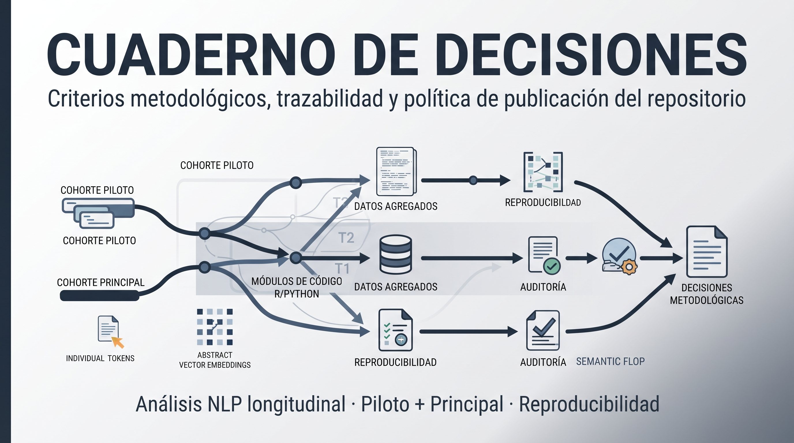
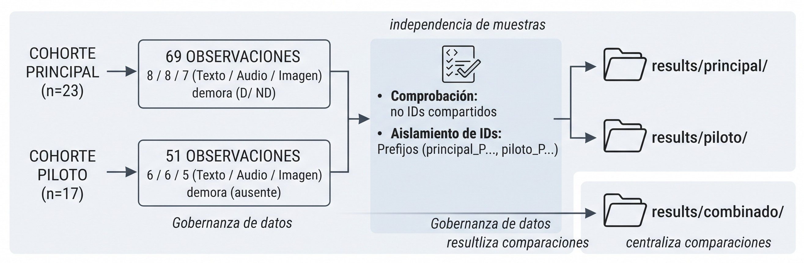
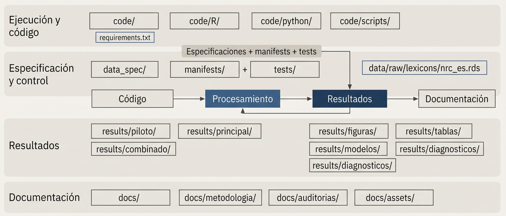

# Cuaderno de decisiones

> Este documento reúne las principales decisiones metodológicas y de organización que sustentan la estructura del repositorio. Su propósito es **facilitar la comprensión de los criterios utilizados para separar cohortes, documentar los análisis, gestionar los artefactos de resultados y establecer los límites de publicación y reproducibilidad.** También identifica los aspectos que permanecen pendientes de definición o validación.

---

## D1. Las cohortes piloto y principal se consideran muestras independientes

Aunque el repositorio integra **40 participantes**, el análisis mantiene separadas las cohortes piloto y principal. Cada una corresponde a una muestra independiente, con su propia estructura de observaciones y sus propias condiciones de análisis.

| Cohorte   | Participantes | Observaciones | Condiciones (Texto / Audio / Imagen) | `demora` | `n_palabras`      |
| --------- | ------------: | ------------: | ------------------------------------ | -------- | ----------------- |
| Principal |        **23** |            69 | 8 / 8 / 7                            | D / ND   | informada         |
| Piloto    |        **17** |            51 | 6 / 6 / 5                            | ausente  | vacía; se calcula |

Esta separación se mantiene explícitamente en la implementación:

* Los identificadores de participante incorporan la procedencia de la cohorte (`principal_P1…` y `piloto_P1…`), evitando coincidencias indebidas durante las operaciones de integración.
* La variable `fuente` identifica de forma explícita la cohorte de cada observación y se conserva en las tablas de resultados.
* El procesamiento comprueba que no existan identificadores compartidos entre cohortes antes de realizar operaciones que dependan de la correspondencia entre participantes.
* Las tablas que integran o comparan ambas cohortes se mantienen en `results/combinado/`, mientras que los resultados específicos permanecen en `results/piloto/` y `results/principal/`.

Esta estructura permite utilizar el conjunto completo de participantes para los análisis que correspondan sin perder la trazabilidad de la procedencia de cada observación.

## D2. Criterio para el conteo de palabras

La variable de número de palabras se trata de forma diferenciada según la disponibilidad y consistencia de la información de origen.

En la cohorte piloto, la columna `n_palabras` del archivo de captura no contiene valores utilizables. Por ello, el análisis obtiene el conteo directamente a partir del texto mediante `n_palabras_calculado`, utilizando la regla `str_count(texto, "\\S+")`.

En la cohorte principal, el conteo registrado y el conteo calculado presentan correspondencia prácticamente completa, por lo que el modelo utiliza `n_palabras` y evita incorporar una medida redundante.

En consecuencia, toda cifra de palabras reportada para la cohorte piloto debe interpretarse como un valor **calculado a partir del texto**, no como un dato suministrado por el instrumento de captura.

## D3. Control de multiplicidad

El repositorio conserva de manera explícita los procedimientos de corrección de multiplicidad utilizados en las distintas etapas del análisis.

El script principal del estudio (`code/01_pipeline_nlp.R`) aplica **FDR** a las pruebas asociadas con los efectos fijos y **Holm** a los contrastes post-hoc. El pipeline modular utiliza **Holm** para los contrastes derivados de `emmeans`.

Estos procedimientos cumplen funciones distintas y no se consideran intercambiables. Por ello, cada tabla o conjunto de resultados debe identificar con claridad el procedimiento de ajuste que respalda sus valores de significación.

## D4. Política de publicación de resultados y datos

El repositorio distingue entre los materiales necesarios para documentar y reproducir el análisis y aquellos que contienen información potencialmente identificable o innecesariamente granular.

| Contenido                                                                                                                                          | Publicación                          | Criterio                                                                                   |
| -------------------------------------------------------------------------------------------------------------------------------------------------- | ------------------------------------ | ------------------------------------------------------------------------------------------ |
| Código, especificaciones, tablas agregadas y figuras                                                                                               | **Sí**                               | Documentan el procedimiento analítico y sus resultados                                     |
| Narrativas de participantes y archivos derivados con contenido individual (`*_completo.csv`, `*_longitudinal.csv`, `scores_diccionarios_long.csv`) | **No**                               | Contienen texto producido por personas en un contexto clínico                              |
| Objetos `.rds` de modelos                                                                                                                          | **Sí, como material complementario** | Permiten conservar objetos analíticos sin utilizar las narrativas como evidencia publicada |
| Versiones editoriales en PDF                                                                                                                       | **No se redistribuyen**              | Se remite a la publicación correspondiente mediante DOI                                    |
| Archivos duplicados o artefactos intermedios (`files.zip`, `Experimento ALC.md`, archivos auxiliares de LaTeX)                                     | **No**                               | Son redundantes o pueden regenerarse a partir de los materiales del repositorio            |

Los patrones de exclusión se mantienen en `.gitignore` y las pruebas definidas en `tests/check_hashes.sh` se utilizan para comprobar que los archivos con contenido no destinado a publicación no queden incorporados al control de versiones.

La política se aplica con base en el **contenido y nivel de granularidad del archivo**, no únicamente en su nombre o ubicación. De este modo, la documentación del análisis permanece disponible sin convertir el repositorio en una distribución del corpus utilizado para el estudio.

## D5. Estructura del repositorio y criterios de organización

La estructura del repositorio responde a la naturaleza modular del pipeline y a la necesidad de mantener separadas la especificación metodológica, la ejecución, los resultados y los materiales de documentación.

La organización principal es:

`code/`, `data_spec/`, `results/{piloto,principal,combinado,figuras}`, `manifests/`, `tests/` y `docs/`.

Algunos directorios y archivos complementan esta estructura para preservar la trazabilidad y la reproducibilidad del proyecto:

| Elemento                                                       | Criterio de organización                                                                                                                                                                                                 |
| -------------------------------------------------------------- | ------------------------------------------------------------------------------------------------------------------------------------------------------------------------------------------------------------------------ |
| `code/R/`, `code/python/`, `code/scripts/`                     | Mantienen la arquitectura modular del pipeline, compuesto por módulos R y utilidades Python. Esta organización preserva las relaciones entre scripts y sus llamadas mediante `source()` y otros mecanismos de ejecución. |
| `docs/metodologia/`, `docs/auditorias/`, `docs/assets/`        | Conservan documentación metodológica, técnica y visual necesaria para interpretar el desarrollo y los artefactos del proyecto.                                                                                           |
| `data/raw/lexicons/nrc_es.rds`                                 | Contiene un recurso necesario para determinadas etapas del procesamiento y no corresponde a datos de participantes.                                                                                                      |
| `results/tablas/`, `results/modelos/`, `results/diagnosticos/` | Agrupan artefactos analíticos agregados y diagnósticos. La procedencia por cohorte se mantiene mediante `results/piloto/`, `results/principal/` y `results/combinado/`.                                                  |
| `requirements.txt`                                             | Documenta las dependencias del entorno Python utilizado para las etapas basadas en `torch` y `sentence-transformers`.                                                                                                    |

Esta organización prioriza la trazabilidad entre código, especificaciones y resultados sin imponer una simplificación que comprometa la arquitectura funcional del pipeline.

## D6. Script de referencia del estudio

`code/01_pipeline_nlp.R` conserva el script de referencia utilizado para el procesamiento del estudio, incorporando las correcciones necesarias para su ejecutabilidad y para la separación explícita de las cohortes. Las modificaciones se encuentran identificadas en el propio archivo mediante las marcas `[v5-A]` a `[v5-N]`.

El script conserva parte de la nomenclatura y de las estructuras de rutas presentes en su contexto de desarrollo original, por lo que algunos nombres internos —como `resultados/`, `outputs/` o `Estructura 14`— no coinciden necesariamente con la organización documental del repositorio.

Para la ejecución reproducible dentro del repositorio se utiliza `code/run_analysis.R`, que actúa como punto de entrada del pipeline y mantiene separada la lógica de ejecución de la versión de referencia del script del estudio.

## D7. Aspectos pendientes de definición o validación

El repositorio identifica algunos elementos cuya resolución requiere información o decisiones procedentes de la documentación formal del estudio o de sus autores:

1. **Autoría y citación.** `CITATION.cff` requiere confirmar los nombres de autoría, identificadores ORCID y el año de referencia bibliográfica.
2. **Licenciamiento.** Se requiere establecer de forma definitiva la licencia aplicable al código, la documentación y las figuras.
3. **Documentación ética.** Debe incorporarse la referencia correspondiente al procedimiento institucional para la gestión y eventual solicitud de materiales con acceso restringido.
4. **Correspondencia entre manuscrito y resultados.** Las tablas del artículo permanecen incorporadas manualmente en el archivo `.tex`; mientras no se generen directamente a partir de los CSV de resultados, la correspondencia entre manuscrito y artefactos analíticos debe verificarse de manera independiente.
5. **Análisis adicionales de la cohorte piloto.** Permanecen como trabajo futuro determinados análisis de prototipos y semántica que podrían recalcularse a partir de los embeddings disponibles para los 17 participantes.

Estos puntos corresponden a aspectos de documentación, validación o ampliación analítica que no modifican la estructura básica del repositorio.

## D8. Alcance de los resultados integrados y criterios de conservación

El repositorio incorpora los artefactos correspondientes a la corrida documentada del pipeline que son necesarios para describir sus procedimientos y resultados, manteniendo fuera del paquete los materiales que contienen información individual o texto producido por participantes.

### Materiales incorporados

Se conservan:

* informes y documentos técnicos;
* figuras en formatos PNG y PDF, en español e inglés;
* tablas agregadas por grupo, modelo o efecto;
* objetos de modelo seleccionados para material complementario, sin estructuras que reproduzcan una fila por participante;
* centroides de prototipos;
* registros e inventarios necesarios para documentar la ejecución;
* los demás artefactos agregados utilizados para describir los resultados publicados.

### Materiales excluidos

No se incorporan:

* archivos que contengan texto escrito por participantes;
* tablas con una fila por observación o participante, incluso cuando su contenido sea exclusivamente numérico, como `*_longitudinal.csv`, `*_metricas_*`, `scores_diccionarios*`, `ancho_*.rds` o `embeddings_*`;
* archivos originales de captura y otros insumos con información individual;
* volcados `.RData`;
* árboles duplicados procedentes de otras fases de preparación, como `articulo_1/` o `para_articulos/`;
* residuos de sesión, como `Rplots.pdf`;
* corridas fallidas o artefactos intermedios que no aportan información adicional al análisis documentado.

La conservación se determina por el **contenido y nivel de granularidad del material**, y no únicamente por su nombre o ubicación. De este modo, el repositorio puede documentar el procedimiento y sus resultados sin incorporar el corpus individual utilizado durante el estudio.

### Verificación de los materiales integrados

Los materiales destinados al repositorio se someten a controles de contenido antes de su incorporación. Entre ellos se incluyen comprobaciones sobre la presencia de cadenas extensas en archivos tabulares, revisión de los objetos `.rds` destinados a publicación y validaciones sobre los archivos ya rastreados por el repositorio.

`tests/check_hashes.sh` forma parte de este control y permite comprobar la integridad de los materiales rastreados y detectar la presencia de contenido que no corresponde al paquete publicable.

La relación completa de materiales incorporados y excluidos, junto con su justificación, se documenta en `docs/resultados_integrados.md`, generado por `integrar_resultados.py`.

