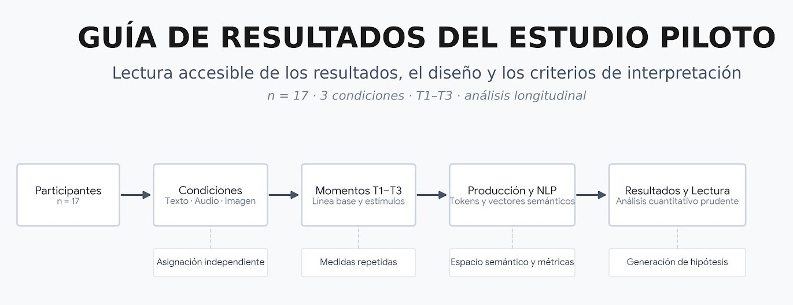

# GUÍA DE RESULTADOS DEL ESTUDIO PILOTO

**Lectura accesible de los resultados, el diseño y los criterios de interpretación**

## 1. Resumen en una página

### Diseño del estudio

El estudio piloto incluyó **17 participantes**, quienes produjeron un texto sobre una misma escena —una persona sola en una habitación— en tres momentos de escritura:

| Momento | Estímulo previo a la escritura            |
| ------- | ----------------------------------------- |
| **T1**  | Sin estímulo; escritura libre             |
| **T2**  | Un estímulo                               |
| **T3**  | Los tres estímulos: texto, audio e imagen |

Desde el inicio, cada participante perteneció a una de tres condiciones:

* **Texto:** 6 participantes
* **Audio:** 6 participantes
* **Imagen:** 5 participantes

Cada participante realizó las tres tareas de escritura, por lo que el conjunto piloto comprende **51 observaciones**.

### Qué se midió

La medida principal utilizada en este informe es el **número de palabras producido en cada texto**, identificado en el análisis como `n_palabras_calculado`.

En el archivo de captura del piloto, la variable original de número de palabras no contiene valores utilizables. Por ello, el conteo se obtiene directamente del texto mediante un procedimiento computacional. Las demás medidas previstas por el pipeline —como diversidad léxica, similitud semántica y análisis temático— se mantienen fuera de este resumen porque el procesamiento disponible para la cohorte piloto no produjo resultados utilizables para esas variables.

### Qué muestran los resultados

Los valores descriptivos para T1 y T3 son:

| Condición | Palabras en T1 | Palabras en T3 | Cambio T3 − T1 |
| --------- | -------------: | -------------: | -------------: |
| Texto     |            144 |            117 |        **−27** |
| Audio     |            134 |            217 |        **+83** |
| Imagen    |             98 |            111 |        **+13** |

La diferencia general entre las condiciones no alcanza significación estadística (`p = 0,218`), y tampoco se observa un efecto general del tiempo (`p = 0,177`). En cambio, la interacción entre **condición y tiempo** sí resulta estadísticamente significativa (`p = 0,016`), lo que indica que la evolución de la producción escrita no siguió el mismo patrón en las tres condiciones.

Los contrastes entre momentos, ajustados mediante **Holm**, muestran un único contraste que conserva significación estadística: **Audio, T1–T3**, con una diferencia estimada de `−83,2` cuando el contraste se expresa como **T1 − T3** (`p = 0,0013`). Expresado en la dirección temporal, esto corresponde a un **aumento aproximado de 83 palabras de T1 a T3** en la condición Audio.

### Cómo debe interpretarse este resultado

El resultado principal del piloto es, por tanto, que **el patrón de cambio en el número de palabras difiere entre las tres condiciones**, con un incremento particularmente marcado en la condición Audio entre T1 y T3.

Este hallazgo debe considerarse **exploratorio**. El grupo Audio está compuesto por seis participantes y el análisis involucra varias comparaciones, por lo que el resultado no permite concluir que la exposición a audio, por sí misma, mejore la escritura.

Del mismo modo, este piloto no proporciona evidencia suficiente para afirmar cambios en la diversidad del vocabulario, las emociones, la organización temática o la similitud semántica, ya que esos análisis no produjeron resultados utilizables para esta cohorte.

### Lectura recomendada del resultado

Una formulación adecuada para describir el hallazgo es:

> En la cohorte piloto, el cambio en la producción de palabras a lo largo de T1–T3 difirió entre las condiciones. El contraste que permaneció significativo después del ajuste de Holm correspondió a la condición Audio entre T1 y T3, donde se observó un aumento aproximado de 83 palabras.

Este resultado **no debe interpretarse como evidencia de que escuchar audio mejora la escritura**, sino como un patrón observado en una muestra piloto pequeña que requiere evaluación en análisis posteriores.

## 2. Cómo leer los principales términos del análisis

Esta sección explica, sin requerir conocimientos previos de NLP o estadística, los términos que aparecen con mayor frecuencia en los resultados del estudio.

### `n_palabras_calculado`

Es el número de palabras de cada texto, obtenido automáticamente a partir de su contenido. En el piloto, la columna original de conteo de palabras del archivo de captura no contiene valores utilizables, por lo que el análisis utiliza este conteo calculado.

Cuando en este informe se habla de **número de palabras**, se hace referencia a `n_palabras_calculado`.

### Embedding o vector de 384 dimensiones

Un **embedding** es una representación numérica de un texto. En este estudio, cada texto se transforma en un vector de **384 valores numéricos** que resume determinados patrones semánticos aprendidos por el modelo.

La idea fundamental es que textos con representaciones semánticas similares tienden a aparecer más próximos entre sí en este espacio numérico. El embedding no constituye una interpretación clínica ni una traducción directa del contenido: es una representación matemática utilizada para comparar textos.

Dos medidas de distancia utilizadas para estas comparaciones son:

* **Similitud de coseno:** indica qué tan próximas son dos representaciones en dirección. Valores más altos indican mayor similitud; un valor cercano a 1 representa una gran proximidad.
* **Distancia euclidiana:** representa la separación entre dos puntos en el espacio numérico. Un valor de 0 indica que ambos vectores ocupan exactamente la misma posición.

Estas medidas permiten comparar textos entre momentos o entre participantes sin depender exclusivamente del número de palabras que contienen.

### Prototipo semántico

Un **prototipo semántico** es un punto de referencia construido para representar un concepto determinado.

En el procedimiento utilizado se definieron **20 conceptos** —por ejemplo, soledad, espera, tristeza, esperanza y miedo— y se utilizaron **cinco frases representativas por concepto**. A partir de esas frases se obtiene una representación numérica del concepto.

Posteriormente, cada texto puede compararse con esos prototipos para estimar su proximidad semántica a cada concepto. En términos sencillos, el procedimiento permite preguntar:

> **¿A qué conceptos se parece más el contenido de este texto?**

Para la cohorte piloto, los archivos disponibles no contienen resultados utilizables de esta etapa. Los resultados de prototipos disponibles corresponden al análisis combinado de las cohortes y, por tanto, **no deben atribuirse directamente al piloto**. Este componente queda identificado como un análisis pendiente de verificación y eventual reprocesamiento específico de la cohorte piloto.

### Modelo mixto

El **modelo mixto** se utiliza porque cada participante produce tres textos. Estas tres observaciones de una misma persona están relacionadas entre sí y no deben tratarse como si provinieran de personas completamente independientes.

El modelo permite distinguir entre:

* diferencias sistemáticas entre participantes, y
* cambios asociados con la condición experimental y el momento de medición.

Una forma sencilla de entenderlo es que el modelo reconoce que algunas personas escriben habitualmente más que otras, independientemente de la condición experimental.

En el piloto, el modelo presenta:

* **R² marginal = 0,21:** proporción de variación explicada por los efectos fijos incluidos en el modelo, como condición y tiempo.
* **R² condicional = 0,80:** proporción de variación explicada por el conjunto del modelo, incluyendo los efectos fijos y las diferencias asociadas con los participantes.

La diferencia entre ambos valores indica que una parte importante de la variación observada en el número de palabras está asociada con **diferencias entre las personas**, además de los factores experimentales incluidos en el modelo.

### `p` y corrección de Holm

El valor **p** indica qué tan compatibles son los datos observados con la hipótesis estadística de referencia, que normalmente supone ausencia de un efecto o diferencia bajo el modelo utilizado.

Un valor pequeño de `p` indica que los datos observados serían poco compatibles con esa hipótesis de referencia. El umbral convencional de `p < 0,05` se utiliza frecuentemente como criterio de significación estadística, aunque no constituye por sí mismo una medida de importancia práctica ni demuestra una relación causal.

En este estudio se realizan varias comparaciones. Cuando se hacen muchas pruebas, aumenta la posibilidad de obtener algún resultado aparentemente significativo simplemente por el número de pruebas realizadas. La **corrección de Holm** ajusta los valores de p para controlar este problema en el conjunto de comparaciones.

Por ello, en este informe debe distinguirse entre:

* **p sin ajustar**, correspondiente a una prueba individual;
* **p ajustada por Holm**, utilizada para interpretar el conjunto de contrastes múltiples.

Cuando un resultado deja de alcanzar el umbral después del ajuste, se reporta como no significativo, aunque su valor sin ajustar pueda parecer pequeño.

---

## 3. Los resultados del piloto, uno por uno

Los resultados que se presentan a continuación corresponden a la cohorte piloto (`n = 17`, `51 observaciones`). Las tablas y modelos de referencia se encuentran en `results/piloto/` y los análisis que comparan ambas cohortes en `results/combinado/`.

### 3.1 ¿Las tres condiciones presentan diferencias generales en el número de palabras?

El efecto principal de la condición no alcanza significación estadística:

`condicion`: F(2,14) = 1,70 · **p = 0,218**.

Esto indica que, considerando conjuntamente los tres momentos de medición, los datos del piloto no muestran evidencia suficiente de una diferencia general en el número de palabras entre Texto, Audio e Imagen.

Las medias descriptivas no deben interpretarse por sí solas como evidencia de una diferencia entre condiciones, especialmente en una muestra pequeña.

### 3.2 ¿El número de palabras cambia con el tiempo?

El efecto general del tiempo tampoco alcanza significación estadística:

`tiempo`: F(2,28) = 1,84 · **p = 0,177**.

Por tanto, el piloto no proporciona evidencia de un cambio uniforme en el número de palabras entre T1, T2 y T3, independientemente de la condición.

Este resultado no contradice los cambios observados dentro de una condición concreta. Una condición puede mostrar una variación importante mientras el efecto promedio del tiempo, considerando conjuntamente las tres condiciones, permanece sin significación.

### 3.3 ¿El patrón de cambio depende de la condición?

Sí. La interacción entre condición y tiempo es estadísticamente significativa:

`condicion × tiempo`: F(4,28) = **3,64** · **p = 0,016**.

La interacción indica que **las tres condiciones no siguen el mismo patrón de cambio entre T1, T2 y T3**. En otras palabras, la evolución de la producción escrita depende de la condición en la que se encuentra el participante.

Este es el resultado principal del modelo del piloto. No significa que una condición sea globalmente superior a otra, sino que las trayectorias observadas a lo largo del tiempo son diferentes.

### 3.4 ¿Dónde se localiza esa diferencia?

Para identificar qué cambios concretos contribuyen a la interacción, se examinan los contrastes entre momentos dentro de cada condición. Los valores de `p` se presentan con corrección de Holm.

| Comparación        | Diferencia estimada | p corregida |
| ------------------ | ------------------: | ----------: |
| **Audio: T3 − T1** |  **+83,2 palabras** |  **0,0013** |
| Audio: T2 − T1     |      +38,5 palabras |       0,082 |
| Audio: T3 − T2     |      +44,7 palabras |       0,082 |
| Texto: T2 − T1     |      −26,8 palabras |        0,61 |
| Texto: T3 − T1     |      −27,2 palabras |        0,61 |
| Texto: T3 − T2     |       −0,3 palabras |        0,99 |
| Imagen: T2 − T1    |       +5,4 palabras |        1,00 |
| Imagen: T3 − T1    |      +12,8 palabras |        1,00 |
| Imagen: T3 − T2    |       +7,4 palabras |        1,00 |

El único contraste que permanece significativo después del ajuste de Holm es **Audio entre T1 y T3**, con un incremento estimado de aproximadamente **83 palabras**.

Es importante expresar la dirección del efecto de forma consistente: cuando el contraste se presenta como `T3 − T1`, el resultado es **+83,2**; algunas tablas del pipeline pueden presentar el mismo contraste en la dirección inversa (`T1 − T3`), en cuyo caso aparece como `−83,2`.

La evidencia del piloto, por tanto, corresponde a un cambio concentrado entre T1 y T3 en la condición Audio. No se observa un patrón estadísticamente significativo en los cambios intermedios T1–T2 o T2–T3, ni en los contrastes equivalentes de Texto e Imagen.

### 3.5 ¿El patrón del piloto se reproduce en la cohorte principal?

El piloto y la cohorte principal deben compararse como **muestras independientes**, no como dos mediciones de las mismas personas.

| Efecto             | Piloto (`n = 17`) | Principal (`n = 23`) |
| ------------------ | ----------------: | -------------------: |
| Condición          |         p = 0,218 |            p = 0,559 |
| Tiempo             |         p = 0,177 |  **p = 7,24 × 10⁻⁸** |
| Condición × Tiempo |     **p = 0,016** |            p = 0,989 |

Los patrones son diferentes. En el piloto, la evidencia principal se concentra en la **interacción entre condición y tiempo**. En la cohorte principal, en cambio, el efecto principal corresponde al **tiempo**, mientras que la interacción condición × tiempo no resulta significativa.

La comparación formal entre cohortes también muestra que el nivel general de producción de palabras no difiere de manera apreciable entre ellas (`fuente`: **p = 0,94**), mientras que el patrón de cambio temporal sí difiere (`fuente × tiempo`: F = **6,85**, p = **0,002**).

Estos resultados no deben interpretarse como una predicción del piloto sobre el estudio principal. Las cohortes están formadas por personas diferentes y tienen tamaños reducidos, por lo que la comparación se presenta como evidencia **exploratoria sobre la consistencia o discrepancia de los patrones observados**.

### 3.6 ¿Qué indican los diagnósticos del modelo?

Los archivos de diagnóstico del piloto contienen, para las **51 observaciones**, los valores observados, los valores estimados por el modelo y los residuos correspondientes.

Estos materiales permiten evaluar cómo se comporta el modelo respecto de los datos utilizados para ajustarlo. En este contexto, su función principal es **descriptiva y diagnóstica**.

El ajuste no debe interpretarse como evidencia de capacidad predictiva sobre participantes o textos nuevos. El piloto fue diseñado como una muestra exploratoria y, con **17 participantes**, no proporciona una base suficiente para presentar el modelo como un sistema de predicción generalizable.

---

## 4. Estado de los datos y procedencia de los resultados

Los resultados del estudio piloto se derivan de una secuencia de archivos de origen, transformación y análisis. Cada etapa cumple una función distinta y permite rastrear el origen de las medidas utilizadas en los modelos.

| Material                                             | Descripción                                                                                                                                                                                 |            Dimensión |
| ---------------------------------------------------- | ------------------------------------------------------------------------------------------------------------------------------------------------------------------------------------------- | -------------------: |
| `data/raw/`                                          | Archivos de captura y materiales de entrada utilizados para la preparación del estudio. Los archivos con información individual no forman parte de la distribución pública del repositorio. |                    — |
| `data/processed/piloto/`                             | Datos procesados de la cohorte piloto y artefactos derivados utilizados en las etapas analíticas.                                                                                           |                    — |
| `data/processed/piloto/embeddings_piloto_t1..t3.rds` | Representaciones numéricas de los textos obtenidas para cada momento de medición. Cada texto está representado mediante un vector de 384 dimensiones.                                       | 17 × 384 por momento |
| `results/piloto/`                                    | Informes, tablas y demás resultados específicos de la cohorte piloto.                                                                                                                       |                    — |
| `results/combinado/`                                 | Materiales destinados a comparaciones entre la cohorte piloto y la cohorte principal.                                                                                                       |                    — |

El conjunto piloto comprende **17 participantes y 51 observaciones**, correspondientes a tres momentos de escritura por participante.

La variable `n_palabras_calculado` se obtiene directamente del contenido textual y constituye la medida principal utilizada en los resultados presentados en este informe.

Los archivos de captura originales y los materiales que contienen texto individual se mantienen fuera de la distribución del repositorio. Los resultados publicados corresponden, en cambio, a productos agregados o derivados que permiten documentar el análisis sin reproducir el corpus individual.

### Consideraciones sobre la procedencia

La estructura de archivos permite distinguir entre:

>**material de origen → datos procesados → modelos → tablas y figuras de resultados.**

Esta separación facilita la trazabilidad de las cifras presentadas y evita confundir los archivos utilizados durante la preparación del estudio con los materiales destinados a documentar sus resultados.
