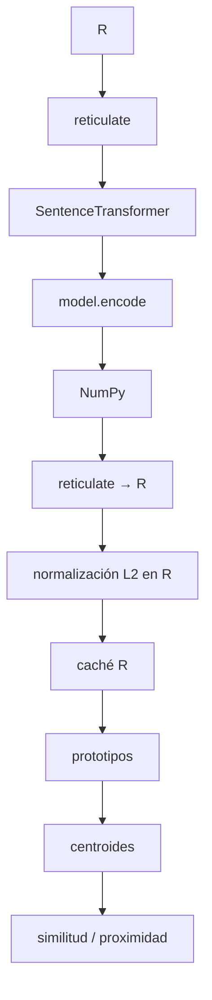
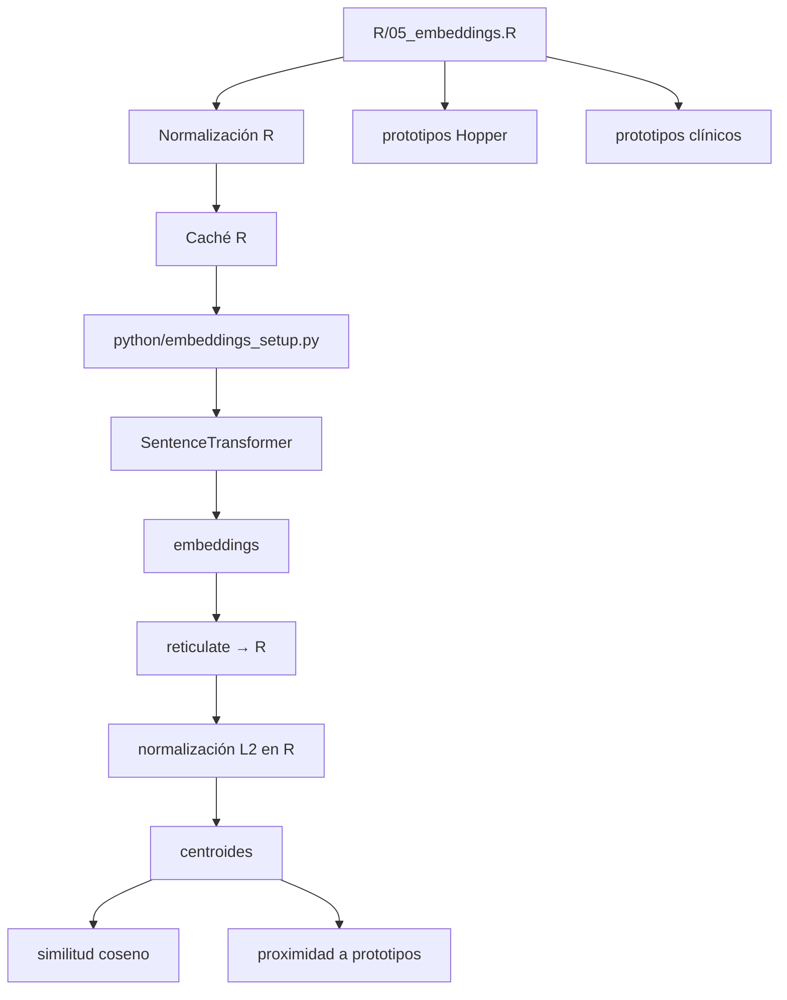
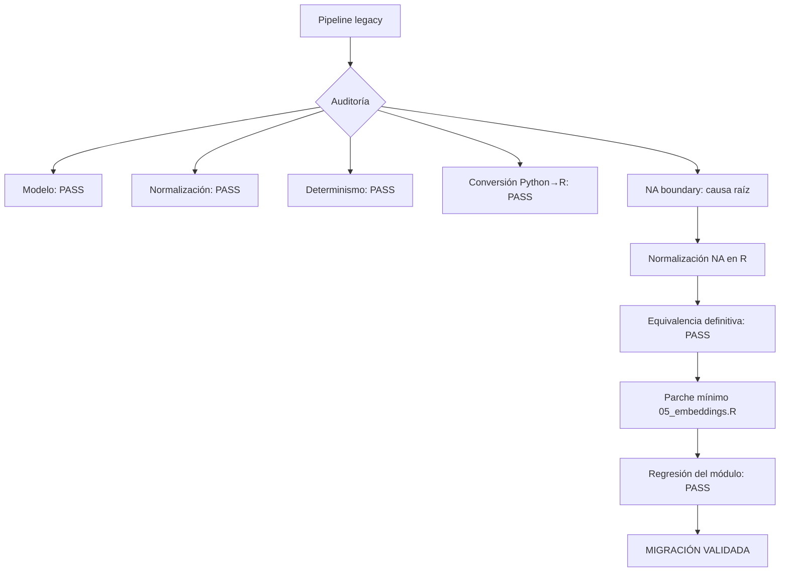

# Auditoría de equivalencia de embeddings

## Experimento NLP — Migración R/reticulate → Python/Sentence Transformers

**Fecha de cierre:** 2026-09-07  
**Repositorio:** `experimento-nlp`  
**Modelo:** `paraphrase-multilingual-MiniLM-L12-v2`  
**Dimensión:** 384  
**Backend:** Sentence Transformers / PyTorch CPU

---

## 1. Propósito de la auditoría

Este documento registra la migración de la infraestructura de generación de embeddings del pipeline experimental de NLP.

El objetivo fue sustituir la implementación anterior, en la que R controlaba directamente `SentenceTransformer` mediante `reticulate` y `py_run_string()`, por una arquitectura donde la inferencia queda encapsulada en un módulo Python estable:

```text
python/embeddings_setup.py
```

La condición de aceptación no era simplemente que el nuevo código "funcionara", sino que conservara el comportamiento científico del pipeline anterior.

La auditoría tuvo tres objetivos:

1. demostrar que el modelo y el entorno Python funcionan de forma determinista;
2. demostrar que la normalización utilizada por el nuevo módulo es compatible con la utilizada por el pipeline legacy;
3. demostrar que la migración R → Python conserva los embeddings dentro de una tolerancia numérica aceptable y, posteriormente, que `R/05_embeddings.R` mantiene sus funciones analíticas.

---

# 2. Arquitectura inicial y arquitectura final

## 2.1. Arquitectura legacy

La implementación original mantenía la carga del modelo y la inferencia dentro de R mediante `reticulate`.



El comportamiento relevante del pipeline legacy era:

```text
texto
  ↓
SentenceTransformer.encode(normalize_embeddings=False)
  ↓
matriz de embeddings
  ↓
conversión Python → R
  ↓
normalización L2 en R
```

Además, antes de generar embeddings, R transformaba los valores ausentes o vacíos en:

```text
"[VACÍO]"
```

mediante:

```r
textos <- as.character(textos)
textos[
  is.na(textos) |
    trimws(textos) == ""
] <- "[VACÍO]"
```

---

## 2.2. Arquitectura final

La infraestructura se separó en dos responsabilidades claramente delimitadas.



### Responsabilidad de Python

`python/embeddings_setup.py` concentra:

- carga del modelo;
- selección de dispositivo (`cpu`/`cuda`);
- generación de embeddings;
- validación dimensional;
- validación de valores finitos;
- normalización opcional;
- metadatos del entorno.

### Responsabilidad de R

`R/05_embeddings.R` conserva:

- normalización de entradas R;
- transformación de `NA` y cadenas vacías a `"[VACÍO]"`;
- caché;
- orquestación analítica;
- prototipos Hopper;
- prototipos clínicos;
- construcción de centroides;
- similitud coseno;
- proximidad a prototipos.

Esto evita trasladar contenido científico del análisis a Python.

---

# 3. Entorno validado

| Componente | Versión / configuración |
|---|---|
| R | 4.6.1 |
| reticulate | 1.46.0 |
| Python | 3.11.8 |
| Python ejecutable | `C:/venvs/renv311/Scripts/python.exe` |
| Sentence Transformers | 5.6.1 |
| PyTorch | 2.11.0+cpu |
| NumPy | 1.23.5 |
| Modelo | `paraphrase-multilingual-MiniLM-L12-v2` |
| Dimensión | 384 |
| Device | CPU |

Durante las pruebas apareció repetidamente el warning:

```text
You are sending unauthenticated requests to the HF Hub.
Please set a HF_TOKEN to enable higher rate limits and faster downloads.
```

Este warning no produjo ningún error de ejecución. El modelo cargó correctamente y todas las pruebas de determinismo y equivalencia relacionadas con el modelo fueron satisfactorias. El warning corresponde a autenticación/rate limiting del Hugging Face Hub y no fue la causa de la discrepancia investigada.

---

# 4. Evidencia y secuencia de pruebas

La auditoría se realizó incrementalmente. Cada prueba aisló una hipótesis diferente antes de modificar producción.


---

# 5. Prueba 1 — módulo Python operativo

### Archivo

```text
python/embeddings_setup.py
```

### Objetivo

Comprobar que el modelo, el entorno Python y la función `encode_texts()` funcionan independientemente de R.

### Prueba ejecutada

El módulo se ejecutó directamente como script y generó embeddings para:

```python
[
    "Me siento aislado y desconectado.",
    "Tengo esperanza de que las cosas mejoren.",
    "",
    None,
]
```

### Resultado

```text
model_name: paraphrase-multilingual-MiniLM-L12-v2
embedding_dim: 384
sentence_transformers_version: 5.6.1
torch_version: 2.11.0+cpu
numpy_version: 1.23.5
python_version: 3.11.8
device: cpu
shape: (4, 384)
dtype: float64
normas: [1. 1. 1. 1.]
PASS — módulo de embeddings operativo.
```

### Conclusión

**PASS.** La implementación Python es funcional y devuelve matrices de dimensión `n × 384` con normalización L2 válida cuando se solicita.

---

# 6. Prueba 2 — puente R → reticulate → Python → R

### Archivo

```text
R/test_embeddings_reticulate.R
```

### Objetivo

Verificar la interoperabilidad básica del nuevo módulo con R.

### Escenarios probados

1. texto único;
2. textos vacíos y `NA`;
3. múltiples textos;
4. integridad numérica.

### Resultados

```text
TEST 1 normal text:
Dimensión: 1 x 384
Norma L2: 0.999999974909
PASS

TEST 2 empty/NA:
3 x 384
Normas 1 1 1
PASS

TEST 3 multiple texts:
5 x 384
Normas 1 1 1 1 1
PASS

TEST 4 numerical integrity:
nonfinite 0
min -0.2220026
max 0.15718207
PASS

FINAL:
PASS — puente R → reticulate → Python → R validado.
```

### Conclusión

**PASS.** La interfaz básica funciona y conserva una matriz de embeddings numéricamente válida.

Sin embargo, este test no demostraba todavía equivalencia con el pipeline legacy.

---

# 7. Prueba 3 — equivalencia de normalización

### Archivo

```text
python/test_embedding_normalization_equivalence.py
```

### Hipótesis

Podía existir una diferencia entre:

```text
A = encode(normalize_embeddings=False) + normalización posterior
```

y:

```text
B = encode(normalize_embeddings=True)
```

### Diseño

Se generaron embeddings de los mismos nueve textos con ambos métodos y se compararon:

- diferencia absoluta máxima;
- diferencia absoluta media;
- RMSE;
- coseno entre vectores.

### Resultado

```text
Dimensión A: (9, 384)
Dimensión B: (9, 384)
Diferencia absoluta máxima: 2.115878305897e-08
Diferencia absoluta media: 1.316036727926e-09
RMSE: 2.095252633116e-09
Coseno mínimo: 1.000000000000
Coseno máximo: 1.000000000000
PASS — normalización posterior e interna son equivalentes.
```

### Conclusión

**PASS.** La estrategia de normalización no explicaba la discrepancia observada posteriormente.

---

# 8. Prueba 4 — determinismo entre dos instancias Python

### Archivo

```text
python/test_embeddings_two_instances.py
```

### Hipótesis

La discrepancia podía deberse a diferencias entre dos instancias de `SentenceTransformer`.

### Resultado

```text
Dimensión A: (9, 384)
Dimensión B: (9, 384)
Diferencia absoluta máxima: 0
Diferencia absoluta media: 0
RMSE: 0
Coseno mínimo: 1.000000000000
Coseno máximo: 1.000000000000
PASS — ambas instancias producen embeddings equivalentes.
```

### Conclusión

**PASS.** El modelo fue determinista en el entorno auditado. No había evidencia de que la carga del modelo o una segunda instancia estuviera introduciendo la discrepancia.

---

# 9. Prueba 5 — diagnóstico de la frontera Python → R

### Archivo

```text
R/test_embeddings_boundary.R
```

### Objetivo

Separar dos posibles problemas:

1. corrupción o alteración al convertir una matriz Python en R;
2. diferencia producida específicamente al invocar `encode_texts()` desde R.

### Resultado clave 1 — conversión Python → R

La matriz generada directamente en Python y posteriormente convertida a R mostró:

```text
Máxima diferencia: 5.551115e-17
Diferencia media: 8.795261e-19
RMSE: 3.541478e-18
```

Esto es numéricamente despreciable.

### Resultado clave 2 — llamada al wrapper

En cambio:

```text
Python normalized vs encode_texts()
Máxima diferencia: 2.150825e-01
Diferencia media: 4.139169e-03
RMSE: 1.587444e-02
Coseno mínimo: 0.564547754863987
```

### Conclusión

La conversión general de una matriz Python a R **no era el problema**. La discrepancia aparecía específicamente al entregar los datos R a `encode_texts()`.

Esto redujo la búsqueda a la representación de los argumentos R → Python.

---

# 10. Prueba 6 — aislamiento de `NA`

### Archivo

```text
R/test_na_boundary.R
```

### Diseño

Se compararon dos vectores:

```r
A <- c("[VACÍO]", "[VACÍO]")
```

frente a:

```r
B <- c("", NA_character_)
```

### Evidencia decisiva

Python recibió:

```text
--- PYTHON: A ---
1 '[VACÍO]' <class 'str'>
2 '[VACÍO]' <class 'str'>

--- PYTHON: B ---
1 '' <class 'str'>
2 'NA' <class 'str'>
```

Por tanto, `reticulate` estaba convirtiendo:

```r
NA_character_
```

en:

```python
"NA"
```

y no en `None`.

### Efecto sobre la función

El wrapper tenía lógica para:

```python
None
""
"   ""
```

pero no podía detectar que el string Python `"NA"` procedía de un `NA` de R.

En consecuencia, Sentence Transformers estaba calculando el embedding de la palabra literal:

```text
"NA"
```

en lugar de:

```text
"[VACÍO]"
```

### Evidencia numérica

```text
A[1] vs A[2]: 1
B[1] vs B[2]: 0.5645478
A[1] vs B[1]: 1
A[2] vs B[2]: 0.5645478
A[2] vs B[1]: 1
A[1] vs B[2]: 0.5645478
```

La discrepancia completa quedó explicada por una única representación incorrecta del valor ausente.

### Conclusión

**CAUSA RAÍZ IDENTIFICADA.**

No era:

- el modelo;
- Sentence Transformers;
- la normalización;
- PyTorch;
- NumPy;
- la conversión general de matrices;
- el determinismo del modelo.

Era la representación de `NA_character_` en la frontera R → Python.

---

# 11. Prueba 7 — equivalencia definitiva

### Archivo

```text
R/test_embeddings_equivalence_final.R
```

### Objetivo

Comparar el pipeline legacy y el nuevo después de aplicar correctamente la normalización de `NA` en R.

### Pipeline legacy

```text
textos normalizados en R
    ↓
NA / vacío → "[VACÍO]"
    ↓
model.encode(normalize_embeddings=False)
    ↓
Python → R
    ↓
normalización L2 en R
```

### Pipeline nuevo auditado

```text
textos normalizados en R
    ↓
NA / vacío → "[VACÍO]"
    ↓
encode_texts(...)
    ↓
Python → R
    ↓
normalización L2
```

### Datos fijos utilizados

```text
1. Me siento solo y aislado de los demás.
2. Tengo esperanza de que las cosas mejoren.
3. La incertidumbre me impide avanzar.
4. Busco maneras de enfrentar las dificultades.
5. No logro comunicarme con los demás.
6. La tristeza y el dolor me acompañan constantemente.
7. Tengo control sobre mis decisiones.
8. ""
9. NA_character_
```

Después de la normalización R, las posiciones 8 y 9 fueron ambas:

```text
"[VACÍO]"
```

### Resultado final

```text
Dimensión legacy: 9 x 384
Dimensión nueva: 9 x 384

Diferencia absoluta máxima: 8.469452472681382e-09
Diferencia absoluta media: 1.023780383187243e-09
RMSE: 1.568188326389676e-09

Coseno mínimo: 1.000000000000000
Coseno máximo: 1.000000000000000
```

### Criterios aceptados

```text
max_abs <= 1e-7       PASS
mean_abs <= 1e-8      PASS
RMSE <= 1e-8          PASS
coseno >= 1 - 1e-9    PASS
```

### Conclusión

**PASS — equivalencia numérica validada.**

La diferencia residual es del orden de `10^-9`, compatible con diferencias de precisión flotante y sin diferencia relevante en la dirección de los vectores, dado que el coseno mínimo fue `1.0` para todas las filas.

La migración Python conserva el comportamiento científico del pipeline legacy dentro de una tolerancia explícita y documentada.

---

# 12. Decisión de implementación

La solución adoptada fue deliberadamente mínima.

## Se modificó `R/05_embeddings.R`

La función `obtener_embeddings()` ahora:

1. convierte la entrada a `character` en R;
2. convierte `NA` y cadenas vacías a `"[VACÍO]"` antes de llamar a Python;
3. conserva la caché R;
4. delega la generación de embeddings a `encode_texts()`;
5. conserva la normalización L2 en R para reproducir fielmente el pipeline legacy.

## No se modificó el contenido científico

Se conservaron sin cambios:

- `prototipos_hopper`;
- `prototipos_clinicos`;
- `prototipos`;
- sus frases originales;
- construcción de centroides;
- similitud coseno;
- proximidad a prototipos.

## No se introdujo una segunda infraestructura de embeddings para el piloto

El piloto debe consumir la misma infraestructura:

```text
python/embeddings_setup.py
        ↑
R/05_embeddings.R
        ↑
principal / piloto
```

Esto evita divergencias entre versiones del modelo o del procesamiento de texto.

---

# 13. Prueba 8 — regresión de `05_embeddings.R`

### Archivo

```text
R/test_05_embeddings_regression.R
```

### Objetivo

Comprobar que la modificación no rompió ninguna responsabilidad funcional del módulo.

### Funciones verificadas

```text
obtener_embeddings             PASS
construir_centroide             PASS
calcular_similitud_coseno       PASS
calcular_proximidad_prototipos  PASS
```

### Prototipos

```text
Hopper:    10 conceptos
Clínicos:  10 conceptos
Total:     20 conceptos
```

Cada concepto mantiene cinco frases prototípicas.

### Embeddings básicos

```text
Dimensión: 5 x 384
Norma mínima: 1.000000000000000
Norma máxima: 1.000000000000000
PASS
```

### NA / vacío

```text
Coseno '' vs NA: 0.999999999999951
PASS — '' y NA tienen representación idéntica.
```

### Caché

```text
Diferencia entre llamadas: 0.000000000000000e+00
PASS — caché estable.
```

### Centroide

```text
Dimensión: 384
Norma: 1.000000000000000
PASS — centroide válido.
```

### Proximidad a prototipos

Se verificó una matriz `3 × 2` con valores finitos y dentro de `[-1, 1]`:

```text
    soledad  tristeza
1  0.8657388 0.4784616
2  0.2130289 0.2697065
3  0.4215549 0.4721709
```

### Similitud coseno

```text
Similitud idéntica: 1.000000000000000
PASS
```

### Resultado

```text
PASS — REGRESIÓN DE 05_embeddings.R COMPLETADA.
```

---

# 14. Estado final de la migración



### Matriz de evidencia

| Área | Evidencia | Resultado |
|---|---|---|
| Modelo Python | ejecución directa | PASS |
| Dimensión | 384 | PASS |
| Normalización | test Python | PASS |
| Determinismo | dos instancias | PASS |
| R ↔ Python | test reticulate | PASS |
| Python → R | test de frontera | PASS |
| `NA_character_` | test específico | **CAUSA RAÍZ** |
| Equivalencia legacy/nuevo | 9 textos, 384 dimensiones | **PASS** |
| Prototipos | 20 × 5 frases | PASS |
| Centroides | dimensión 384, norma 1 | PASS |
| Caché | diferencia 0 | PASS |
| Similitud coseno | identidad = 1 | PASS |
| Proximidad | valores válidos | PASS |
| Regresión módulo 05 | todas las funciones | **PASS** |

---

# 15. Archivos implicados en la auditoría

```text
experimento-nlp/
│
├── python/
│   ├── embeddings_setup.py
│   ├── test_embedding_normalization_equivalence.py
│   └── test_embeddings_two_instances.py
│
├── R/
│   ├── 05_embeddings.R
│   ├── test_embeddings_reticulate.R
│   ├── test_embeddings_equivalence.R
│   ├── test_embeddings_boundary.R
│   ├── test_encode_texts_input.R
│   ├── test_na_boundary.R
│   ├── test_embeddings_equivalence_final.R
│   └── test_05_embeddings_regression.R
│
└── docs/
    └── EMBEDDINGS_EQUIVALENCE_AUDIT.md
```

### Nota sobre tests exploratorios

No todos los tests fueron diseñados como tests permanentes de regresión. Algunos fueron diagnósticos temporales utilizados para aislar la causa raíz.

Los tests de mayor valor para conservar como evidencia automatizada son:

```text
python/test_embedding_normalization_equivalence.py
python/test_embeddings_two_instances.py
R/test_embeddings_reticulate.R
R/test_embeddings_equivalence_final.R
R/test_05_embeddings_regression.R
```

Los tests de frontera (`test_embeddings_boundary.R`, `test_encode_texts_input.R`, `test_na_boundary.R`) pueden conservarse como trazabilidad forense o moverse posteriormente a una carpeta `tests/diagnostic/`.

---

# 16. Consideraciones científicas

La migración no debe interpretarse como una reestimación del modelo ni como una modificación del espacio semántico.

La evidencia disponible demuestra que, para el conjunto de prueba utilizado:

- el modelo es el mismo;
- la dimensionalidad es la misma (`384`);
- los textos que llegan al modelo son equivalentes una vez corregida la representación de `NA`;
- la normalización produce vectores equivalentes dentro de error de precisión flotante;
- la dirección de los embeddings es coincidente (`coseno = 1.0` en la comparación final).

Por tanto, la migración es una **refactorización de infraestructura**, no un cambio conceptual del constructo semántico ni de las operaciones científicas posteriores.

---

# 17. Limitaciones de la equivalencia demostrada

La equivalencia demostrada es fuerte para el mecanismo de generación de embeddings y para los casos explícitamente probados, pero no sustituye una validación sobre el corpus completo.

La siguiente fase de validación debe comprobar:

1. igualdad de número y orden de textos en el corpus real;
2. ausencia de cambios de codificación o transformación de caracteres;
3. igualdad de las matrices generadas sobre el corpus completo, cuando exista un snapshot reproducible del pipeline legacy;
4. igualdad de resultados derivados de esas matrices en los análisis downstream;
5. estabilidad del comportamiento cuando cambien `batch_size`, longitud de texto y volumen de datos.

Estas comprobaciones son posteriores a la auditoría de infraestructura aquí documentada.

---

# 18. Regla de mantenimiento futura

Toda modificación de `python/embeddings_setup.py` o `R/05_embeddings.R` que pueda afectar la generación de embeddings deberá ejecutar como mínimo:

```powershell
& "C:\Program Files\R\R-4.6.1\bin\Rscript.exe" `
    ".\R\test_embeddings_equivalence_final.R"

& "C:\Program Files\R\R-4.6.1\bin\Rscript.exe" `
    ".\R\test_05_embeddings_regression.R"
```

La equivalencia numérica debe evaluarse con tolerancias explícitas y no mediante igualdad exacta de punto flotante.

---

# 19. Decisión final

**ESTADO: VALIDADO**

La infraestructura de embeddings ha sido migrada de la implementación R/reticulate inline a un módulo Python dedicado sin evidencia de alteración científicamente relevante en los embeddings.

La causa raíz encontrada —`NA_character_` convertido por `reticulate` al string Python `"NA"`— quedó corregida antes de cruzar la frontera R → Python.

El módulo `R/05_embeddings.R` supera la regresión funcional y conserva la arquitectura científica existente.

**Conclusión operativa:** la infraestructura de embeddings queda cerrada para esta fase y puede utilizarse como dependencia común tanto para el análisis principal como para el piloto.
