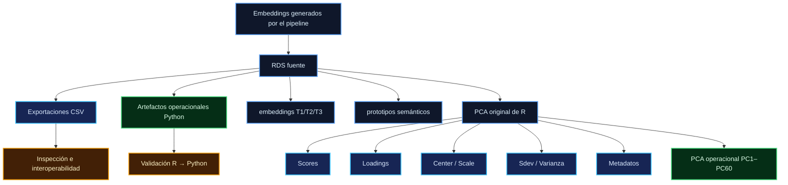
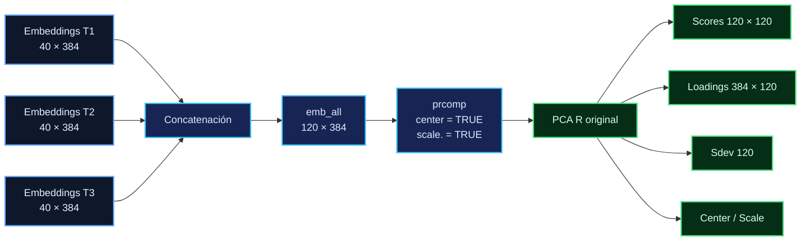
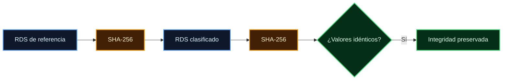
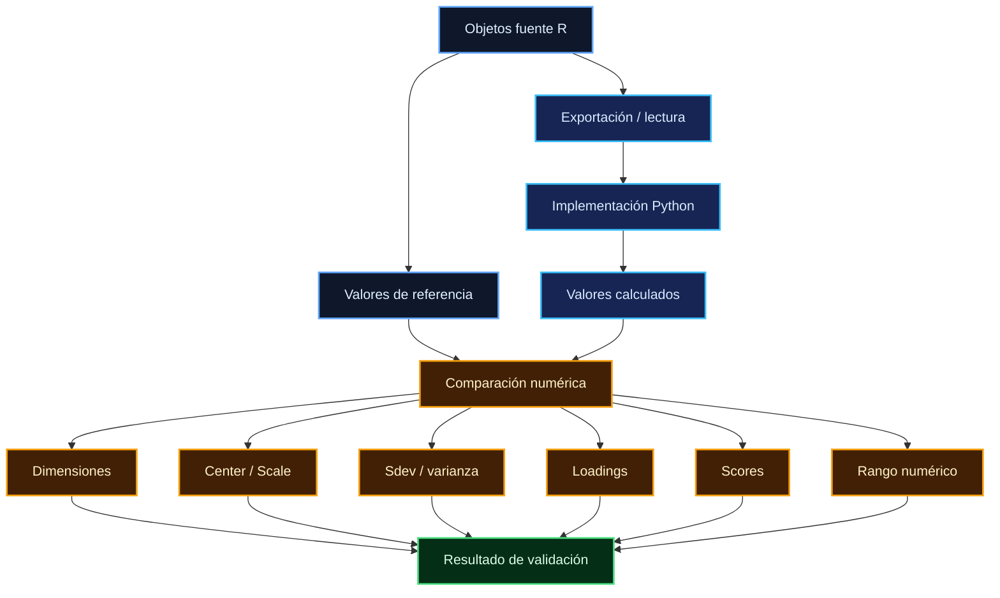
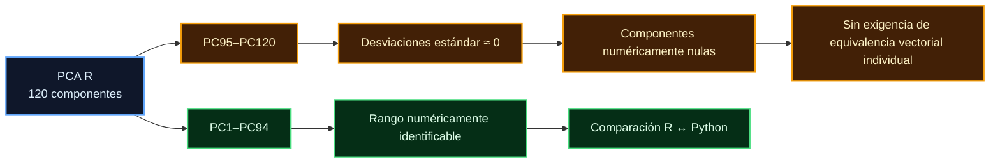
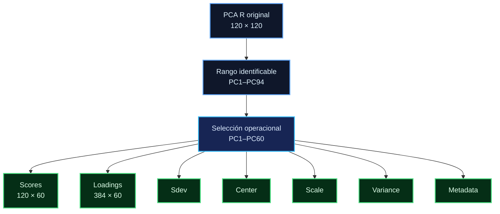
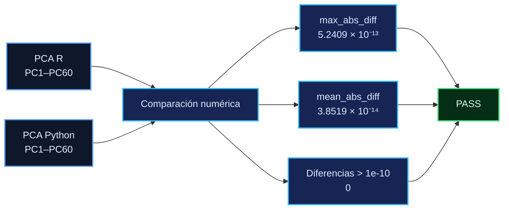
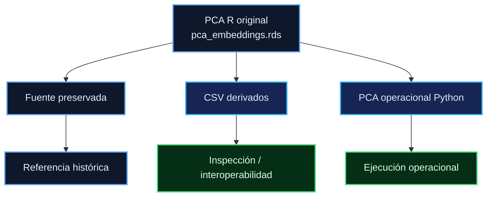
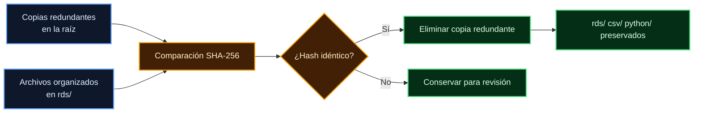
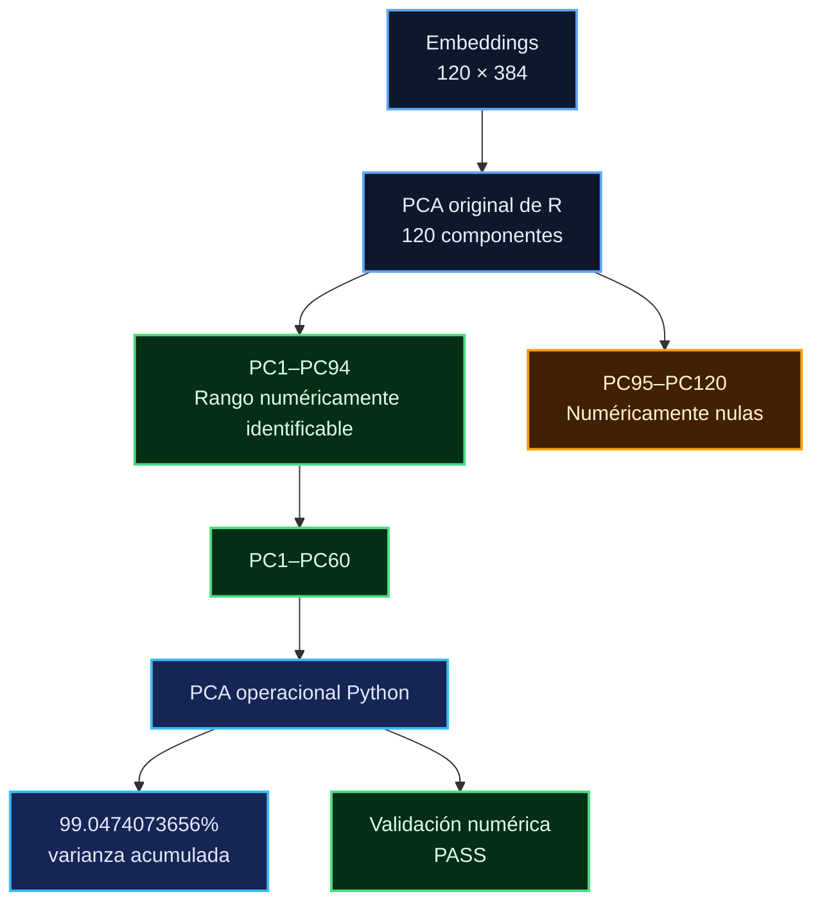

# Embeddings — organización, exportación y trazabilidad

**Proyecto:** Análisis NLP de textos en 3 tiempos
**Fecha de consolidación:** 2026-09-07
**Estado:** Migración R → Python validada

---

## 1. Propósito y alcance

Este directorio contiene los artefactos fuente, derivados y operacionales asociados a la generación de embeddings semánticos y al análisis de componentes principales (PCA) desarrollado en el pipeline NLP longitudinal.

La organización distingue explícitamente entre:

1. objetos fuente preservados en formato RDS;
2. representaciones tabulares derivadas en formato CSV;
3. artefactos operacionales utilizados por el componente Python.

El objetivo de esta estructura es preservar la procedencia del procesamiento original realizado en R, facilitar la inspección de los objetos analíticos y permitir una migración controlada hacia Python sin sustituir los artefactos fuente.

La validación documentada en este archivo evalúa la correspondencia numérica entre los objetos originales de R y sus representaciones derivadas u operacionales en Python.

---

## 2. Arquitectura de almacenamiento

La estructura consolidada del directorio es:

```text
data/
└── processed/
    └── embeddings/
        ├── rds/
        │   ├── embeddings/
        │   │   ├── embeddings_t1.rds
        │   │   ├── embeddings_t2.rds
        │   │   └── embeddings_t3.rds
        │   ├── semantic_prototypes/
        │   │   └── prototipos_semanticos.rds
        │   └── pca/
        │       └── pca_embeddings.rds
        │
        ├── csv/
        │   ├── embeddings/
        │   │   ├── embeddings_t1.csv
        │   │   ├── embeddings_t2.csv
        │   │   └── embeddings_t3.csv
        │   ├── semantic_prototypes/
        │   │   └── prototipos_semanticos.csv
        │   └── pca/
        │       ├── pca_embeddings_center.csv
        │       ├── pca_embeddings_loadings.csv
        │       ├── pca_embeddings_metadata.csv
        │       ├── pca_embeddings_scale.csv
        │       ├── pca_embeddings_scores.csv
        │       ├── pca_embeddings_sdev.csv
        │       └── pca_embeddings_var_exp.csv
        │
        └── python/
            └── pca/
                ├── pca_embeddings_pc60_scores.csv
                ├── pca_embeddings_pc60_loadings.csv
                ├── pca_embeddings_pc60_sdev.csv
                ├── pca_embeddings_pc60_center.csv
                ├── pca_embeddings_pc60_scale.csv
                ├── pca_embeddings_pc60_variance.csv
                └── metadata.json
```

La organización puede resumirse mediante el siguiente flujo de procedencia:



---

## 3. Embeddings originales

Se conservaron tres matrices de embeddings correspondientes a los tres momentos temporales del estudio:

```text
T1 = 40 × 384
T2 = 40 × 384
T3 = 40 × 384
```

Cada fila representa una observación y cada columna una dimensión de la representación vectorial.

Los objetos originales en formato RDS se encuentran en:

```text
rds/embeddings/
```

Las copias clasificadas fueron verificadas mediante SHA-256 antes de eliminar las copias redundantes que se encontraban directamente en la raíz de `data/processed/embeddings/`.

La reorganización, por tanto, no implicó modificación de los objetos RDS preservados.

---

## 4. Prototipos semánticos

El objeto:

```text
prototipos_semanticos.rds
```

contiene una matriz de:

```text
20 prototipos × 384 dimensiones
```

Los prototipos identificados son:

```text
soledad
espera
incomunicacion
objetos
emociones_negativas
luz_sombra
pasividad
desconexion
duda
espacio
tristeza
miedo
ansiedad_malestar
esperanza
confianza
agencia
control
incertidumbre
evitacion
afrontamiento
```

El objeto fuente se conserva en:

```text
rds/semantic_prototypes/prototipos_semanticos.rds
```

Su representación tabular correspondiente se encuentra en:

```text
csv/semantic_prototypes/prototipos_semanticos.csv
```

La relación entre objeto fuente y representación tabular es de tipo derivado: el CSV facilita inspección e interoperabilidad, mientras que el RDS constituye el artefacto fuente preservado.

---

## 5. PCA original de R

El análisis de componentes principales original se conserva íntegramente en:

```text
rds/pca/pca_embeddings.rds
```

El objeto contiene un objeto `prcomp` junto con los metadatos asociados.

Las dimensiones principales del objeto son:

```text
pca$x         = 120 × 120
pca$rotation  = 384 × 120
pca$sdev      = 120
pca$center    = 384
pca$scale     = 384
```

El conjunto de observaciones corresponde a:

```text
40 participantes
```

La diferencia entre las dimensiones completas del objeto PCA y su rango numéricamente identificable se desarrolla en las secciones posteriores.

---

## 6. Construcción del PCA

El PCA original se construyó mediante la concatenación de las matrices correspondientes a los tres momentos temporales:

```text
T1 = 40 × 384
T2 = 40 × 384
T3 = 40 × 384
```

produciendo:

```text
emb_all = 120 × 384
```

El orden de las observaciones es:

```text
1–40      → T1
41–80     → T2
81–120    → T3
```

El procedimiento original utiliza:

```r
prcomp(
    emb_all,
    center = TRUE,
    scale. = TRUE
)
```

La transformación de estandarización puede expresarse como:

$$
Z_{ij} = \frac{X_{ij}-\mu_j}{s_j}
$$

donde:

* \(X_{ij}\) es el valor original de la observación \(i\) en la dimensión \(j\);
* \(\mu_j\) corresponde al centro almacenado en `pca$center`;
* \(s_j\) corresponde a la escala almacenada en `pca$scale`.

La procedencia general del PCA puede representarse así:



---

## 7. Exportaciones del objeto PCA

Para facilitar la interoperabilidad, inspección y validación independiente, los componentes principales del objeto `prcomp` se exportaron individualmente.

### Scores

```text
pca_embeddings_scores.csv
```

Dimensiones:

```text
120 × 120
```

### Loadings / rotation

```text
pca_embeddings_loadings.csv
```

Dimensiones:

```text
384 × 120
```

### Desviaciones estándar

```text
pca_embeddings_sdev.csv
```

Dimensión:

```text
120
```

### Centro

```text
pca_embeddings_center.csv
```

Dimensión:

```text
384
```

### Escala

```text
pca_embeddings_scale.csv
```

Dimensión:

```text
384
```

### Varianza explicada

```text
pca_embeddings_var_exp.csv
```

Este archivo contiene la información de varianza explicada utilizada para caracterizar la solución PCA original.

### Metadatos

```text
pca_embeddings_metadata.csv
```

Los CSV anteriores son representaciones derivadas del objeto PCA fuente y no constituyen sustitutos del RDS original.

---

## 8. Integridad de los objetos RDS

Los cinco objetos RDS preservados fueron comparados con sus respectivos archivos de referencia mediante SHA-256.

El resultado fue:

```text
OK  embeddings_t1.rds
OK  embeddings_t2.rds
OK  embeddings_t3.rds
OK  prototipos_semanticos.rds
OK  pca_embeddings.rds
```

Para `embeddings_t1.rds`, por ejemplo, la comparación produjo el mismo valor SHA-256 para el archivo original y su copia clasificada:

```text
77C2483300A3B91197037E2F30770AAAD9A58037EB6B8748B0A66E9CF738150A
```

La correspondencia se resume como:



En consecuencia, los archivos clasificados constituyen las copias preservadas de los objetos R originales.

---

## 9. Validación de equivalencia R → Python

La validación automatizada se encuentra en:

```text
scripts/validation/validate_r_python_embeddings.py
```

El procedimiento evaluó, entre otros aspectos:

* dimensiones de T1, T2 y T3;
* correspondencia numérica de los embeddings;
* prototipos semánticos;
* dimensiones del PCA;
* reconstrucción de `emb_all`;
* parámetros `center` y `scale`;
* rango numérico;
* desviaciones estándar;
* varianza explicada;
* loadings;
* scores;
* componentes numéricamente nulos;
* funcionamiento operacional del PCA.

El resultado global documentado es:

```text
PASS — equivalencia R → Python validada
       para el rango numéricamente identificable PC1–PC94.
```

El flujo de validación es:



---

## 10. Rango numérico del PCA

La matriz estandarizada presenta un rango numéricamente identificable de:

```text
94 componentes
```

Por tanto:

```text
PC1–PC94
```

constituyen el rango numéricamente identificable de la matriz analizada.

A partir de:

```text
PC95–PC120
```

las desviaciones estándar son numéricamente próximas a cero.

El valor máximo observado entre dichas componentes fue aproximadamente:

```text
1.346 × 10⁻¹⁵
```

con una varianza relativa residual aproximada de:

```text
2.596 × 10⁻³²
```

Estas componentes se clasifican, para efectos de la validación numérica, como **componentes numéricamente nulas**.

Esta clasificación no implica que las componentes PC95–PC120 no existan como columnas del objeto `prcomp`; significa que, dadas las precisiones numéricas observadas, no proporcionan una dimensión identificable de forma estable.

La estructura puede visualizarse así:



Debido a la indeterminación numérica de una base dentro del espacio nulo, no se exige equivalencia vectorial individual entre R y Python para PC95–PC120.

---

## 11. Varianza explicada y selección operacional

Algunos puntos de referencia de la varianza acumulada son:

| Componentes | Varianza acumulada aproximada |
| ----------- | ----------------------------: |
| PC8         |                        50.86% |
| PC21        |                        78.72% |
| PC31        |                        89.52% |
| PC41        |                        95.00% |
| PC60        |                      99.0474% |
| PC94        |                       100.00% |

La representación operacional seleccionada conserva:

```text
PC1–PC60
```

que explican:

```text
99.0474073656%
```

de la varianza total.

La selección de PC60 constituye una **decisión operacional específica para este pipeline**. No debe interpretarse como una afirmación de optimalidad universal ni como un número de componentes necesariamente apropiado para modelos futuros, conjuntos de datos distintos o análisis con otros objetivos.

---

## 12. PCA operacional en Python

El artefacto operacional se encuentra en:

```text
python/pca/
```

y fue generado mediante:

```text
scripts/validation/build_operational_pca.py
```

La representación operacional conserva:

```text
scores:
120 × 60

loadings:
384 × 60
```

Además, se preservan:

```text
sdev
center
scale
variance
metadata
```

La PCA operacional utiliza los parámetros `center` y `scale` derivados del PCA original de R.

Para permitir una comparación numérica directa con la solución original, los signos de los componentes fueron alineados con la orientación de los `loadings` de R.

La relación entre la solución completa y la representación operacional es:



---

## 13. Validación de la PCA operacional

La comparación independiente de los scores de R frente a Python para PC1–PC60 produjo:

```text
max_abs_diff  = 5.24094656562113e-13
mean_abs_diff = 3.851946650944486e-14
```

El número de componentes con una diferencia superior a:

```text
1e-10
```

fue:

```text
0
```

La varianza acumulada retenida por PC60 es:

```text
99.0474073656%
```

Por tanto, el resultado documentado es:

```text
PASS — PCA operacional PC1–PC60 validada.
```

La evidencia de equivalencia puede resumirse como:



---

## 14. Regla de conservación de artefactos

El artefacto fuente histórico del PCA permanece en:

```text
rds/pca/pca_embeddings.rds
```

Este archivo constituye la referencia principal para reconstruir la solución original de R.

Los archivos CSV se consideran representaciones derivadas destinadas a:

* interoperabilidad;
* inspección;
* validación;
* trazabilidad;
* reproducción controlada.

Los artefactos Python constituyen derivados operacionales y no sustituyen al objeto R original.

La PCA original almacenada en R:

```text
NO fue modificada.
```

La regla de procedencia es, por tanto:



---

## 15. Eliminación de copias redundantes

Antes de la consolidación existían copias redundantes directamente en:

```text
data/processed/embeddings/
```

Las copias candidatas a eliminación fueron comparadas mediante SHA-256.

Los duplicados identificados fueron byte a byte idénticos respecto de los archivos organizados correspondientes.

En consecuencia, la eliminación se limitó exclusivamente a copias redundantes de la raíz.

La estructura organizada:

```text
rds/
csv/
python/
```

permanece intacta.

No se eliminaron los objetos RDS preservados dentro de:

```text
rds/
```

La operación puede representarse de manera simplificada como:



---

## 16. Scripts de migración y validación

Los scripts relacionados con la migración, construcción y validación de la representación operacional se encuentran en:

```text
scripts/validation/
```

Entre los principales se encuentran:

```text
build_operational_pca.py
validate_r_python_embeddings.py
```

`build_operational_pca.py` genera la representación operacional empleada por Python.

`validate_r_python_embeddings.py` evalúa la correspondencia entre los objetos fuente de R y los artefactos derivados u operacionales de Python.

Estos scripts forman parte de la trazabilidad técnica de la migración y deben conservarse junto con la documentación correspondiente.

Los artefactos temporales o de respaldo generados durante procesos auxiliares no forman parte del pipeline operacional.

---

## 17. Documentación principal

La documentación técnica completa de la migración del PCA de R a Python se encuentra en:

```text
docs/PCA_R_PYTHON_MIGRATION.md
```

Este documento contiene:

* metodología de migración;
* formulación matemática;
* dimensiones de los objetos;
* resultados de validación;
* tolerancias numéricas;
* análisis del rango;
* tratamiento de la indeterminación de signos;
* tratamiento de componentes numéricamente nulas;
* selección de la representación operacional;
* diagramas de procedencia;
* resultados de las comprobaciones automatizadas.

Este archivo de organización y trazabilidad debe leerse conjuntamente con dicha documentación cuando se requiera reconstruir el procedimiento de migración.

---

## 18. Estado final de la validación

La validación de equivalencia R → Python para embeddings y PCA queda documentada en los siguientes términos:

```text
EMBEDDINGS
├── T1 40 × 384                 PASS
├── T2 40 × 384                 PASS
├── T3 40 × 384                 PASS
└── Prototipos 20 × 384         PASS

PCA R ORIGINAL
├── Scores 120 × 120            PASS
├── Loadings 384 × 120          PASS
├── Center 384                  PASS
├── Scale 384                   PASS
└── Sdev 120                    PASS

RANGO NUMÉRICO
├── Rango = 94                  PASS
├── PC1–PC94                    PASS
└── PC95–PC120                  NUMÉRICAMENTE NULOS

PCA OPERACIONAL
├── PC1–PC60                    PASS
└── 99.0474% varianza acumulada

RESULTADO GLOBAL
└── PASS
```

El siguiente diagrama resume la relación entre la solución fuente, el rango identificable y la solución operacional:



---

## 19. Historial de consolidación

### 2026-09-07

* Auditoría estructural de los cinco objetos RDS.
* Confirmación de T1, T2 y T3 como matrices de 40 × 384.
* Identificación de 20 prototipos semánticos de 384 dimensiones.
* Identificación del objeto PCA `prcomp`.
* Confirmación de la solución PCA de 120 × 120.
* Exportación de los componentes principales a CSV.
* Creación de la estructura `rds/`.
* Creación de la estructura `csv/`.
* Creación de la estructura `python/`.
* Verificación SHA-256 de los cinco objetos RDS.
* Confirmación de equivalencia R → Python para PC1–PC94.
* Identificación de un rango numérico de 94 componentes.
* Clasificación de PC95–PC120 como numéricamente nulas.
* Generación de la PCA operacional PC1–PC60.
* Confirmación de 99.047407% de varianza acumulada en PC60.
* Creación de scripts automatizados de construcción y validación.
* Eliminación de copias redundantes de la raíz.
* Conservación de los objetos RDS clasificados.
* Cierre de la validación de equivalencia R → Python.

---

## 20. Principio de procedencia

La organización final sigue una regla simple:

```text
OBJETO R ORIGINAL
       │
       ├── preservado como RDS
       │
       ├── exportado a CSV para inspección/interoperabilidad
       │
       └── transformado en artefacto operacional Python
                    │
                    ▼
             validación numérica
```

Por tanto, la migración hacia Python se entiende como una **derivación controlada del artefacto fuente**, no como una sustitución de la solución analítica original.

La referencia científica y computacional primaria permanece en los objetos RDS preservados y en los scripts que documentan su construcción y validación.
