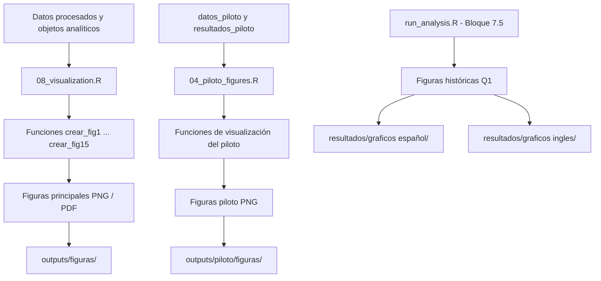

# Figuras: Documentación técnica

Este documento describe la **arquitectura metodológica y computacional utilizada para generar las figuras** del repositorio `experimento-nlp`.

Cada figura debe poder trazarse, en la medida en que corresponda, hasta:

* el **script que la genera**;
* los **objetos de datos utilizados como entrada**;
* los **modelos estadísticos o transformaciones aplicadas**;
* y el **directorio de salida** donde se conserva el resultado.

El objetivo es mantener una relación explícita entre **datos → análisis → visualización → archivo final**, facilitando la reproducibilidad, auditoría y trazabilidad de los resultados.

---

## 1. Propósito

La carpeta `outputs/figuras/` contiene las figuras correspondientes al **análisis principal del experimento**. Estas visualizaciones tienen dos funciones principales:

1. **Comunicación científica:** presentar de forma clara los resultados del estudio en artículos, informes, presentaciones y otros productos científicos.
2. **Reproducibilidad y auditoría:** permitir identificar cómo fue generada cada figura y qué datos, modelos y transformaciones intervienen en su construcción.

La documentación de las figuras no se limita al archivo gráfico final (`.png`, `.pdf`, etc.). La **fuente de verdad para su generación es el código analítico**, mientras que las imágenes constituyen artefactos derivados de dicho código.

Por tanto, la estructura conceptual es:

```text
Datos procesados
      ↓
Objetos analíticos
      ↓
Modelos / transformaciones
      ↓
Funciones de visualización
      ↓
Figura
      ↓
Archivo de salida
```

Este README funciona como **catálogo técnico de las figuras**, vinculando cada familia de visualizaciones con su código generador, sus entradas principales y su ubicación dentro del repositorio.

---

## 2. Inventario de figuras

El repositorio contiene tres familias principales de visualizaciones. Se distinguen por su **función analítica, origen y estado de conservación**.

| Familia                | Ubicación                                                      | Script / origen                         | Propósito                                                                                          | Estado                                      |
| ---------------------- | -------------------------------------------------------------- | --------------------------------------- | -------------------------------------------------------------------------------------------------- | ------------------------------------------- |
| **Análisis principal** | `outputs/figuras/`                                             | `08_visualization.R` y `run_analysis.R` | Visualización de los resultados del análisis principal y de los análisis integrados en el pipeline | **Activa / reproducible**                   |
| **Piloto**             | `outputs/piloto/figuras/`                                      | `04_piloto_figures.R`                   | Visualizaciones específicas del estudio piloto y de sus análisis independientes                    | **Activa / reproducible**                   |
| **Históricas Q1**      | `resultados/graficos español/` y `resultados/graficos ingles/` | `run_analysis.R` — Bloque 7.5           | Versiones tempranas de figuras utilizadas durante el desarrollo de un artículo Q1                  | **Histórica / conservada por trazabilidad** |

### Convención de nombres

Las familias de figuras utilizan convenciones de nomenclatura diferentes:

* **Análisis principal:** prefijo `fig` seguido del número de figura.
  Ejemplo: `fig1_palabras_condicion.png`

* **Piloto:** identificación de la figura mediante el sufijo `_piloto`.
  Ejemplo: `fig1_palabras_condicion_piloto.png`

* **Figuras históricas Q1:** prefijo `figura_` seguido de un número de dos dígitos.
  Ejemplo: `figura_02_linguistica_es.png`

Estas convenciones permiten distinguir rápidamente entre **artefactos vigentes del pipeline**, **figuras específicas del piloto** y **productos históricos conservados por trazabilidad**.

> **Nota:** las figuras históricas no deben interpretarse automáticamente como parte del conjunto vigente de resultados. Se conservan como evidencia del desarrollo analítico y editorial del proyecto, salvo que un análisis posterior las haya reincorporado explícitamente al pipeline actual.

---

## 3. Arquitectura de reproducibilidad

La generación de figuras se organiza en tres rutas principales: **análisis principal, piloto y figuras históricas**.



### Flujo principal

La ruta principal de generación puede resumirse como:

```text
Datos procesados
    ↓
Objetos analíticos
    ↓
08_visualization.R
    ↓
Funciones crear_fig1 ... crear_fig15
    ↓
Archivos PNG / PDF
    ↓
outputs/figuras/
```

La generación de una figura, por tanto, **no constituye un proceso independiente del análisis**. Las visualizaciones dependen de los objetos creados durante las etapas anteriores del pipeline.

### Dependencias principales

Las dependencias documentadas incluyen:

* `datos$ancho`: estructura de datos utilizada por las visualizaciones del análisis principal.
* `datos_piloto`: datos correspondientes al análisis piloto.
* `resultados_piloto`: resultados derivados utilizados por las figuras del piloto.
* `modelos`: colección de modelos estadísticos ajustados durante el análisis.
* `mat_cor`: matriz de correlaciones utilizada por las visualizaciones correspondientes.
* `diccionarios_hopper`: diccionarios temáticos enriquecidos utilizados en las figuras basadas en categorías lingüísticas o temáticas.

En particular, las figuras que utilizan resultados inferenciales o asociaciones entre variables deben considerarse dependientes no solamente de los datos originales, sino también de los **objetos analíticos y modelos estadísticos previamente calculados**.

De forma esquemática:

```text
datos
 ├── datos$ancho
 │      └── visualizaciones descriptivas
 │
 ├── modelos
 │      └── visualizaciones basadas en modelos
 │
 ├── mat_cor
 │      └── visualizaciones de asociaciones
 │
 └── diccionarios_hopper
        └── visualizaciones temáticas / lingüísticas
```

### Principio de trazabilidad

La trazabilidad debe mantenerse en sentido inverso desde el archivo final:

```text
Figura
  ↓
Función de visualización
  ↓
Script generador
  ↓
Objeto analítico
  ↓
Datos procesados
  ↓
Pipeline de análisis
```

Esto permite distinguir entre una **figura reproducida por el pipeline vigente** y una **figura histórica conservada como artefacto documental**.

## 4. Main analysis figures

Las figuras del análisis principal se generan mediante `generar_todas_figuras()`, definida en `R/08_visualization.R` y ejecutada desde `run_analysis.R`.

La mayoría de las visualizaciones utilizan `datos$ancho`, el dataset integrado en formato ancho. Algunas figuras incorporan además **modelos estadísticos ajustados**, **matrices de correlación** o **diccionarios temáticos**, según el análisis que representan.

Las figuras se numeran `fig1`–`fig15` y constituyen la **versión canónica de las visualizaciones del análisis principal**.

> **Criterio de interpretación:** las figuras descriptivas y sus intervalos de confianza permiten visualizar magnitud, incertidumbre y heterogeneidad. No deben interpretarse por sí solas como pruebas de hipótesis ni como evidencia de significancia estadística, salvo que dicha inferencia esté respaldada explícitamente por el modelo o procedimiento estadístico correspondiente.

---

### 4.1 `fig1_palabras_condicion.png` — Trayectorias de longitud textual

* **Tipo:** Trayectorias longitudinales con medias e intervalos de confianza bootstrap.
* **Objetivo:** Describir la evolución del número de palabras en las condiciones Texto, Audio e Imagen.
* **Pregunta analítica:** ¿Cómo cambia la extensión de los textos entre las tres iteraciones y cómo se comportan las condiciones entre sí?
* **Datos:** `datos$ancho`.
* **Variables principales:** `n_palabras_t1`, `n_palabras_t2`, `n_palabras_t3`, `condicion`, `id_participante`.
* **Transformación:** Conversión del formato ancho a formato largo mediante `pivot_longer`.
* **Preprocesamiento:** Exclusión de valores no finitos.
* **Estimación:** Media por condición y tiempo; intervalo bootstrap percentil del 95% mediante 1000 réplicas.
* **Visualización:** Trayectorias individuales con transparencia, media por condición mediante línea destacada, puntos de media e intervalo de confianza.
* **Función:** `crear_fig1()`.
* **Código fuente:** `R/08_visualization.R`.
* **Interpretación:** Permite identificar tendencias longitudinales, diferencias descriptivas entre condiciones y heterogeneidad interindividual.
* **Limitaciones:** El intervalo bootstrap describe incertidumbre de la estimación y no constituye por sí mismo una prueba de significancia. La estimación puede verse afectada por valores extremos y por el tamaño muestral de cada condición.

---

### 4.2 `fig2_palabras_demora.png` — Número de palabras por demora

* **Tipo:** Barras de medias con error estándar y observaciones individuales.
* **Objetivo:** Describir el número de palabras según la presencia o ausencia de demora.
* **Pregunta analítica:** ¿Difiere descriptivamente la extensión textual entre las condiciones D y ND?
* **Datos:** `datos$ancho`, restringido a `fuente == "principal"`.
* **Justificación del filtro:** El piloto no incorpora la variable `demora`.
* **Variables principales:** `n_palabras_t1`, `n_palabras_t2`, `n_palabras_t3`, `demora`, `id_participante`.
* **Transformación:** Conversión a formato largo y cálculo de estadísticas descriptivas por grupo.
* **Estimación:** Media ± error estándar mediante `mean_se`.
* **Visualización:** Barras de media, barras de error y observaciones individuales mediante jitter.
* **Función:** `crear_fig2()`.
* **Interpretación:** Permite visualizar diferencias de nivel y dispersión entre participantes con y sin demora.
* **Limitaciones:** El análisis está restringido al dataset principal y la figura es descriptiva; no establece por sí misma un efecto causal o estadísticamente significativo de la demora.

---

### 4.3 `fig3_emociones.png` — Trayectorias emocionales

* **Tipo:** Gráfico longitudinal facetado por métrica emocional.
* **Objetivo:** Visualizar la evolución de sentimiento global y de las métricas de tristeza y alegría.
* **Pregunta analítica:** ¿Cómo evolucionan las métricas emocionales a través de las iteraciones y condiciones?
* **Datos:** `datos$ancho`.
* **Variables:** `bing_t1`–`bing_t3`, `sadness_t1`–`sadness_t3`, `joy_t1`–`joy_t3`, `condicion`.
* **Transformaciones:** Conversión a formato largo y separación de la dimensión emocional y temporal.
* **Estimación:** Media y error estándar por condición y tiempo mediante `mean_se`.
* **Visualización:** Líneas de media, barras de error y facetas por métrica.
* **Función:** `crear_fig3()`.
* **Interpretación:** Facilita la comparación visual de las trayectorias emocionales entre condiciones.
* **Limitaciones:** Las métricas pueden estar expresadas en escalas diferentes y, por tanto, su magnitud absoluta no debe compararse directamente entre emociones. La figura no incorpora ajuste por multiplicidad.

---

### 4.4 `fig4_ttr.png` — Diversidad léxica

* **Tipo:** Trayectorias longitudinales con intervalos bootstrap.
* **Objetivo:** Evaluar descriptivamente la evolución del Type-Token Ratio (TTR).
* **Pregunta analítica:** ¿Cambia la diversidad léxica entre iteraciones y condiciones?
* **Datos:** `datos$ancho`.
* **Variables:** `ttr_t1`, `ttr_t2`, `ttr_t3`, `condicion`.
* **Estimación:** Media por condición y tiempo con intervalo bootstrap del 95% mediante 1000 réplicas.
* **Visualización:** Observaciones individuales, medias y bandas de confianza.
* **Función:** `crear_fig4()`.
* **Interpretación:** Un TTR mayor representa una mayor proporción de tipos léxicos respecto del número de tokens.
* **Limitación principal:** El TTR es dependiente de la longitud del texto. Las diferencias observadas pueden reflejar parcialmente diferencias en extensión textual y no exclusivamente cambios en diversidad léxica.

---

### 4.5 `fig5_modelo_estimado.png` — Medias marginales estimadas

* **Tipo:** Medias marginales estimadas (EMM) de un modelo mixto.
* **Objetivo:** Representar las estimaciones ajustadas del modelo para `n_palabras`.
* **Pregunta analítica:** ¿Cuál es la estimación del número de palabras por condición y tiempo después de considerar la estructura del modelo?
* **Objeto de entrada:** `modelos$palabras$modelo`.
* **Variables:** `condicion` y `tiempo`.
* **Método:** Cálculo de medias marginales estimadas mediante `emmeans`, con ajuste Tukey para comparaciones múltiples cuando corresponde.
* **Visualización:** Medias estimadas, puntos, líneas e intervalos de confianza del 95%.
* **Función:** `crear_fig5()`.
* **Interpretación:** Complementa la descripción de `fig1` proporcionando estimaciones derivadas del modelo estadístico en lugar de medias descriptivas sin ajustar.
* **Limitaciones:** La interpretación depende de la especificación, supuestos y convergencia del modelo mixto. La figura no sustituye la inspección de los resultados inferenciales completos.

---

### 4.6 `fig6_scores.png` — Distribución de scores heurísticos

* **Tipo:** Boxplots facetados con observaciones individuales.
* **Objetivo:** Explorar la distribución de los scores heurísticos de influencia y complejidad.
* **Pregunta analítica:** ¿Cómo se distribuyen estos indicadores entre las condiciones experimentales?
* **Datos:** `datos$ancho`.
* **Variables:** `score_influencia_T2`, `score_influencia_T3`, `score_complejidad`, `condicion`.
* **Visualización:** Boxplots, puntos individuales mediante jitter y referencia horizontal en cero.
* **Función:** `crear_fig6()`.
* **Interpretación:** Permite identificar diferencias descriptivas, dispersión y posibles valores extremos entre condiciones.
* **Limitación principal:** Los scores son indicadores heurísticos; no deben interpretarse como escalas psicométricas validadas ni como medidas clínicas sin evidencia adicional de validez.

---

### 4.7 `fig7_correlaciones.png` — Correlaciones entre cambios

* **Tipo:** Matriz de correlaciones de Spearman.
* **Objetivo:** Visualizar la asociación entre cambios longitudinales de las variables principales.
* **Pregunta analítica:** ¿Qué variables presentan patrones de covariación en sus cambios entre iteraciones?
* **Datos:** `mat_cor`.
* **Variables:** Variables `cambio_*_t1t2` y `cambio_*_t2t3` incluidas en la matriz.
* **Método:** Correlación de Spearman y reordenamiento mediante clustering jerárquico `ward.D2`.
* **Visualización:** Matriz de correlaciones con representación gráfica y coeficientes numéricos.
* **Función:** `crear_fig7()`.
* **Interpretación:** Permite detectar asociaciones monotónicas entre cambios longitudinales y posibles agrupamientos de variables.
* **Limitaciones:** La figura no presenta correcciones por multiplicidad ni debe utilizarse para determinar significancia estadística sin consultar los análisis inferenciales correspondientes.

---

### 4.8 `fig8_cambios.png` — Magnitud de los cambios longitudinales

* **Tipo:** Gráfico de puntos con intervalos bootstrap.
* **Objetivo:** Visualizar los cambios entre T1→T2 y T2→T3 en palabras, sentimiento y TTR.
* **Pregunta analítica:** ¿Cuál es la dirección y magnitud descriptiva de los cambios longitudinales?
* **Datos:** `datos$ancho`.
* **Variables:** `cambio_palabras_*`, `cambio_bing_*`, `cambio_ttr_*`.
* **Método:** Estimación de medias e intervalos bootstrap del 95% por condición y periodo.
* **Visualización:** Puntos con intervalos de confianza y facetas por variable y periodo.
* **Función:** `crear_fig8()`.
* **Interpretación:** Los intervalos permiten evaluar visualmente la incertidumbre de las estimaciones y si incluyen el valor cero.
* **Precaución:** Que un intervalo incluya o no incluya cero **no debe equipararse automáticamente a una prueba formal de significancia**, especialmente cuando existen múltiples estimaciones.

---

### 4.9 `fig9_trayectorias_individuales.png` — Heterogeneidad individual

* **Tipo:** Trayectorias longitudinales individuales con medias grupales.
* **Objetivo:** Mostrar la variabilidad interindividual en la evolución del número de palabras.
* **Pregunta analítica:** ¿Qué grado de heterogeneidad existe en las trayectorias individuales dentro de cada condición?
* **Datos:** `datos$ancho`.
* **Variables:** `n_palabras_t1`–`n_palabras_t3`, `condicion`, `id_participante`.
* **Método:** Representación de trayectorias individuales y estimación de medias por condición.
* **Visualización:** `geom_line` con transparencia y resumen de medias mediante `stat_summary`.
* **Función:** `crear_fig9()`.
* **Interpretación:** Hace visible la heterogeneidad que puede quedar oculta cuando se presentan únicamente medias grupales.
* **Relación con `fig1`:** Es complementaria a `fig1`; mientras `fig1` enfatiza la tendencia grupal y su incertidumbre, `fig9` enfatiza las trayectorias individuales.

---

### 4.10 `fig10_interaccion_condicion_tiempo.png` — Interacción Condición × Tiempo

* **Tipo:** Gráfico de medias marginales estimadas del modelo mixto.
* **Objetivo:** Representar visualmente el patrón de interacción entre condición y tiempo para `n_palabras`.
* **Pregunta analítica:** ¿Las trayectorias temporales estimadas difieren entre condiciones?
* **Objeto de entrada:** Modelo mixto de `n_palabras`.
* **Método:** Estimación de EMM mediante `emmeans`.
* **Visualización:** Líneas, puntos e intervalos de confianza.
* **Función:** `crear_fig10()`.
* **Interpretación:** Diferencias en la pendiente o forma de las trayectorias pueden sugerir un patrón de interacción.
* **Precaución:** La no paralelidad visual de las líneas **no demuestra por sí misma una interacción estadísticamente significativa**. La inferencia debe basarse en el término de interacción del modelo y sus contrastes correspondientes.

---

### 4.11 `fig11_efecto_demora.png` — Cambios según demora

* **Tipo:** Barras de medias con intervalos bootstrap.
* **Objetivo:** Comparar la magnitud de los cambios en palabras entre condiciones con demora (D) y sin demora (ND).
* **Pregunta analítica:** ¿Difiere la magnitud del cambio longitudinal según la presencia de demora?
* **Datos:** `datos$ancho`, restringido a `fuente == "principal"`.
* **Variables:** `demora`, `cambio_palabras_t1t2`, `cambio_palabras_t2t3`, `cambio_palabras_total`.
* **Método:** Media e intervalo bootstrap del 95% mediante 1000 réplicas.
* **Visualización:** Barras con intervalos de confianza y facetas por tipo de cambio.
* **Función:** `crear_fig11()`.
* **Interpretación:** Permite comparar descriptivamente la magnitud y dirección de los cambios entre D y ND.
* **Limitaciones:** Solo aplica al dataset principal. La figura no establece por sí misma un efecto estadístico de la demora.

---

### 4.12 `fig12_cambio_emocional_multivariado.png` — Cambios emocionales

* **Tipo:** Heatmap multivariado.
* **Objetivo:** Resumir la dirección y magnitud media de los cambios en las ocho emociones NRC.
* **Pregunta analítica:** ¿Qué emociones presentan mayores cambios y en qué dirección?
* **Datos:** `datos$ancho`.
* **Variables:** Variables de cambio correspondientes a las ocho emociones NRC en T1→T2 y T2→T3.
* **Método:** Cálculo de medias por condición y periodo.
* **Visualización:** Mapa de calor con escala divergente para representar aumentos y disminuciones.
* **Función:** `crear_fig12()`.
* **Interpretación:** Permite identificar patrones multivariados de cambio emocional y comparar su dirección entre condiciones.
* **Limitaciones:** La interpretación depende de la escala y propiedades de las métricas NRC utilizadas; el heatmap es principalmente descriptivo.

---

### 4.13 `fig13_diccionarios_tematicos.png` — Evolución de temas Hopper

* **Tipo:** Trayectorias longitudinales facetadas por tema.
* **Objetivo:** Visualizar la evolución de la frecuencia relativa de categorías temáticas de Hopper.
* **Pregunta analítica:** ¿Cómo cambia la presencia relativa de los temas a lo largo del tiempo y entre condiciones?
* **Datos:** `datos$ancho` y `diccionarios_hopper`.
* **Variables:** Tasas `rate_*_t1`, `rate_*_t2`, `rate_*_t3`.
* **Transformación:** Normalización de las frecuencias por longitud textual y expresión como tasa por 1000 palabras.
* **Estimación:** Media por condición y tiempo.
* **Visualización:** Líneas de media y facetas por tema.
* **Función:** `crear_fig13()`.
* **Interpretación:** Permite comparar la evolución relativa de los diferentes dominios temáticos.
* **Limitaciones:** Las tasas dependen de la definición y cobertura de los diccionarios utilizados. La interpretación representa presencia léxica según el diccionario y no necesariamente la presencia conceptual del tema.

---

### 4.14 `fig14_similitud_textual.png` — Similitud entre iteraciones

* **Tipo:** Boxplots facetados con observaciones individuales.
* **Objetivo:** Examinar la similitud textual entre iteraciones mediante medidas basadas en tokens.
* **Pregunta analítica:** ¿Qué grado de similitud existe entre los textos de diferentes iteraciones y cómo varía entre condiciones?
* **Datos:** `datos$ancho`.
* **Variables:** `cos_t1_t2`, `cos_t2_t3`, `cos_t1_t3`, `jac_t1_t2`, `jac_t2_t3`, `jac_t1_t3`.
* **Métodos:** Medidas de similitud de coseno y Jaccard.
* **Comparaciones:** T1→T2, T2→T3 y T1→T3.
* **Visualización:** Boxplots, puntos individuales y facetas por medida y comparación.
* **Función:** `crear_fig14()`.
* **Interpretación:** Permite evaluar la estabilidad o transformación del contenido textual entre iteraciones.
* **Limitaciones:** Las medidas están basadas en la representación utilizada para su cálculo y pueden ser sensibles a tokenización, vocabulario y longitud textual. No deben interpretarse como equivalentes a una medida semántica profunda.

---

### 4.15 `fig15_mapa_integrado_cambio.png` — Mapa integrado de cambios

* **Tipo:** Heatmap de cambios estandarizados.
* **Objetivo:** Integrar múltiples indicadores longitudinales en una representación común.
* **Pregunta analítica:** ¿Qué patrón conjunto de cambios se observa entre condiciones y periodos?
* **Datos:** `datos$ancho`.
* **Variables:** Indicadores de cambio de palabras, TTR, Bing, tristeza y alegría, entre otros incluidos en el mapa.
* **Transformación:** Estandarización mediante z-scores por variable y tipo de cambio.
* **Agregación:** Media por condición.
* **Visualización:** Heatmap con escala divergente.
* **Función:** `crear_fig15()`.
* **Interpretación:** Facilita la identificación de patrones relativos de aumento y disminución entre múltiples indicadores.
* **Limitación principal:** La estandarización permite comparar patrones relativos, pero elimina la escala original de cada variable. Por tanto, la intensidad del color no representa directamente una magnitud clínica o lingüística absoluta.

## 4. Main analysis figures

Las figuras del análisis principal se generan mediante `generar_todas_figuras()`, definida en `R/08_visualization.R` y ejecutada desde `run_analysis.R`.

La mayoría de las visualizaciones utilizan `datos$ancho`, el dataset integrado en formato ancho. Dependiendo de la figura, también se utilizan objetos analíticos derivados, como modelos estadísticos, matrices de correlación y diccionarios temáticos.

Las figuras `fig1`–`fig15` constituyen el **conjunto canónico de visualizaciones del análisis principal**.

> **Criterio de interpretación:** las figuras descriptivas permiten examinar patrones, magnitudes, incertidumbre y heterogeneidad. La inspección visual de medias, intervalos o trayectorias no debe interpretarse por sí sola como evidencia de significancia estadística. Las conclusiones inferenciales deben remitirse al procedimiento estadístico correspondiente.
>
> **Revisión metodológica:** cuando una especificación técnica concreta —por ejemplo, número de réplicas bootstrap, variables exactas incluidas, filtros o transformaciones implementadas— no pueda verificarse únicamente a partir de esta documentación, deberá confirmarse en el código fuente correspondiente antes de considerarla una especificación definitiva.

---

### 4.1 `fig1_palabras_condicion.png` — Trayectorias de longitud textual

* **Tipo:** Trayectorias longitudinales con medias e intervalos de confianza bootstrap.
* **Objetivo:** Describir la evolución del número de palabras en las condiciones Texto, Audio e Imagen.
* **Pregunta analítica:** ¿Cómo cambia la extensión de los textos entre las tres iteraciones y cómo se comportan las condiciones entre sí?
* **Datos:** `datos$ancho`.
* **Variables principales:** `n_palabras_t1`, `n_palabras_t2`, `n_palabras_t3`, `condicion`, `id_participante`.
* **Transformación:** Conversión del formato ancho a formato largo mediante `pivot_longer`.
* **Preprocesamiento:** Exclusión de valores no finitos (`NA`, `Inf`).
* **Estimación:** Media por condición y tiempo e intervalo bootstrap percentil del 95%.
* **Visualización:** Trayectorias individuales con transparencia, media por condición, puntos de media y bandas de confianza.
* **Paquetes:** `ggplot2`, `dplyr`, `tidyr`, `purrr`.
* **Función:** `crear_fig1()`.
* **Código fuente:** `R/08_visualization.R`.
* **Interpretación:** Permite observar tendencias longitudinales, diferencias descriptivas entre condiciones y heterogeneidad interindividual.
* **Limitaciones:** El bootstrap depende del tamaño y estructura de los datos disponibles y puede ser sensible a valores extremos. El intervalo de confianza no constituye por sí mismo una prueba de significancia.
* **Revisión pendiente:** Confirmar en `R/08_visualization.R` el número exacto de réplicas bootstrap y el procedimiento de cálculo del intervalo antes de tratar estos detalles como especificación definitiva.

---

### 4.2 `fig2_palabras_demora.png` — Número de palabras según demora

* **Tipo:** Barras de medias con error estándar y observaciones individuales.
* **Objetivo:** Describir el número de palabras según la presencia o ausencia de demora.
* **Pregunta analítica:** ¿Difiere descriptivamente la extensión textual entre las condiciones D y ND?
* **Datos:** `datos$ancho`, restringido a `fuente == "principal"`.
* **Justificación del filtro:** El análisis de demora corresponde al dataset principal, ya que el piloto no incorpora esta variable.
* **Variables principales:** `n_palabras_t1`, `n_palabras_t2`, `n_palabras_t3`, `demora`, `id_participante`.
* **Transformación:** Conversión a formato largo y cálculo de estadísticas descriptivas por grupo.
* **Estimación:** Media ± error estándar mediante `mean_se`.
* **Visualización:** Barras de media, barras de error y observaciones individuales mediante jitter.
* **Paquete principal:** `ggplot2`.
* **Función:** `crear_fig2()`.
* **Interpretación:** Permite observar diferencias de nivel y dispersión entre los grupos con y sin demora.
* **Limitaciones:** La figura es descriptiva y está restringida al dataset principal. No establece por sí misma un efecto estadístico o causal de la demora.
* **Revisión pendiente:** Verificar en `R/08_visualization.R` la implementación exacta del filtro `fuente == "principal"` y de la agregación utilizada para el error estándar.

---

### 4.3 `fig3_emociones.png` — Trayectorias emocionales

* **Tipo:** Gráfico longitudinal facetado por métrica emocional.
* **Objetivo:** Visualizar la evolución del sentimiento global y de las métricas de tristeza y alegría.
* **Pregunta analítica:** ¿Cómo evolucionan las métricas emocionales a través de las iteraciones y condiciones?
* **Datos:** `datos$ancho`.
* **Variables:** `bing_t1`–`bing_t3`, `sadness_t1`–`sadness_t3`, `joy_t1`–`joy_t3`, `condicion`.
* **Transformaciones:** Conversión a formato largo y separación de emoción y tiempo.
* **Estimación:** Media y error estándar por condición y tiempo mediante `mean_se`.
* **Visualización:** Líneas de media, barras de error y facetas por métrica.
* **Paquete principal:** `ggplot2`.
* **Función:** `crear_fig3()`.
* **Interpretación:** Facilita la comparación visual de las trayectorias de las métricas emocionales entre condiciones.
* **Limitaciones:** Las métricas pueden encontrarse en escalas diferentes; por ello, sus magnitudes absolutas no deben compararse directamente entre emociones. La figura tampoco representa por sí misma un ajuste por multiplicidad.
* **Revisión pendiente:** Confirmar en el código las transformaciones exactas aplicadas a cada métrica antes de interpretar sus escalas como directamente comparables.

---

### 4.4 `fig4_ttr.png` — Diversidad léxica

* **Tipo:** Trayectorias longitudinales con intervalos de confianza bootstrap.
* **Objetivo:** Evaluar descriptivamente la evolución del Type-Token Ratio (TTR).
* **Pregunta analítica:** ¿Cambia la diversidad léxica entre iteraciones y condiciones?
* **Datos:** `datos$ancho`.
* **Variables:** `ttr_t1`, `ttr_t2`, `ttr_t3`, `condicion`.
* **Estimación:** Media por condición y tiempo con intervalo bootstrap del 95%.
* **Visualización:** Observaciones individuales, medias y bandas de confianza.
* **Paquetes:** `ggplot2`, `scales`.
* **Función:** `crear_fig4()`.
* **Interpretación:** Un TTR mayor representa una mayor proporción de tipos léxicos respecto del número de tokens.
* **Limitación principal:** El TTR es dependiente de la longitud textual. Diferencias en TTR pueden reflejar parcialmente diferencias en extensión de los textos.
* **Revisión pendiente:** Verificar en el código el procedimiento bootstrap y la transformación utilizada para el formato porcentual.

---

### 4.5 `fig5_modelo_estimado.png` — Medias marginales estimadas

* **Tipo:** Medias marginales estimadas (EMM) derivadas de un modelo mixto.
* **Objetivo:** Representar las estimaciones ajustadas del modelo para `n_palabras`.
* **Pregunta analítica:** ¿Cuál es la estimación del número de palabras por condición y tiempo según el modelo estadístico?
* **Objeto de entrada:** `modelos$palabras$modelo`.
* **Variables:** `condicion`, `tiempo`.
* **Método:** Estimación mediante `emmeans`.
* **Comparaciones:** Se documenta ajuste Tukey cuando corresponde.
* **Visualización:** Puntos, líneas e intervalos de confianza del 95%.
* **Paquetes:** `emmeans`, `ggplot2`.
* **Función:** `crear_fig5()`.
* **Interpretación:** Complementa las medias descriptivas de `fig1` mediante estimaciones derivadas del modelo mixto.
* **Limitaciones:** La interpretación depende de la especificación, supuestos y convergencia del modelo. La figura no sustituye los resultados inferenciales del modelo.
* **Revisión pendiente:** Confirmar en `R/08_visualization.R` qué contrastes y ajustes de `emmeans` se incorporan efectivamente en la figura.

---

### 4.6 `fig6_scores.png` — Distribución de scores heurísticos

* **Tipo:** Boxplots facetados con observaciones individuales.
* **Objetivo:** Explorar la distribución de los scores heurísticos de influencia y complejidad.
* **Pregunta analítica:** ¿Cómo se distribuyen estos indicadores entre las condiciones experimentales?
* **Datos:** `datos$ancho`.
* **Variables:** `score_influencia_T2`, `score_influencia_T3`, `score_complejidad`, `condicion`.
* **Visualización:** Boxplots, puntos individuales mediante jitter y referencia horizontal en cero.
* **Paquete:** `ggplot2`.
* **Función:** `crear_fig6()`.
* **Interpretación:** Permite examinar diferencias descriptivas, dispersión y posibles valores extremos.
* **Limitación principal:** Los scores son indicadores heurísticos y no deben interpretarse como escalas psicométricas validadas o medidas clínicas sin evidencia específica de validez.
* **Revisión pendiente:** Confirmar en la documentación metodológica correspondiente la definición operacional y el procedimiento de cálculo de cada score.

---

### 4.7 `fig7_correlaciones.png` — Correlaciones entre cambios

* **Tipo:** Matriz de correlaciones de Spearman.
* **Objetivo:** Visualizar asociaciones entre cambios longitudinales de las variables principales.
* **Pregunta analítica:** ¿Qué variables presentan patrones de covariación en sus cambios entre iteraciones?
* **Datos:** `mat_cor`.
* **Variables:** Variables `cambio_*_t1t2` y `cambio_*_t2t3` incluidas en `mat_cor`.
* **Método:** Correlación de Spearman y reordenamiento mediante clustering jerárquico `ward.D2`.
* **Visualización:** Matriz de correlaciones con coeficientes numéricos y representación gráfica.
* **Paquete:** `corrplot`.
* **Función:** `crear_fig7()`.
* **Interpretación:** Permite identificar asociaciones monotónicas y patrones de covariación entre cambios longitudinales.
* **Limitaciones:** La figura no constituye un análisis causal. Tampoco debe utilizarse para establecer significancia estadística sin consultar los resultados de las pruebas correspondientes.
* **Revisión pendiente:** Confirmar en la sección de construcción de `mat_cor` qué variables concretas se incluyen y cómo se manejan valores faltantes.

---

### 4.8 `fig8_cambios.png` — Magnitud de los cambios longitudinales

* **Tipo:** Gráfico de puntos con intervalos de confianza bootstrap.
* **Objetivo:** Visualizar los cambios entre T1→T2 y T2→T3 en palabras, sentimiento y TTR.
* **Pregunta analítica:** ¿Cuál es la dirección y magnitud descriptiva de los cambios longitudinales?
* **Datos:** `datos$ancho`.
* **Variables:** `cambio_palabras_*`, `cambio_bing_*`, `cambio_ttr_*`.
* **Método:** Estimación de medias e intervalos bootstrap por condición y tipo de cambio.
* **Visualización:** Puntos con intervalos y facetas por variable y periodo.
* **Paquete:** `ggplot2`.
* **Función:** `crear_fig8()`.
* **Interpretación:** Permite examinar dirección, magnitud e incertidumbre de los cambios.
* **Precaución:** La inclusión o exclusión del cero en un intervalo no debe equipararse automáticamente con una prueba formal de significancia, especialmente cuando existen múltiples estimaciones.
* **Revisión pendiente:** Confirmar el número de réplicas y el método exacto de cálculo de los intervalos bootstrap en el código fuente.

---

### 4.9 `fig9_trayectorias_individuales.png` — Heterogeneidad individual

* **Tipo:** Trayectorias longitudinales individuales con medias grupales.
* **Objetivo:** Mostrar la variabilidad interindividual en la evolución del número de palabras.
* **Pregunta analítica:** ¿Qué grado de heterogeneidad existe en las trayectorias individuales dentro de cada condición?
* **Datos:** `datos$ancho`.
* **Variables:** `n_palabras_t1`–`n_palabras_t3`, `condicion`, `id_participante`.
* **Método:** Representación de trayectorias individuales y estimación de medias por condición.
* **Visualización:** `geom_line` con transparencia y `stat_summary` para las medias.
* **Paquete:** `ggplot2`.
* **Función:** `crear_fig9()`.
* **Interpretación:** Hace visible la heterogeneidad que puede quedar oculta al presentar únicamente medias grupales.
* **Relación con `fig1`:** Es complementaria a `fig1`: `fig1` enfatiza la tendencia grupal y su incertidumbre, mientras `fig9` enfatiza las trayectorias individuales.

---

### 4.10 `fig10_interaccion_condicion_tiempo.png` — Interacción Condición × Tiempo

* **Tipo:** Gráfico de medias marginales estimadas del modelo mixto.
* **Objetivo:** Representar visualmente el patrón de interacción entre condición y tiempo para `n_palabras`.
* **Pregunta analítica:** ¿Difieren las trayectorias temporales estimadas entre condiciones?
* **Objeto de entrada:** Modelo mixto de `n_palabras`.
* **Método:** Estimación de EMM mediante `emmeans`.
* **Visualización:** Líneas, puntos e intervalos de confianza.
* **Paquetes:** `emmeans`, `ggplot2`.
* **Función:** `crear_fig10()`.
* **Interpretación:** Diferencias en la pendiente o configuración de las trayectorias pueden sugerir un patrón de interacción.
* **Precaución:** La no paralelidad visual de las líneas **no demuestra por sí misma una interacción estadísticamente significativa**. La inferencia debe basarse en el término `condicion × tiempo` del modelo y en los contrastes correspondientes.
* **Revisión pendiente:** Confirmar en la sección de modelado la especificación exacta del término de interacción y en `R/08_visualization.R` la forma en que se extraen las EMM.

---

### 4.11 `fig11_efecto_demora.png` — Cambios según demora

* **Tipo:** Barras de medias con intervalos de confianza bootstrap.
* **Objetivo:** Comparar la magnitud de los cambios en palabras entre condiciones con demora (D) y sin demora (ND).
* **Pregunta analítica:** ¿Difiere la magnitud del cambio longitudinal según la presencia de demora?
* **Datos:** `datos$ancho`, restringido al dataset principal.
* **Variables:** `demora`, `cambio_palabras_t1t2`, `cambio_palabras_t2t3`, `cambio_palabras_total`.
* **Método:** Estimación de medias e intervalos bootstrap.
* **Visualización:** Barras con intervalos de confianza y facetas por tipo de cambio.
* **Paquete:** `ggplot2`.
* **Función:** `crear_fig11()`.
* **Interpretación:** Permite comparar descriptivamente la dirección y magnitud de los cambios entre D y ND.
* **Limitaciones:** Solo aplica al dataset principal y no establece por sí misma un efecto estadístico de la demora.
* **Revisión pendiente:** Confirmar en el código el número de réplicas bootstrap y la definición exacta de `cambio_palabras_total`.

---

### 4.12 `fig12_cambio_emocional_multivariado.png` — Cambios emocionales

* **Tipo:** Heatmap multivariado.
* **Objetivo:** Resumir la dirección y magnitud media de los cambios en las ocho emociones NRC.
* **Pregunta analítica:** ¿Qué emociones presentan mayores cambios y en qué dirección?
* **Datos:** `datos$ancho`.
* **Variables:** Variables de cambio correspondientes a las ocho emociones NRC en T1→T2 y T2→T3.
* **Método:** Cálculo de medias por condición y periodo.
* **Visualización:** Mapa de calor con escala divergente para representar aumentos y disminuciones.
* **Paquete:** `ggplot2`.
* **Función:** `crear_fig12()`.
* **Interpretación:** Permite identificar patrones multivariados de cambio emocional y comparar su dirección entre condiciones y periodos.
* **Limitaciones:** El heatmap es principalmente descriptivo y la interpretación depende de la escala y propiedades de las métricas NRC utilizadas.
* **Revisión pendiente:** Confirmar en el código la lista exacta de ocho emociones y las variables de cambio utilizadas.

---

### 4.13 `fig13_diccionarios_tematicos.png` — Evolución de temas Hopper

* **Tipo:** Trayectorias longitudinales facetadas por tema.
* **Objetivo:** Visualizar la evolución de la frecuencia relativa de categorías temáticas de Hopper.
* **Pregunta analítica:** ¿Cómo cambia la presencia relativa de los temas a lo largo del tiempo y entre condiciones?
* **Datos:** `datos$ancho` y `diccionarios_hopper`.
* **Variables:** Tasas `rate_*_t1`, `rate_*_t2`, `rate_*_t3`.
* **Transformación:** Normalización de las frecuencias por longitud textual y expresión como tasa por 1000 palabras.
* **Estimación:** Media por condición y tiempo.
* **Visualización:** Líneas de media y facetas por tema.
* **Paquete:** `ggplot2`.
* **Función:** `crear_fig13()`.
* **Interpretación:** Permite comparar la evolución relativa de diferentes dominios temáticos.
* **Limitaciones:** Una tasa basada en diccionario representa presencia léxica según las categorías definidas y no equivale necesariamente a la presencia conceptual o semántica del tema.
* **Revisión pendiente:** Confirmar en la documentación de `diccionarios_hopper` la composición, enriquecimiento y definición operacional de las categorías utilizadas.

---

### 4.14 `fig14_similitud_textual.png` — Similitud entre iteraciones

* **Tipo:** Boxplots facetados con observaciones individuales.
* **Objetivo:** Examinar la similitud textual entre iteraciones mediante medidas basadas en tokens.
* **Pregunta analítica:** ¿Qué grado de similitud existe entre los textos de diferentes iteraciones y cómo varía entre condiciones?
* **Datos:** `datos$ancho`.
* **Variables:** `cos_t1_t2`, `cos_t2_t3`, `cos_t1_t3`, `jac_t1_t2`, `jac_t2_t3`, `jac_t1_t3`.
* **Métodos:** Similitud de coseno y Jaccard.
* **Comparaciones:** T1→T2, T2→T3 y T1→T3.
* **Visualización:** Boxplots, observaciones individuales y facetas por medida y comparación.
* **Paquete:** `ggplot2`.
* **Función:** `crear_fig14()`.
* **Interpretación:** Permite evaluar descriptivamente la estabilidad o transformación textual entre iteraciones.
* **Limitaciones:** Las medidas dependen de la representación textual utilizada para calcularlas y pueden ser sensibles a tokenización, vocabulario y longitud.
* **Precaución:** Estas medidas no deben interpretarse como equivalentes a una medida de similitud semántica profunda.
* **Revisión pendiente:** Confirmar en el pipeline de NLP la tokenización y representación utilizadas para calcular coseno y Jaccard.

---

### 4.15 `fig15_mapa_integrado_cambio.png` — Mapa integrado de cambios

* **Tipo:** Heatmap de cambios estandarizados.
* **Objetivo:** Integrar múltiples indicadores longitudinales en una representación común.
* **Pregunta analítica:** ¿Qué patrón conjunto de cambios se observa entre condiciones y periodos?
* **Datos:** `datos$ancho`.
* **Variables:** Indicadores de cambio de palabras, TTR, Bing, tristeza, alegría y demás variables incluidas en el mapa.
* **Transformación:** Estandarización mediante z-scores por variable y tipo de cambio.
* **Agregación:** Media por condición.
* **Visualización:** Heatmap con escala divergente.
* **Paquete:** `ggplot2`.
* **Función:** `crear_fig15()`.
* **Interpretación:** Facilita la identificación de patrones relativos de aumento y disminución entre múltiples indicadores.
* **Limitación principal:** La estandarización elimina las unidades originales. Por ello, la intensidad del color representa una magnitud relativa estandarizada y no una magnitud clínica, lingüística o emocional absoluta.
* **Revisión pendiente:** Confirmar en `R/08_visualization.R` la lista exacta de variables incluidas, el nivel de estandarización y el procedimiento de agregación por condición.

## 8. Figure-to-code mapping

La siguiente tabla establece la correspondencia documentada entre cada figura, su función generadora y el script de origen. Para las figuras principales se conserva la numeración `fig1`–`fig15` definida en la Sección 4.

| Figura                                    | Función generadora        | Script fuente           | Entrada principal                    |
| ----------------------------------------- | ------------------------- | ----------------------- | ------------------------------------ |
| `fig1_palabras_condicion.png`             | `crear_fig1()`            | `R/08_visualization.R`  | `datos$ancho`                        |
| `fig2_palabras_demora.png`                | `crear_fig2()`            | `R/08_visualization.R`  | `datos$ancho`                        |
| `fig3_emociones.png`                      | `crear_fig3()`            | `R/08_visualization.R`  | `datos$ancho`                        |
| `fig4_ttr.png`                            | `crear_fig4()`            | `R/08_visualization.R`  | `datos$ancho`                        |
| `fig5_modelo_estimado.png`                | `crear_fig5()`            | `R/08_visualization.R`  | `modelos$palabras$modelo`            |
| `fig6_scores.png`                         | `crear_fig6()`            | `R/08_visualization.R`  | `datos$ancho`                        |
| `fig7_correlaciones.png`                  | `crear_fig7()`            | `R/08_visualization.R`  | `mat_cor`                            |
| `fig8_cambios.png`                        | `crear_fig8()`            | `R/08_visualization.R`  | `datos$ancho`                        |
| `fig9_trayectorias_individuales.png`      | `crear_fig9()`            | `R/08_visualization.R`  | `datos$ancho`                        |
| `fig10_interaccion_condicion_tiempo.png`  | `crear_fig10()`           | `R/08_visualization.R`  | `modelos$palabras$modelo`            |
| `fig11_efecto_demora.png`                 | `crear_fig11()`           | `R/08_visualization.R`  | `datos$ancho`                        |
| `fig12_cambio_emocional_multivariado.png` | `crear_fig12()`           | `R/08_visualization.R`  | `datos$ancho`                        |
| `fig13_diccionarios_tematicos.png`        | `crear_fig13()`           | `R/08_visualization.R`  | `datos$ancho`, `diccionarios_hopper` |
| `fig14_similitud_textual.png`             | `crear_fig14()`           | `R/08_visualization.R`  | `datos$ancho`                        |
| `fig15_mapa_integrado_cambio.png`         | `crear_fig15()`           | `R/08_visualization.R`  | `datos$ancho`                        |
| Paneles (`panel_*.png`)                   | `generar_todas_figuras()` | `R/08_visualization.R`  | Figuras generadas                    |
| Figuras del piloto                        | `figuras_piloto()`        | `R/04_piloto_figures.R` | `datos_piloto`, `resultados_piloto`  |
| Figuras Q1 históricas                     | Bloques 7.5               | `run_analysis.R`        | `datos`, `scores_long`, entre otros  |

> **Nota de trazabilidad:** esta tabla documenta la correspondencia indicada para el pipeline. La existencia, firma exacta y argumentos internos de cada función deberán considerarse **pendientes de verificación en el código fuente** si se requiere una auditoría ejecutable de la correspondencia.

---

## 9. Figure-to-data mapping

La siguiente tabla documenta la relación entre las figuras y los objetos de datos utilizados para su construcción, así como el archivo físico equivalente cuando este se encuentra especificado.

| Figura                                                | Objeto de entrada                     | Archivo físico equivalente                       |
| ----------------------------------------------------- | ------------------------------------- | ------------------------------------------------ |
| `fig1`–`fig4`, `fig6`, `fig8`–`fig9`, `fig11`–`fig15` | `datos$ancho`                         | `resultados/tablas/datos_completos_ancho.csv`    |
| `fig5`, `fig10`                                       | `modelos$palabras$modelo`             | `resultados/modelos_mixtos.rds`                  |
| `fig7`                                                | `mat_cor`                             | `resultados/tablas/correlaciones_spearman.csv`   |
| `fig13`                                               | `datos$ancho` + `diccionarios_hopper` | `diccionarios_enriquecidos.RData`                |
| Figuras del piloto                                    | `datos_piloto$ancho`                  | `outputs/piloto/datos/ancho_piloto_completo.rds` |

### Criterio de correspondencia

La correspondencia se establece entre el **objeto utilizado por la función generadora** y el archivo físico que representa o contiene dicho objeto cuando esta equivalencia está documentada.

Debe distinguirse entre:

* **Objeto de entrada:** estructura utilizada directamente durante la generación de la figura.
* **Archivo físico equivalente:** archivo persistente que contiene los datos o resultados asociados.
* **Figura derivada:** producto visual generado a partir de uno o más objetos analíticos.

> **Revisión pendiente:** La tabla agrupa varias figuras bajo `datos$ancho`. Esto documenta su objeto de entrada común, pero no implica que todas utilicen exactamente las mismas columnas, filtros o transformaciones. Esos detalles deben verificarse individualmente en las funciones generadoras.

> **Revisión pendiente:** La correspondencia entre objetos R y archivos físicos se conserva tal como está especificada en la documentación proporcionada. No se asume aquí que cada archivo físico sea generado directamente por la función de visualización.

---

## 10. Historical duplicates and canonical versions

El proyecto contiene figuras correspondientes a diferentes etapas de desarrollo del análisis. Para evitar confundir versiones históricas con las visualizaciones actualmente documentadas, se establece una distinción entre **figuras canónicas** y **figuras históricas**.

### 10.1 Figura histórica de longitud textual

Se identifica una correspondencia parcial entre:

* `fig1_palabras_condicion.png` — versión canónica.
* `figura_02_linguistica_es.png` — versión histórica.

Ambas representan la evolución del número de palabras por condición, pero corresponden a implementaciones diferentes.

| Característica            | Versión canónica              | Versión histórica              |
| ------------------------- | ----------------------------- | ------------------------------ |
| Archivo                   | `fig1_palabras_condicion.png` | `figura_02_linguistica_es.png` |
| Ubicación documentada     | `outputs/figuras/`            | `resultados/graficos español/` |
| Generación                | `crear_fig1()`                | Bloque histórico 7.5           |
| Incertidumbre documentada | Bootstrap                     | `mean_cl_normal`               |
| Tema gráfico              | Versión actual                | `theme_q1`                     |
| Estado                    | Canónica                      | Histórica                      |

La diferencia entre ambas versiones no debe interpretarse como una duplicación exacta del mismo artefacto, sino como resultado de diferentes etapas de implementación.

### 10.2 Figuras que no constituyen duplicados

A partir de la documentación proporcionada, no se establece como duplicado de `fig4_ttr.png` ninguna de las figuras históricas identificadas.

Del mismo modo, `fig8_cambios.png` no se considera equivalente a `figura_04_similitud_es.png`, ya que esta última corresponde a un análisis de similitud textual/semántica y no al mismo objeto visual documentado para `fig8`.

### 10.3 Figuras históricas identificadas

Se mantienen como artefactos históricos las siguientes figuras:

* `figura_02_linguistica_es.png`
* `figura_03_hopper_es.png`
* `figura_04_similitud_es.png`
* `figura_05_prototipos_es.png`
* `figura_06_pca_es.png`
* `figura_07_cambio_semantico_es.png`
* `figura_08_correlaciones_es.png`

Estas figuras pertenecen a una etapa histórica del análisis y **no forman parte de la numeración canónica `fig1`–`fig15`** establecida en la Sección 4.

### 10.4 Criterio de canonicidad

Para efectos de esta documentación, las figuras generadas por las funciones principales de `R/08_visualization.R` constituyen el conjunto canónico del análisis principal.

Las figuras históricas generadas mediante los bloques anteriores de `run_analysis.R` se conservan como referencia de trazabilidad y evolución del análisis.

> **Revisión pendiente:** La afirmación de que todas las figuras generadas por `R/08_visualization.R` y `R/04_piloto_figures.R` son efectivamente las versiones actualmente generadas por el pipeline debe verificarse directamente contra la implementación antes de utilizar este criterio como regla automática de gestión de archivos.

> **Revisión pendiente:** La documentación proporcionada no establece de manera suficiente si los directorios históricos deben conservarse, archivarse o eliminarse. Por tanto, esta sección únicamente establece su carácter histórico y no prescribe una acción de eliminación.

---

## 11. Reproducibility notes

La reproducción de las figuras depende de la ejecución de los scripts correspondientes, de la disponibilidad de los datos requeridos y de la configuración del entorno computacional.

### 11.1 Análisis principal

Según la especificación documentada, el pipeline principal se ejecuta mediante:

```bash
Rscript run_analysis.R
```

La salida esperada incluye las figuras del análisis principal en:

```text
outputs/figuras/
```

### 11.2 Análisis piloto

El pipeline del piloto se ejecuta mediante:

```bash
Rscript R/piloto/run_piloto.R
```

Las figuras correspondientes al piloto se documentan en:

```text
outputs/piloto/figuras/
```

### 11.3 Requisitos de datos y entorno

La reproducción requiere:

* disponibilidad de los datos ubicados en `data/raw/`;
* configuración del entorno Python cuando el pipeline requiera generación o procesamiento de embeddings;
* dependencias de R registradas en `renv.lock`;
* dependencias Python registradas en `requirements.txt`.

### 11.4 Reproducibilidad de procesos estocásticos

La documentación especifica la utilización de:

```r
set.seed(20260526)
```

como semilla para los procesos estocásticos, incluyendo los procedimientos bootstrap documentados.

> **Revisión pendiente:** La capacidad de esta única semilla para reproducir exactamente todos los resultados depende de dónde y cuándo se establezca `set.seed()` y de qué procesos aleatorios se ejecuten posteriormente. Debe verificarse en el pipeline antes de afirmar reproducibilidad bit a bit.

### 11.5 Estado de reproducibilidad

La reproducibilidad debe entenderse en tres niveles:

1. **Reproducibilidad del pipeline:** posibilidad de volver a ejecutar los scripts.
2. **Reproducibilidad de los resultados:** obtención de las mismas estimaciones y figuras bajo la misma configuración.
3. **Reproducibilidad computacional estricta:** obtención de resultados idénticos considerando versiones de software, dependencias, sistema y operaciones numéricas.

La documentación actual establece principalmente el primer nivel y algunos elementos del segundo. Los requisitos para garantizar el tercero requieren verificación adicional.

---

## 12. Limitations

Las figuras documentadas presentan las siguientes limitaciones metodológicas y de trazabilidad.

### 12.1 Intervalos de confianza

Los intervalos bootstrap utilizados en las figuras correspondientes representan incertidumbre de las estimaciones bajo el procedimiento empleado. No deben interpretarse automáticamente como pruebas de hipótesis.

Además, la documentación actual no establece un ajuste por comparaciones múltiples para las distintas estimaciones visualizadas.

### 12.2 Dependencia de modelos

Las figuras `fig5_modelo_estimado.png` y `fig10_interaccion_condicion_tiempo.png` dependen del modelo mixto utilizado para generar las medias marginales estimadas.

Su interpretación está condicionada por:

* especificación del modelo;
* convergencia;
* supuestos estadísticos;
* estructura de efectos fijos y aleatorios;
* procedimiento utilizado para calcular las estimaciones marginales.

> **Revisión pendiente:** La condición exacta de generación de estas figuras cuando el modelo no converge debe verificarse en el código. La documentación actual no permite establecer el comportamiento exacto del pipeline en ese escenario.

### 12.3 Tamaño muestral

El tamaño muestral reducido, particularmente en el piloto, puede producir estimaciones inestables, intervalos amplios y baja capacidad para detectar diferencias.

Esta limitación debe considerarse especialmente al interpretar patrones visuales entre condiciones.

### 12.4 Heterogeneidad y estructura longitudinal

Las trayectorias individuales pueden presentar una variabilidad considerable. Las medias grupales pueden ocultar patrones individuales, razón por la cual `fig9_trayectorias_individuales.png` proporciona información complementaria a las figuras basadas en medias.

### 12.5 Figuras históricas

La coexistencia de figuras canónicas e históricas puede producir ambigüedad si los nombres de archivo se utilizan sin considerar su ubicación y procedencia.

Por ello, la interpretación de una figura histórica debe conservar su contexto de generación y no confundirse con la versión canónica correspondiente.

### 12.6 Análisis semántico y textual

Las medidas de similitud textual, diversidad léxica y frecuencia basada en diccionarios dependen de las representaciones y procedimientos utilizados durante el procesamiento lingüístico.

En particular:

* el TTR está condicionado por la longitud textual;
* Jaccard y coseno dependen de la representación utilizada;
* las categorías basadas en diccionarios representan coincidencias léxicas según sus recursos de referencia;
* los indicadores derivados no deben interpretarse automáticamente como constructos clínicos o semánticos validados.

### 12.7 Embeddings y reducción dimensional

La documentación proporcionada no identifica una figura canónica específica de reducción dimensional mediante t-SNE o UMAP dentro del conjunto `fig1`–`fig15`.

Por tanto, no debe interpretarse su ausencia como una deficiencia del pipeline sin una evaluación adicional de los objetivos analíticos del proyecto.

> **Revisión pendiente:** Determinar posteriormente si la ausencia de una visualización específica de embeddings constituye una limitación relevante para el objetivo del análisis. Esta sección no prescribe su incorporación.

---

## 13. Master table

La siguiente tabla consolida la información documentada para las figuras principales, las figuras del piloto y los artefactos históricos.

| Figura                                    | Tipo             | Dataset / etapa    | Código fuente             | Método / resumen         | Estado              |
| ----------------------------------------- | ---------------- | ------------------ | ------------------------- | ------------------------ | ------------------- |
| `fig1_palabras_condicion.png`             | Trayectorias     | Principal          | `crear_fig1()`            | Bootstrap IC             | Canónica            |
| `fig2_palabras_demora.png`                | Barras           | Principal          | `crear_fig2()`            | Media ± SE               | Canónica            |
| `fig3_emociones.png`                      | Líneas facetadas | Principal          | `crear_fig3()`            | Media ± SE               | Canónica            |
| `fig4_ttr.png`                            | Trayectorias     | Principal          | `crear_fig4()`            | Bootstrap IC             | Canónica            |
| `fig5_modelo_estimado.png`                | EMM              | Principal          | `crear_fig5()`            | Modelo mixto             | Canónica            |
| `fig6_scores.png`                         | Boxplots         | Principal          | `crear_fig6()`            | Distribución descriptiva | Canónica            |
| `fig7_correlaciones.png`                  | Matriz           | Principal          | `crear_fig7()`            | Spearman                 | Canónica            |
| `fig8_cambios.png`                        | Puntos con IC    | Principal          | `crear_fig8()`            | Bootstrap IC             | Canónica            |
| `fig9_trayectorias_individuales.png`      | Trayectorias     | Principal          | `crear_fig9()`            | Trayectorias + media     | Canónica            |
| `fig10_interaccion_condicion_tiempo.png`  | EMM              | Principal          | `crear_fig10()`           | Modelo mixto             | Canónica            |
| `fig11_efecto_demora.png`                 | Barras           | Principal          | `crear_fig11()`           | Bootstrap IC             | Canónica            |
| `fig12_cambio_emocional_multivariado.png` | Heatmap          | Principal          | `crear_fig12()`           | Media                    | Canónica            |
| `fig13_diccionarios_tematicos.png`        | Líneas facetadas | Principal          | `crear_fig13()`           | Media                    | Canónica            |
| `fig14_similitud_textual.png`             | Boxplots         | Principal          | `crear_fig14()`           | Coseno / Jaccard         | Canónica            |
| `fig15_mapa_integrado_cambio.png`         | Heatmap          | Principal          | `crear_fig15()`           | Z-score                  | Canónica            |
| `*_piloto.png`                            | Varias           | Piloto             | `figuras_piloto()`        | Según figura             | Canónica del piloto |
| `figura_02_linguistica_es.png`            | Trayectorias     | Histórica          | Bloque 7.5                | Media ± IC               | Histórica           |
| `figura_03_hopper_es.png`                 | Heatmap          | Histórica          | Bloque 7.5                | Media                    | Histórica           |
| `figura_04_similitud_es.png`              | Boxplots         | Histórica          | Bloque 7.5                | Boxplot                  | Histórica           |
| `figura_05_prototipos_es.png`             | Heatmap          | Histórica          | Bloque 7.5                | Media                    | Histórica           |
| `figura_06_pca_es.png`                    | PCA              | Histórica          | Bloque 7.5                | PCA                      | Histórica           |
| `figura_07_cambio_semantico_es.png`       | Boxplots         | Histórica          | Bloque 7.5                | Boxplot                  | Histórica           |
| `figura_08_correlaciones_es.png`          | Corrplot         | Histórica          | Bloque 7.5                | Spearman                 | Histórica           |
| `panel_*.png`                             | Paneles          | Principal / piloto | `generar_todas_figuras()` | Combinación de figuras   | Derivada            |

### Convención de estado

* **Canónica:** figura perteneciente al conjunto principal documentado actualmente.
* **Canónica del piloto:** figura perteneciente al pipeline específico del piloto.
* **Histórica:** figura correspondiente a una implementación anterior y conservada para trazabilidad.
* **Derivada:** composición de figuras previamente generadas, sin constituir una nueva figura analítica independiente.

> **Revisión pendiente:** La tabla conserva la clasificación suministrada para los paneles y las figuras del piloto. La condición exacta bajo la cual `generar_todas_figuras()` produce cada panel debe verificarse posteriormente en el código si se requiere una trazabilidad archivo-por-archivo.


## Mapa de generación y trazabilidad de figuras

El diagrama siguiente resume la relación documentada entre los objetos de datos y resultados analíticos, las funciones responsables de generar las visualizaciones, las figuras canónicas del análisis principal, las figuras del piloto, los paneles compuestos y las figuras históricas conservadas para trazabilidad.

El flujo debe leerse de izquierda a derecha:

**datos y objetos analíticos → funciones de generación → figuras → paneles y artefactos finales**.

Las figuras `fig1`–`fig15` corresponden al conjunto canónico de visualizaciones definido en este documento. Las figuras del piloto constituyen un conjunto independiente asociado a su propio pipeline, mientras que las figuras históricas se mantienen como referencia de versiones anteriores del análisis y no forman parte del conjunto canónico actual.

Este mapa tiene una función principalmente documental: permite identificar el origen de cada figura, distinguir entre productos canónicos e históricos y relacionar las visualizaciones con los objetos analíticos de los que proceden. No representa por sí mismo relaciones estadísticas, dependencia causal ni la secuencia temporal de los análisis.

```mermaid
flowchart LR

    %% =========================================================
    %% SOURCE / DATA LAYER
    %% =========================================================

    subgraph DATA["01 · DATA / ANALYTICAL OBJECTS"]
        D1["datos$ancho"]
        D2["modelos$palabras$modelo"]
        D3["mat_cor"]
        D4["diccionarios_hopper"]
        D5["datos_piloto"]
        D6["resultados_piloto"]
    end

    %% =========================================================
    %% CODE / GENERATION LAYER
    %% =========================================================

    subgraph CODE["02 · GENERATION PIPELINE"]
        F1["crear_fig1()"]
        F2["crear_fig2()"]
        F3["crear_fig3()"]
        F4["crear_fig4()"]
        F5["crear_fig5()"]
        F6["crear_fig6()"]
        F7["crear_fig7()"]
        F8["crear_fig8()"]
        F9["crear_fig9()"]
        F10["crear_fig10()"]
        F11["crear_fig11()"]
        F12["crear_fig12()"]
        F13["crear_fig13()"]
        F14["crear_fig14()"]
        F15["crear_fig15()"]

        FP["figuras_piloto()"]
        GP["generar_todas_figuras()"]
        HIST["Bloques 7.5\nrun_analysis.R"]
    end

    %% =========================================================
    %% CANONICAL FIGURES
    %% =========================================================

    subgraph CANON["03 · CANONICAL FIGURES"]
        C1["fig1"]
        C2["fig2"]
        C3["fig3"]
        C4["fig4"]
        C5["fig5"]
        C6["fig6"]
        C7["fig7"]
        C8["fig8"]
        C9["fig9"]
        C10["fig10"]
        C11["fig11"]
        C12["fig12"]
        C13["fig13"]
        C14["fig14"]
        C15["fig15"]
    end

    %% =========================================================
    %% PILOT / HISTORICAL / PANELS
    %% =========================================================

    subgraph EXTRA["04 · PILOT / HISTORICAL / PANELS"]
        PILOT["*_piloto.png"]
        PANELS["panel_*.png"]

        H2["figura_02_linguistica_es.png"]
        H3["figura_03_hopper_es.png"]
        H4["figura_04_similitud_es.png"]
        H5["figura_05_prototipos_es.png"]
        H6["figura_06_pca_es.png"]
        H7["figura_07_cambio_semantico_es.png"]
        H8["figura_08_correlaciones_es.png"]
    end

    %% =========================================================
    %% DATA → FUNCTIONS
    %% =========================================================

    D1 --> F1
    D1 --> F2
    D1 --> F3
    D1 --> F4
    D1 --> F6
    D1 --> F8
    D1 --> F9
    D1 --> F11
    D1 --> F12
    D1 --> F13
    D1 --> F14
    D1 --> F15

    D2 --> F5
    D2 --> F10

    D3 --> F7

    D4 --> F13

    D5 --> FP
    D6 --> FP

    %% =========================================================
    %% FUNCTIONS → CANONICAL FIGURES
    %% =========================================================

    F1 --> C1
    F2 --> C2
    F3 --> C3
    F4 --> C4
    F5 --> C5
    F6 --> C6
    F7 --> C7
    F8 --> C8
    F9 --> C9
    F10 --> C10
    F11 --> C11
    F12 --> C12
    F13 --> C13
    F14 --> C14
    F15 --> C15

    %% =========================================================
    %% PIPELINE ORCHESTRATION
    %% =========================================================

    GP --> C1
    GP --> C2
    GP --> C3
    GP --> C4
    GP --> C5
    GP --> C6
    GP --> C7
    GP --> C8
    GP --> C9
    GP --> C10
    GP --> C11
    GP --> C12
    GP --> C13
    GP --> C14
    GP --> C15

    %% Pilot
    FP --> PILOT

    %% Panels
    GP --> PANELS

    %% Historical
    HIST --> H2
    HIST --> H3
    HIST --> H4
    HIST --> H5
    HIST --> H6
    HIST --> H7
    HIST --> H8

    %% =========================================================
    %% STYLING — NEURAL NETWORK / SCIENTIFIC
    %% =========================================================

    classDef dataNode fill:#0f172a,stroke:#38bdf8,color:#e0f2fe,stroke-width:2px;
    classDef codeNode fill:#111827,stroke:#a78bfa,color:#ede9fe,stroke-width:2px;
    classDef canonicalNode fill:#052e16,stroke:#4ade80,color:#dcfce7,stroke-width:2px;
    classDef pilotNode fill:#172554,stroke:#60a5fa,color:#dbeafe,stroke-width:2px;
    classDef historicalNode fill:#3f3f46,stroke:#a1a1aa,color:#f4f4f5,stroke-width:2px;
    classDef panelNode fill:#422006,stroke:#f59e0b,color:#fef3c7,stroke-width:2px;

    class D1,D2,D3,D4,D5,D6 dataNode;
    class F1,F2,F3,F4,F5,F6,F7,F8,F9,F10,F11,F12,F13,F14,F15,FP,GP,HIST codeNode;
    class C1,C2,C3,C4,C5,C6,C7,C8,C9,C10,C11,C12,C13,C14,C15 canonicalNode;
    class PILOT pilotNode;
    class PANELS panelNode;
    class H2,H3,H4,H5,H6,H7,H8 historicalNode;
```



### Convenciones del diagrama

* **Datos / objetos analíticos:** entradas utilizadas para construir las visualizaciones.
* **Pipeline de generación:** funciones y procesos responsables de producir las figuras.
* **Figuras canónicas:** `fig1`–`fig15`, correspondientes al análisis principal.
* **Figuras del piloto:** salidas específicas del pipeline piloto.
* **Paneles:** composiciones de figuras previamente generadas.
* **Figuras históricas:** artefactos de versiones anteriores conservados para trazabilidad.

> **Nota de trazabilidad:** el diagrama representa la estructura documentada en las secciones anteriores. La correspondencia exacta entre cada archivo físico, objeto R y función deberá considerarse sujeta a verificación cuando se realice una auditoría directa del código fuente.
