# Modelos estadísticos — Documentación técnica 

## 1. Propósito

Este documento establece la documentación técnica, metodológica y de trazabilidad de los modelos estadísticos utilizados en el proyecto de análisis NLP longitudinal.

Su objetivo es responder de forma reproducible a una pregunta central:

> **¿De dónde salió cada modelo y qué recorrido siguieron los datos hasta convertirse en un resultado estadístico almacenado en un objeto `.rds`?**

La documentación distingue cuidadosamente entre:

- modelos canónicos de la generación analítica actual;
- artefactos históricos;
- copias o duplicados;
- resultados derivados;
- código de generación;
- datos de entrada;
- figuras y tablas que consumen resultados de los modelos.

El repositorio actual conserva una selección controlada de artefactos científicos. La ausencia de un dataset original en este repositorio no implica que el análisis no haya sido realizado; significa que dicho material no forma parte de esta migración controlada.

---

## 2. Arquitectura general

El pipeline analítico se organiza como una secuencia de etapas que transforma los datos de entrada en **objetos analíticos, modelos estadísticos y artefactos reproducibles**, a partir de los cuales se generan las figuras y tablas del estudio.

### 2.1 Flujo conceptual del pipeline

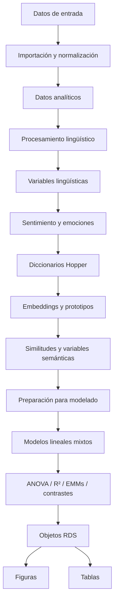

Este flujo representa la **arquitectura conceptual** del análisis. Cada etapa produce información que alimenta las etapas posteriores hasta llegar a dos tipos principales de productos: **resultados estadísticos persistentes** y **salidas de visualización y tabulación**.

### 2.2 Módulos principales

Los scripts principales asociados a este recorrido son:

```text
R/01_import_data.R
R/02_text_processing.R
R/03_sentiment.R
R/04_dictionaries.R
R/05_embeddings.R
R/06_similarity.R
R/07_models.R
R/08_visualization.R
R/09_sensitivity.R
python/embeddings_setup.py
```

Estos módulos cubren, de manera general, las siguientes funciones:

| Módulo                 | Función principal                                        |
| ---------------------- | -------------------------------------------------------- |
| `01_import_data.R`     | Importación y preparación inicial de los datos           |
| `02_text_processing.R` | Procesamiento y extracción de variables lingüísticas     |
| `03_sentiment.R`       | Análisis de sentimiento y emociones                      |
| `04_dictionaries.R`    | Aplicación y procesamiento de diccionarios Hopper        |
| `05_embeddings.R`      | Integración de representaciones vectoriales y prototipos |
| `06_similarity.R`      | Cálculo de similitudes y variables semánticas            |
| `07_models.R`          | Ajuste de modelos estadísticos                           |
| `08_visualization.R`   | Generación de figuras                                    |
| `09_sensitivity.R`     | Análisis de sensibilidad                                 |
| `embeddings_setup.py`  | Configuración de la dependencia Python para embeddings   |

> **Revisión metodológica:** la tabla anterior describe la función documentada de cada módulo y no pretende sustituir la especificación interna de cada script.

### 2.3 Dependencia de embeddings

La generación de embeddings constituye una **dependencia específica del pipeline** y utiliza el modelo:

```text
paraphrase-multilingual-MiniLM-L12-v2
```

La representación resultante se documenta con una dimensionalidad de:

```text
384 dimensiones
```

Esta representación se incorpora posteriormente a los análisis de similitud y variables semánticas.

### 2.4 Migración y equivalencia numérica

La documentación del proyecto establece que la equivalencia entre la implementación histórica y la implementación en Python fue **evaluada mediante una comparación numérica** antes de consolidar la migración.

Este punto es relevante para la trazabilidad porque la migración no se describe únicamente como un cambio de implementación, sino como un proceso en el que se verificó la correspondencia numérica entre las versiones.

> **Importante:** esta afirmación debe entenderse específicamente como una validación de equivalencia numérica de la implementación documentada y no como una afirmación general de equivalencia absoluta de todos los componentes del pipeline.

---

## 3. Artefactos de modelo canónicos

Los modelos estadísticos persistidos constituyen una parte central de la reproducibilidad del análisis. Para esta versión del proyecto se identifican **tres artefactos canónicos**, correspondientes a las etapas piloto, principal y comparativa.

### 3.1 Objetos canónicos

> ### Artefactos de modelo
>
> | Archivo                    | Ubicación                 | Etapa           | Función                                      |
> | -------------------------- | ------------------------- | --------------- | -------------------------------------------- |
> | `modelos_piloto.rds`       | `outputs/modelos/piloto/` | **Piloto**      | Modelos longitudinales del estudio piloto    |
> | `modelos_principal.rds`    | `outputs/modelos/piloto/` | **Principal**   | Modelos longitudinales del estudio principal |
> | `modelos_comparativos.rds` | `outputs/modelos/piloto/` | **Comparación** | Comparación entre piloto y principal         |

Estos objetos se consideran **artefactos de modelo canónicos** dentro de la estructura documentada del repositorio.

### 3.2 Función de los artefactos

Los archivos `.rds` constituyen objetos persistentes que permiten conservar los resultados de los modelos estadísticos utilizados por las etapas posteriores del análisis.

En particular:

* `modelos_piloto.rds` conserva los modelos correspondientes al estudio piloto.
* `modelos_principal.rds` conserva los modelos correspondientes al estudio principal.
* `modelos_comparativos.rds` conserva los resultados destinados a la comparación entre ambas etapas.

Esta separación permite distinguir claramente entre **modelado piloto**, **modelado principal** y **análisis comparativo**.

### 3.3 Relación con las visualizaciones

Los artefactos de modelo tienen además una función de trazabilidad respecto de las visualizaciones que utilizan resultados estadísticos ajustados.

En particular, las figuras que representan medias marginales estimadas o resultados derivados del modelo se vinculan con los objetos de modelado correspondientes, en lugar de depender exclusivamente de las tablas descriptivas.

Esta distinción es importante porque separa:

```text
Datos → Modelo → Estimaciones / contrastes → Figura
```

de las visualizaciones construidas directamente a partir de datos descriptivos:

```text
Datos → Estadística descriptiva → Figura
```

### 3.4 Artefactos históricos

Los tres objetos anteriores deben distinguirse de las copias históricas que puedan existir en versiones anteriores del proyecto.

El criterio documentado es:

> **Los archivos `modelos_piloto.rds`, `modelos_principal.rds` y `modelos_comparativos.rds` constituyen los artefactos canónicos utilizados para representar el estado consolidado del modelado durante la migración. Las copias históricas se conservan únicamente como referencia de trazabilidad y no sustituyen a los artefactos canónicos.**

### 3.5 Principio de canonicidad

La condición de **artefacto canónico** implica que estos objetos son los que deben utilizarse como referencia principal al documentar, reproducir o relacionar los resultados de los modelos con las etapas posteriores del pipeline.

> **Revisión pendiente:** La clasificación de un archivo como canónico describe el estado documental establecido para esta versión del proyecto. La existencia de archivos adicionales no debe interpretarse automáticamente como una versión alternativa válida del modelo.

## 4. Modelo longitudinal del piloto

### 4.1 Diseño

El estudio piloto comprende **17 participantes** y tres momentos de evaluación longitudinal:

```text
T1
T2
T3
```

Las condiciones experimentales consideradas son:

```text
Texto
Audio
Imagen
```

A diferencia del estudio principal, el piloto **no incorpora la variable `demora`**.

Esta diferencia de diseño debe conservarse explícitamente al comparar ambos conjuntos de datos, ya que determina qué efectos pueden ser evaluados en cada etapa.

### 4.2 Estructura analítica

Las variables dependientes se reorganizan en una **estructura longitudinal**, de modo que cada fila representa una observación correspondiente a una variable dependiente para un participante en un momento determinado.

La estructura conceptual utilizada es:

```text
id_participante
condicion
tiempo
valor
```

Esta transformación permite utilizar una misma especificación de modelado para distintas variables dependientes, manteniendo explícitamente la estructura de medidas repetidas.

### 4.3 Especificación del modelo

La especificación canónica documentada para el piloto es:

```r
valor ~ condicion * tiempo + (1 | id_participante)
```

Los componentes del modelo son:

| Componente               | Función                                                       |
| ------------------------ | ------------------------------------------------------------- |
| `valor`                  | Variable dependiente analizada                                |
| `condicion`              | Factor experimental                                           |
| `tiempo`                 | Factor longitudinal                                           |
| `condicion * tiempo`     | Efectos principales de condición y tiempo, más su interacción |
| `(1 \| id_participante)` | Intercepto aleatorio por participante                         |

El término `(1 | id_participante)` permite representar la **dependencia entre observaciones repetidas del mismo participante**, incorporando diferencias basales entre participantes dentro de la estructura del modelo.

### 4.4 Variables analizadas

El conjunto de variables susceptibles de modelado procede de las variables calculadas durante las distintas etapas del pipeline. Entre ellas se incluyen, según disponibilidad y criterios de aptitud analítica:

```text
Métricas lingüísticas
Variables emocionales
Variables derivadas de diccionarios
Proximidades semánticas
Medidas de similitud
```

La enumeración anterior debe entenderse como una **clasificación de tipos de variables**, no como un inventario fijo de variables modeladas en todos los casos.

La selección efectiva depende de:

* disponibilidad de la variable;
* estructura longitudinal requerida;
* calidad de los datos;
* criterios de aptitud aplicados por el pipeline.

> **Revisión pendiente:** La lista anterior describe las familias de variables documentadas, pero no establece por sí sola cuáles fueron efectivamente ajustadas en el conjunto final de modelos del piloto.

---

## 5. Modelo longitudinal principal

### 5.1 Diseño

El estudio principal comprende **23 participantes** y tres momentos longitudinales:

```text
T1
T2
T3
```

Además de la condición experimental, el análisis principal incorpora la variable:

```text
demora
```

La presencia de esta variable constituye una diferencia estructural respecto del modelo longitudinal del piloto.

### 5.2 Especificación del modelo

La especificación registrada para el análisis principal es:

```r
valor ~ condicion * tiempo + demora + (1 | id_participante)
```

Los componentes del modelo son:

| Componente               | Función                                                       |
| ------------------------ | ------------------------------------------------------------- |
| `valor`                  | Variable dependiente analizada                                |
| `condicion`              | Factor experimental                                           |
| `tiempo`                 | Factor longitudinal                                           |
| `demora`                 | Factor adicional incorporado en el estudio principal          |
| `condicion * tiempo`     | Efectos principales de condición y tiempo, más su interacción |
| `(1 \| id_participante)` | Intercepto aleatorio por participante                         |

La especificación incluye `demora` como **efecto principal**.

Por tanto, la fórmula no especifica interacciones entre `demora` y `condicion` o `tiempo`. Tampoco especifica una interacción `demora × condicion × tiempo`.

Esta distinción es importante para interpretar correctamente qué preguntas estadísticas permite responder el modelo.

### 5.3 Alcance de la especificación

La estructura del modelo permite evaluar simultáneamente:

* cambios longitudinales asociados con `tiempo`;
* diferencias asociadas con `condicion`;
* el patrón de interacción `condicion × tiempo`;
* diferencias asociadas con `demora`;
* variabilidad basal entre participantes mediante el intercepto aleatorio.

> **Revisión pendiente:** La fórmula documentada establece la estructura del modelo, pero no determina por sí sola la codificación de los factores, niveles de referencia, contrastes empleados ni las transformaciones aplicadas a cada variable dependiente.

---

## 6. Modelo comparativo piloto–principal

### 6.1 Objetivo

El modelo comparativo integra las dos fuentes de datos del proyecto:

```text
Piloto
Principal
```

Su objetivo es evaluar si los patrones longitudinales observados presentan diferencias asociadas con la **fuente de datos**, además de las variaciones relacionadas con condición y tiempo.

La comparación debe entenderse como un análisis de **heterogeneidad entre fuentes**, y no como evidencia automática de replicación o no replicación.

### 6.2 Especificación del modelo

La estructura documentada es:

```r
valor ~ fuente * condicion * tiempo + (1 | id_fuente)
```

La expansión de `fuente * condicion * tiempo` incorpora:

| Componente                     | Representación                                                |
| ------------------------------ | ------------------------------------------------------------- |
| Efecto de `fuente`             | Diferencias entre fuentes                                     |
| Efecto de `condicion`          | Diferencias entre condiciones                                 |
| Efecto de `tiempo`             | Cambios longitudinales                                        |
| Interacciones de segundo orden | `fuente × condicion`, `fuente × tiempo`, `condicion × tiempo` |
| Interacción de tercer orden    | `fuente × condicion × tiempo`                                 |
| `(1 \| id_fuente)`             | Intercepto aleatorio asociado a `id_fuente`                   |

Esta formulación permite evaluar si la relación entre condición y tiempo cambia según la fuente mediante los términos de interacción que involucran `fuente`.

### 6.3 Interpretación

La presencia de una interacción con `fuente` **no debe interpretarse automáticamente como evidencia de replicación o ausencia de replicación**.

La interpretación científica depende del término específico evaluado y debe considerar conjuntamente:

* estimación del efecto;
* dirección y magnitud;
* incertidumbre;
* contraste estadístico;
* estructura del modelo.

En particular, una interacción `fuente × condicion × tiempo` respondería a una pregunta más específica: si el patrón conjunto de condición y cambio temporal difiere entre piloto y principal.

### 6.4 Relación entre los modelos

Los tres niveles de análisis pueden representarse conceptualmente como:

```text
PILOTO
  │
  └── condicion × tiempo
          │
          ▼
PRINCIPAL
  │
  └── condicion × tiempo + demora
          │
          ▼
COMPARATIVO
  │
  └── fuente × condicion × tiempo
```

La comparación, por tanto, no sustituye a los modelos específicos de cada etapa, sino que añade explícitamente la dimensión `fuente` para estudiar diferencias entre ambos conjuntos de datos.

### 6.5 Mapa conceptual de los modelos

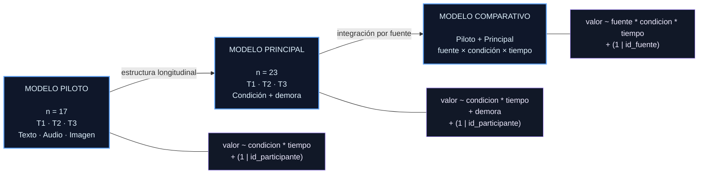

> **Nota de interpretación:** Este diagrama representa la relación estructural entre las especificaciones documentadas. No implica que el modelo comparativo sea una extensión automática del modelo principal ni que la secuencia gráfica represente un procedimiento de ajuste ejecutado en ese orden.

## 7. Métodos de estimación e inferencia

Los modelos longitudinales del pipeline se especifican como **modelos lineales mixtos (Linear Mixed Models, LMM)**, adecuados para representar la estructura de medidas repetidas y la variabilidad asociada a los participantes.

La infraestructura estadística documentada incluye los siguientes componentes:

> ### Infraestructura estadística
>
> | Componente                   | Función                                                                        |
> | ---------------------------- | ------------------------------------------------------------------------------ |
> | `lme4::lmer()`               | Ajuste de modelos lineales mixtos                                              |
> | `lmerTest::anova()`          | Inferencia sobre los efectos del modelo mediante aproximación de Satterthwaite |
> | `emmeans`                    | Cálculo de medias marginales estimadas y contrastes                            |
> | `performance::r2_nakagawa()` | Estimación de R² marginal y condicional, cuando corresponde                    |

### 7.1 Estimación de los modelos

La implementación documentada utiliza **REML (Restricted Maximum Likelihood)** para la estimación de los modelos mixtos.

REML proporciona la estimación de los componentes de varianza del modelo considerando la estructura de efectos fijos especificada y resulta especialmente relevante en modelos mixtos cuando se pretende estimar la variabilidad asociada a los efectos aleatorios.

La configuración del optimizador forma parte de la implementación utilizada para el ajuste. Este componente debe conservarse como parte de la especificación computacional del modelo, ya que puede afectar la convergencia y la obtención de la solución numérica.

### 7.2 Inferencia

La inferencia sobre los efectos fijos se realiza mediante la infraestructura asociada a `lmerTest`, utilizando la **aproximación de Satterthwaite** para los grados de libertad.

Este procedimiento debe distinguirse conceptualmente de la estimación del modelo:

```text
Estimación
    │
    └── ajuste del modelo mixto mediante REML
             │
             ▼
Inferencia
    │
    └── evaluación de efectos mediante ANOVA
             │
             └── aproximación de Satterthwaite
```

Por tanto, los resultados de inferencia no deben interpretarse como equivalentes a los parámetros estimados por el modelo, sino como una capa posterior destinada a evaluar los efectos especificados.

### 7.3 Medidas de ajuste y varianza explicada

Cuando corresponde, el pipeline utiliza `performance::r2_nakagawa()` para obtener:

* **R² marginal:** proporción de variabilidad explicada por los efectos fijos;
* **R² condicional:** proporción de variabilidad explicada por los efectos fijos y aleatorios conjuntamente.

Estas medidas deben interpretarse dentro de la estructura específica del modelo mixto y no como equivalentes directos al R² convencional de una regresión lineal simple.

> **Revisión pendiente:** La aplicación de `r2_nakagawa()` es condicional según el artefacto o modelo. Por ello, su presencia no debe asumirse para todos los modelos sin comprobar la salida correspondiente.

### 7.4 Principio de trazabilidad estadística

La especificación estadística debe conservar conjuntamente:

```text
fórmula del modelo
        ↓
método de estimación
        ↓
configuración numérica
        ↓
procedimiento inferencial
        ↓
medidas derivadas
```

Esta trazabilidad permite interpretar los resultados derivados en el contexto exacto del modelo que los produjo.

---

## 8. Resultados derivados de los modelos

Los modelos ajustados no constituyen únicamente una colección de coeficientes. El pipeline conserva diferentes niveles de resultados derivados que permiten pasar desde el **objeto estadístico ajustado** hasta la **inferencia, las estimaciones marginales y la información diagnóstica**.

### 8.1 Estructura de resultados

La estructura conceptual documentada es:

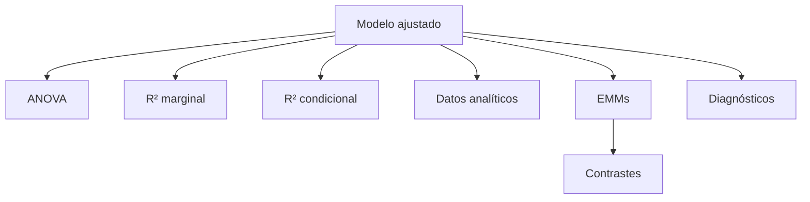

Los componentes pueden organizarse en diferentes niveles:

| Nivel       | Resultado        | Propósito                                                          |
| ----------- | ---------------- | ------------------------------------------------------------------ |
| Modelo      | Modelo ajustado  | Conservar la especificación y estimaciones del modelo              |
| Inferencia  | ANOVA            | Evaluar los efectos globales incluidos en la fórmula               |
| Ajuste      | R² marginal      | Cuantificar la varianza explicada por efectos fijos                |
| Ajuste      | R² condicional   | Cuantificar la varianza explicada por efectos fijos + aleatorios   |
| Estimación  | EMMs             | Obtener medias marginales estimadas para combinaciones factoriales |
| Comparación | Contrastes       | Evaluar diferencias específicas entre niveles                      |
| Diagnóstico | Diagnósticos     | Examinar propiedades y adecuación del ajuste                       |
| Datos       | Datos analíticos | Conservar la estructura utilizada para generar los resultados      |

### 8.2 Separación de niveles analíticos

Estos componentes cumplen funciones diferentes y deben mantenerse conceptualmente separados:

```text
OBJETO ESTADÍSTICO
        │
        ├── Inferencia global
        │      └── ANOVA
        │
        ├── Tamaño explicativo
        │      ├── R² marginal
        │      └── R² condicional
        │
        ├── Estimaciones
        │      └── EMMs
        │
        ├── Comparaciones
        │      └── Contrastes
        │
        └── Evaluación del ajuste
               └── Diagnósticos
```

Esta separación es importante porque cada resultado responde a una pregunta estadística diferente.

### 8.3 Resultados para visualización

Algunos resultados derivados, especialmente las **EMMs** y sus intervalos, sirven además como entrada para las visualizaciones del análisis.

En estos casos, la figura debe poder rastrearse hasta:

```text
modelo ajustado
      ↓
EMMs
      ↓
intervalos / contrastes
      ↓
figura
```

Esto permite distinguir visualizaciones basadas en estimaciones ajustadas de aquellas construidas directamente a partir de estadísticas descriptivas.

> **Revisión pendiente:** La presencia exacta de cada componente dentro de cada artefacto `.rds` debe determinarse según la estructura real del objeto conservado. Esta sección describe la arquitectura documentada de resultados y no presupone que todos los componentes estén presentes en todos los archivos.

---

## 9. Contrastes y comparaciones

Los contrastes permiten descomponer los efectos globales del modelo en **comparaciones específicas entre niveles de los factores**.

En los modelos donde están implementados, se utilizan para examinar principalmente:

```text
Condición dentro de cada momento
        ↓
diferencias entre condiciones en T1, T2 o T3

Momento dentro de cada condición
        ↓
diferencias entre momentos dentro de Texto, Audio o Imagen
```

### 9.1 Tipos de comparación

Las comparaciones documentadas pueden expresarse conceptualmente como:

| Comparación                | Pregunta                                                     |
| -------------------------- | ------------------------------------------------------------ |
| Condición dentro de tiempo | ¿Difieren las condiciones entre sí en un momento específico? |
| Tiempo dentro de condición | ¿Difieren los momentos dentro de una condición específica?   |

Cuando el modelo incluye una interacción `condicion × tiempo`, estas comparaciones permiten explorar con mayor detalle la estructura del efecto conjunto.

### 9.2 Ajuste por multiplicidad

El procedimiento de ajuste por comparaciones múltiples forma parte de la implementación del pipeline.

Por tanto, el ajuste utilizado debe conservarse junto con los resultados de los contrastes y no debe sustituirse retrospectivamente por otro procedimiento durante la interpretación.

Conceptualmente:

```text
Modelo
  ↓
EMMs
  ↓
Contrastes
  ↓
Ajuste por multiplicidad
  ↓
Resultado inferencial
```

### 9.3 Trazabilidad de los contrastes

Una tabla de contrastes no debe interpretarse de manera aislada. Cada resultado debe poder vincularse con:

```text
modelo
variable dependiente
factores incluidos
niveles comparados
contraste utilizado
ajuste por multiplicidad
estimación
incertidumbre
resultado inferencial
```

Esta relación garantiza que una comparación específica pueda reconstruirse a partir del modelo que la generó.

### 9.4 Interpretación

Los contrastes representan **comparaciones derivadas del modelo**, no nuevos modelos independientes.

En consecuencia, la interpretación debe conservar la relación entre:

**especificación global → estimaciones marginales → contraste específico → inferencia correspondiente**.

> **Revisión pendiente:** El tipo exacto de contraste y el método de ajuste por multiplicidad deben conservarse tal como estén implementados en cada análisis. Esta sección establece el principio de trazabilidad, pero no asigna un método específico cuando no está explícitamente documentado.

## 10. Diagnósticos

El pipeline incorpora mecanismos destinados a comprobar el **ajuste, estabilidad y calidad de los modelos**. Estos controles deben distinguirse de aquellas evaluaciones que constituyen buenas prácticas metodológicas, pero que no necesariamente fueron ejecutadas por la implementación documentada.

### 10.1 Controles de diagnóstico

Entre los controles documentados se encuentran:

```text
Convergencia del modelo
        ↓
Singularidad del ajuste
        ↓
Inspección de residuos
        ↓
Diagnósticos gráficos, cuando están disponibles
        ↓
Análisis de valores atípicos en etapas de sensibilidad
```

Estos controles cumplen funciones diferentes:

| Diagnóstico           | Propósito                                                                                   |
| --------------------- | ------------------------------------------------------------------------------------------- |
| Convergencia          | Determinar si el procedimiento numérico alcanza una solución del modelo                     |
| Singularidad          | Detectar problemas en la estructura de efectos aleatorios                                   |
| Residuos              | Evaluar el comportamiento de los errores del modelo                                         |
| Diagnósticos gráficos | Examinar visualmente aspectos del ajuste                                                    |
| Valores atípicos      | Evaluar la sensibilidad de los resultados frente a observaciones potencialmente influyentes |

### 10.2 Distinción entre implementación y recomendación metodológica

La documentación distingue explícitamente entre:

**diagnósticos efectivamente ejecutados por el pipeline** y **procedimientos recomendables que no deben presentarse como realizados sin evidencia en el código o en los artefactos conservados**.

Por esta razón, no se presentan automáticamente como ejecutados los siguientes procedimientos:

```text
Pruebas formales de homocedasticidad
Cook's distance / medidas de influencia
Evaluación exhaustiva de multicolinealidad
```

Su inclusión en la metodología definitiva requiere evidencia explícita de que fueron calculados y utilizados en el análisis.

> **Principio documental:** la ausencia de un diagnóstico documentado no debe convertirse retrospectivamente en una afirmación de que dicho diagnóstico fue realizado.

---

## 11. Análisis de sensibilidad

El análisis de sensibilidad constituye una **capa complementaria al modelo canónico**. Su finalidad es evaluar la estabilidad de los resultados frente a decisiones analíticas alternativas.

El módulo correspondiente es:

```text
R/09_sensitivity.R
```

### 11.1 Función analítica

Las sensibilidades pueden evaluar, según la implementación disponible:

```text
Modelo canónico
      │
      ├── Transformaciones alternativas
      ├── Exclusión de valores atípicos
      ├── Variables alternativas
      └── Especificaciones relacionadas
             │
             ▼
      Comparación de resultados
             │
             ▼
      Evaluación de robustez
```

El objetivo no es reemplazar el modelo principal, sino determinar hasta qué punto las conclusiones dependen de determinadas decisiones analíticas.

### 11.2 Interpretación

Los resultados de sensibilidad deben interpretarse como **evidencia complementaria sobre la robustez de los hallazgos**.

Una diferencia entre el modelo canónico y una especificación de sensibilidad no implica automáticamente que el modelo principal sea incorrecto. Indica que la conclusión puede depender, en distinto grado, de la decisión analítica evaluada.

De manera equivalente, la estabilidad de un resultado bajo diferentes especificaciones proporciona evidencia adicional de robustez, pero no transforma automáticamente el análisis en una prueba causal.

> **Revisión pendiente:** La lista anterior presenta tipos de sensibilidad documentados conceptualmente. Las modificaciones efectivamente ejecutadas deben distinguirse de las alternativas metodológicas que únicamente podrían evaluarse.

---

## 12. Relación con el procesamiento NLP

Los modelos estadísticos consumen variables derivadas de las etapas de procesamiento de lenguaje natural (NLP). En consecuencia, la interpretación de un resultado estadístico depende no sólo de la fórmula del modelo, sino también de **cómo fue construida la variable que entra en dicha fórmula**.

### 12.1 Flujo general

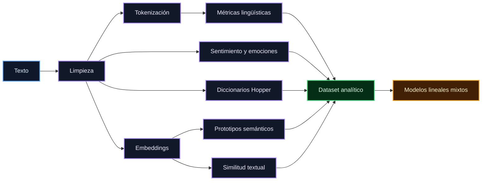

### 12.2 Implicación metodológica

El recorrido puede resumirse como:

```text
Texto
  ↓
Procesamiento NLP
  ↓
Variables derivadas
  ↓
Dataset analítico
  ↓
Modelo estadístico
  ↓
Resultado inferencial
```

Por tanto, una variable como `ttr`, una puntuación emocional, una tasa de diccionario o una medida de similitud debe interpretarse conjuntamente con el procedimiento mediante el cual fue calculada.

Esta relación es especialmente relevante para las variables semánticas basadas en embeddings, ya que su comportamiento depende de la representación vectorial utilizada y de las operaciones posteriores aplicadas sobre ella.

---

## 13. Embeddings y variables semánticas

Las variables semánticas utilizadas en el pipeline se apoyan en representaciones vectoriales de **384 dimensiones** generadas mediante el modelo:

```text
paraphrase-multilingual-MiniLM-L12-v2
```

A partir de estas representaciones se documentan diferentes objetos y medidas:

```text
Embeddings temporales
        ↓
Prototipos semánticos
        ↓
PCA / representación reducida
        ↓
Proximidad semántica
        ↓
Similitud coseno
```

### 13.1 Familias de prototipos

Las categorías de prototipos documentadas se organizan en **dos familias conceptuales**: `Hopper` y `Clínicos`.

### 13.2 Familia Hopper

La familia `Hopper` comprende:

```text
soledad
espera
incomunicacion
objetos
emociones_negativas
luz_sombra
pasividad
desconexion
duda
espacio
```

### 13.3 Familia Clínica

La familia `Clínicos` comprende:

```text
tristeza
miedo
ansiedad_malestar
esperanza
confianza
agencia
control
incertidumbre
evitacion
afrontamiento
```

### 13.4 Mapa de familias semánticas

La distribución puede representarse de manera compacta como:

```mermaid id="uy0m5i"
flowchart TB

    E["Embeddings<br/>384 dimensiones"]

    E --> H["FAMILIA HOPPER"]
    E --> C["FAMILIA CLÍNICA"]

    subgraph HOPPER["Hopper"]
        H1["soledad"]
        H2["espera"]
        H3["incomunicacion"]
        H4["objetos"]
        H5["emociones_negativas"]
        H6["luz_sombra"]
        H7["pasividad"]
        H8["desconexion"]
        H9["duda"]
        H10["espacio"]
    end

    subgraph CLIN["Clínicos"]
        C1["tristeza"]
        C2["miedo"]
        C3["ansiedad_malestar"]
        C4["esperanza"]
        C5["confianza"]
        C6["agencia"]
        C7["control"]
        C8["incertidumbre"]
        C9["evitacion"]
        C10["afrontamiento"]
    end

    H --> H1
    H --> H2
    H --> H3
    H --> H4
    H --> H5
    H --> H6
    H --> H7
    H --> H8
    H --> H9
    H --> H10

    C --> C1
    C --> C2
    C --> C3
    C --> C4
    C --> C5
    C --> C6
    C --> C7
    C --> C8
    C --> C9
    C --> C10

    H --> P["Prototipos semánticos"]
    C --> P

    P --> S["Proximidades"]
    P --> CS["Similitud coseno"]
    P --> PCA["PCA"]

    classDef embedding fill:#0f172a,stroke:#60a5fa,color:#e0f2fe,stroke-width:2px;
    classDef hopper fill:#1f2937,stroke:#a78bfa,color:#ede9fe,stroke-width:2px;
    classDef clinical fill:#172554,stroke:#38bdf8,color:#dbeafe,stroke-width:2px;
    classDef derived fill:#052e16,stroke:#4ade80,color:#dcfce7,stroke-width:2px;

    class E embedding;
    class H,H1,H2,H3,H4,H5,H6,H7,H8,H9,H10 hopper;
    class C,C1,C2,C3,C4,C5,C6,C7,C8,C9,C10 clinical;
    class P,S,CS,PCA derived;
```

### 13.5 Interpretación de las variables semánticas

El diagrama representa una jerarquía de procesamiento:

```text
Embeddings
    ↓
Representación semántica
    ↓
Prototipos
    ↓
Medidas de proximidad / similitud
    ↓
Variables semánticas analíticas
```

Las categorías `Hopper` y `Clínicos` deben entenderse como **familias de referencia semántica definidas para el pipeline**, no como diagnósticos clínicos ni como categorías psicométricas validadas por el mero hecho de recibir una etiqueta clínica.

### 13.6 Código asociado

La generación y transformación de estas variables se documenta principalmente en:

```text
R/05_embeddings.R
R/06_similarity.R
python/embeddings_setup.py
```

> **Revisión pendiente:** La documentación identifica las familias y los objetos semánticos utilizados, pero no establece aquí las reglas internas exactas para construir cada prototipo ni la forma precisa en que cada medida se transforma posteriormente en una variable analítica.

---

## 14. Validación de la migración de embeddings

La migración del componente de embeddings fue sometida a una **prueba específica de equivalencia numérica** entre la implementación histórica y la nueva implementación Python.

Antes de realizar la comparación se normalizaron explícitamente los valores ausentes y vacíos como:

```text
[VACÍO]
```

### 14.1 Métricas de equivalencia

El resultado documentado de la prueba final fue:

```text
max abs diff = 8.469452472681382e-09
mean abs diff = 1.023780383187243e-09
RMSE          = 1.568188326389676e-09
cosine        = 1.0
```

Las métricas pueden resumirse como:

| Métrica         | Resultado               |
| --------------- | ----------------------- |
| `max abs diff`  | `8.469452472681382e-09` |
| `mean abs diff` | `1.023780383187243e-09` |
| `RMSE`          | `1.568188326389676e-09` |
| `cosine`        | `1.0`                   |

### 14.2 Interpretación

La prueba documentada satisface los criterios de aceptación definidos para esa comparación y proporciona evidencia de **equivalencia numérica de las representaciones comparadas**.

El resultado respalda la continuidad del componente de embeddings después de la migración, dentro del alcance específico de la prueba realizada.

### 14.3 Flujo de validación

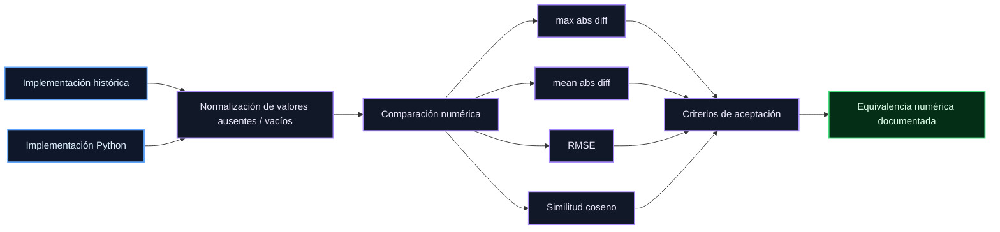

### 14.4 Alcance de la validación

La validación demuestra equivalencia numérica **para la representación comparada y bajo las condiciones de la prueba documentada**.

Por tanto, el resultado no debe extenderse automáticamente a componentes del pipeline que no hayan formado parte de esta comparación.

> **Principio de interpretación:** `cosine = 1.0` y las diferencias absolutas del orden de `10^-9` respaldan la equivalencia numérica observada en la prueba, pero la afirmación debe permanecer vinculada al procedimiento de validación realizado y no generalizarse más allá de su alcance.

## 15. Trazabilidad modelo → figura → tabla

Los modelos estadísticos no constituyen artefactos aislados. Sus resultados alimentan diferentes productos analíticos, entre ellos tablas, resúmenes y visualizaciones.

El principio de trazabilidad utilizado en el pipeline puede representarse como:

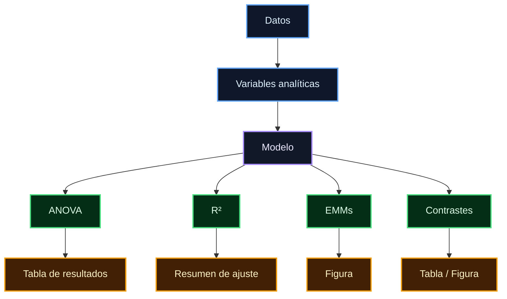

Este flujo distingue las principales capas de resultados:

| Capa        | Resultado                 | Destino posible |
| ----------- | ------------------------- | --------------- |
| Datos       | Variables analíticas      | Modelo          |
| Modelo      | Ajuste estadístico        | Artefacto RDS   |
| Inferencia  | ANOVA                     | Tabla           |
| Ajuste      | R² marginal / condicional | Resumen         |
| Estimación  | EMMs                      | Figura          |
| Comparación | Contrastes                | Tabla / figura  |

### 15.1 Requisitos mínimos de trazabilidad

Para cada resultado presentado en el análisis debe ser posible identificar, como mínimo:

```text
Variable dependiente
        ↓
Modelo utilizado
        ↓
Objeto RDS correspondiente
        ↓
Procedimiento de estimación / inferencia
        ↓
Resultado derivado
        ↓
Figura o tabla de destino
```

Esto permite reconstruir el origen de un resultado sin depender únicamente de la imagen, tabla o valor numérico publicado.

### 15.2 Figuras derivadas directamente de datos

No todas las figuras proceden de objetos de modelo.

Cuando una visualización se genera directamente a partir de datos procesados, debe documentarse explícitamente como una **figura descriptiva basada en datos**, sin atribuirle artificialmente una procedencia modelística.

Por tanto, existen al menos dos rutas de procedencia:

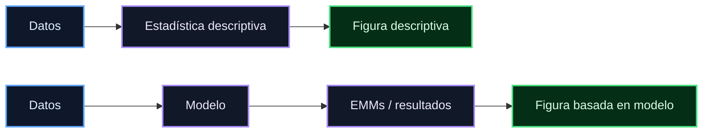

Esta distinción evita confundir una representación descriptiva de los datos con una visualización basada en estimaciones ajustadas por un modelo.

---

## 16. Relación con la documentación de figuras

La documentación específica de las figuras se conserva independientemente en:

```text
outputs/figuras/
```

Los resultados de modelado se conservan en:

```text
outputs/modelos/
```

La relación conceptual entre ambos conjuntos de artefactos puede representarse como:

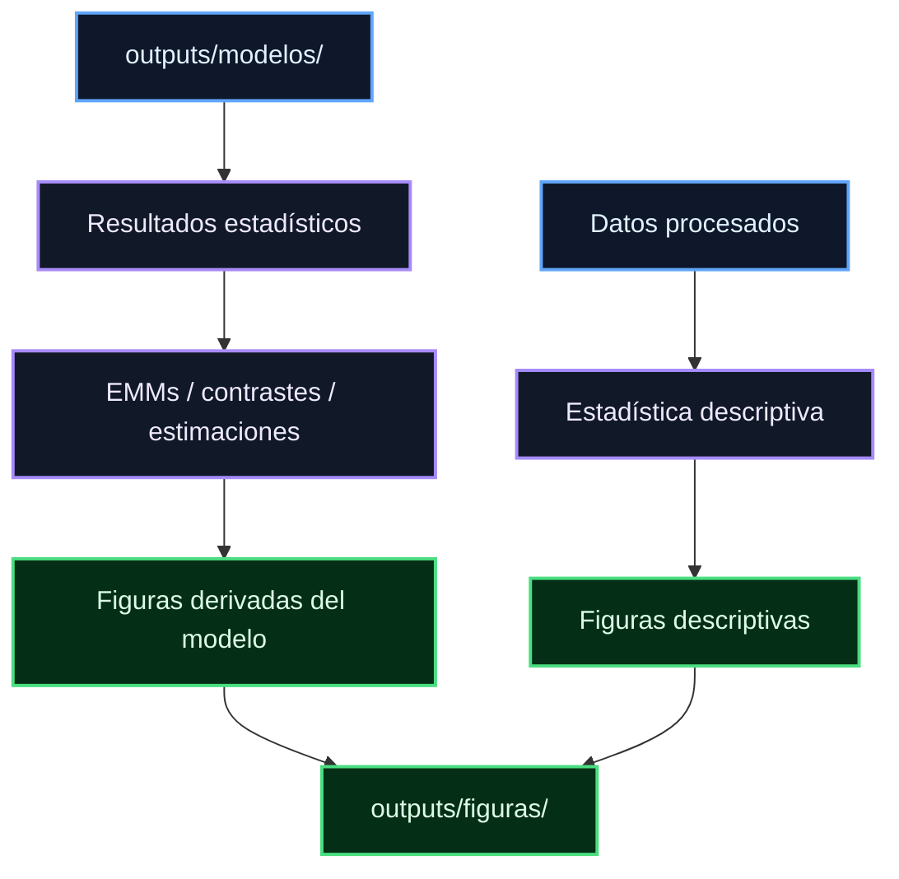

El hecho de que `outputs/modelos/` y `outputs/figuras/` estén relacionados **no significa que todas las figuras hayan sido generadas directamente a partir de un objeto `.rds`**.

La procedencia de cada figura debe determinarse individualmente:

> **Modelo → resultado derivado → figura**

cuando la visualización utiliza resultados ajustados, o:

> **Datos → estadística descriptiva → figura**

cuando la visualización se construye directamente a partir de los datos procesados.

Esta distinción debe mantenerse en la documentación para preservar la trazabilidad real del pipeline.

---

## 17. Artefactos históricos

Durante la auditoría del proyecto de origen se localizaron generaciones anteriores de resultados, modelos y otros artefactos analíticos.

Estos elementos cumplen una función importante para reconstruir la **historia del desarrollo del análisis**, pero no deben confundirse con los artefactos canónicos correspondientes a la implementación actualmente consolidada.

### 17.1 Distinción entre generaciones

La separación conceptual es:

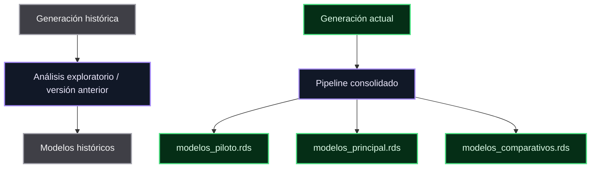

La existencia de un modelo histórico **no implica que dicho modelo sea incorrecto**. Significa que corresponde a una etapa diferente del desarrollo analítico y, por tanto, debe conservarse con su contexto de procedencia.

### 17.2 Principio de interpretación

Un artefacto histórico puede ser útil para:

* reconstruir decisiones metodológicas anteriores;
* comparar implementaciones;
* documentar la evolución del pipeline;
* verificar la transición hacia la implementación consolidada.

Sin embargo, su presencia en el repositorio no debe interpretarse como evidencia de que constituye una alternativa vigente al artefacto canónico.

---

## 18. Duplicados y selección de artefactos canónicos

Durante la auditoría del proyecto de origen se identificaron múltiples copias físicas de determinados objetos RDS.

Para determinar si diferentes archivos representaban realmente el mismo contenido, se utilizó **SHA-256** como criterio de equivalencia byte a byte.

### 18.1 Criterio de deduplicación

El principio aplicado es:

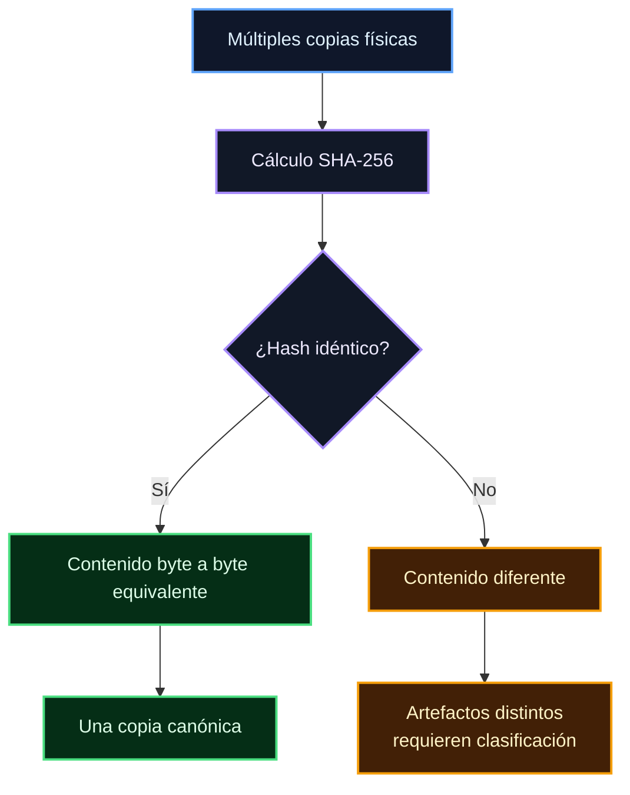

Cuando varias copias presentan el mismo SHA-256, se considera que contienen el mismo contenido binario y, por tanto, la multiplicidad de rutas no representa múltiples versiones del análisis.

El criterio puede resumirse como:

```text
Mismo contenido
      ↓
SHA-256 idéntico
      ↓
Una única copia canónica
      ↓
Rutas adicionales = referencias / duplicados
```

### 18.2 Importancia para la trazabilidad

La deduplicación evita que una multiplicidad de archivos físicamente diferentes sea interpretada como una multiplicidad de resultados analíticos.

Esto permite separar:

```text
multiplicidad de archivos
        ≠
multiplicidad de análisis
```

Por tanto, la selección de artefactos canónicos se basa en la **identidad del contenido y su función dentro del pipeline**, no simplemente en el número de copias existentes en el proyecto.

### 18.3 Relación con los artefactos canónicos

Los archivos:

```text
modelos_piloto.rds
modelos_principal.rds
modelos_comparativos.rds
```

representan los artefactos de modelo canónicos establecidos para la versión consolidada del pipeline.

Las copias históricas o duplicadas pueden conservarse para trazabilidad, pero no deben generar una segunda interpretación del mismo resultado cuando su contenido es idéntico.

> **Revisión pendiente:** La identidad byte a byte mediante SHA-256 demuestra equivalencia de contenido entre archivos comparados. No demuestra por sí sola que dos archivos conceptualmente diferentes representen el mismo modelo; esa clasificación depende además de su función y contexto dentro del pipeline.

## 19. Reproducibilidad

La reproducibilidad de los modelos debe evaluarse de manera **multinivel**. La existencia de código, artefactos persistidos y datos de entrada representa dimensiones diferentes de la reproducibilidad y ninguna de ellas, de manera aislada, garantiza que un análisis pueda reconstruirse completamente.

Para este proyecto se distinguen tres niveles principales:

### 19.1 Nivel 1 — Código

La primera condición consiste en determinar si existe el código necesario para definir, ajustar y procesar el modelo.

La pregunta central es:

> **¿Existe y se conserva el código que especifica el procedimiento mediante el cual se obtiene el modelo?**

Este nivel permite evaluar la **reproducibilidad procedimental**. Un investigador puede disponer de una descripción de la fórmula del modelo, pero sin el código que implementa realmente las transformaciones, filtros, contrastes, opciones de estimación y demás decisiones computacionales, la reconstrucción puede quedar incompleta.

Conceptualmente:

```text
Código
  ↓
Especificación
  ↓
Procedimiento de ajuste
  ↓
Resultados
```

La conservación del código permite rastrear cómo se construyó el resultado, pero **no garantiza por sí sola que el resultado pueda regenerarse** si faltan los datos o dependencias necesarias.

---

### 19.2 Nivel 2 — Artefacto

La segunda condición consiste en comprobar la existencia del objeto estadístico resultante.

La pregunta central es:

> **¿Existe y se conserva el objeto RDS generado por el procedimiento de modelado?**

Los archivos `.rds` permiten preservar los objetos estadísticos resultantes y facilitan la recuperación de los resultados sin necesidad de volver a ejecutar inmediatamente todo el pipeline.

Conceptualmente:

```text
Modelo ajustado
      ↓
Objeto R
      ↓
Archivo .rds
      ↓
Artefacto persistente
```

Este nivel proporciona **reproducibilidad del resultado almacenado**, pero no demuestra por sí mismo que el resultado pueda volver a producirse desde los datos originales.

Un archivo `.rds` puede conservar un modelo válido aun cuando los datos que originalmente lo produjeron ya no estén presentes en el repositorio.

---

### 19.3 Nivel 3 — Datos

La tercera condición consiste en determinar si se encuentran disponibles los datos requeridos para volver a ejecutar el procedimiento.

La pregunta central es:

> **¿Están disponibles los datos de entrada necesarios para regenerar el modelo?**

Los datos constituyen la materia prima sobre la que se aplican las transformaciones, el procesamiento NLP y el modelado estadístico.

Conceptualmente:

```text
Datos
  ↓
Procesamiento
  ↓
Variables analíticas
  ↓
Modelo
```

La ausencia de los datos originales impide, en general, realizar una reconstrucción completa desde cero, incluso cuando el código y el objeto `.rds` estén disponibles.

---

### 19.4 Evaluación integrada de reproducibilidad

Los tres niveles deben evaluarse conjuntamente:

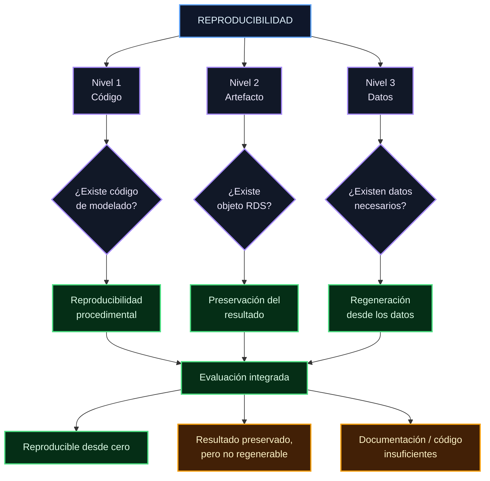

Este esquema muestra que la reproducibilidad no debe reducirse a una única comprobación.

Puede existir:

```text
Código + RDS + datos
        ↓
Reproducción potencial desde cero
```

pero también:

```text
Código + RDS − datos
        ↓
Resultado preservado
pero regeneración incompleta
```

o:

```text
RDS − código − datos
        ↓
Resultado almacenado
pero trazabilidad procedimental limitada
```

### 19.5 Principio de interpretación

Por tanto:

> **La presencia de un archivo `.rds` demuestra que un resultado estadístico fue almacenado; no demuestra por sí sola que cualquier investigador pueda regenerarlo desde cero utilizando únicamente el contenido actual del repositorio.**

La evaluación de reproducibilidad debe considerar conjuntamente **código, artefactos y datos**, además de las dependencias computacionales requeridas.

### 19.6 Alcance de la migración

La migración actual fue diseñada principalmente para preservar:

```text id="4e4u9m"
Código
  ↓
Resultados seleccionados
  ↓
Artefactos científicos
  ↓
Trazabilidad
  ↓
Documentación
```

Los datos originales que no forman parte de la migración deben gestionarse mediante los mecanismos de acceso, protección y control correspondientes.

La ausencia de datos del repositorio no debe interpretarse automáticamente como pérdida del resultado científico cuando el artefacto estadístico y su documentación han sido preservados.

---

## 20. Limitaciones metodológicas

Los modelos deben interpretarse considerando tanto la estructura del diseño como las características del conjunto de datos y las decisiones implementadas durante el pipeline.

Entre las principales limitaciones documentadas se encuentran:

```text id="1h3vdy"
Tamaños muestrales reducidos
        ↓
Posible desbalance entre condiciones
        ↓
Diferencias estructurales entre piloto y principal
        ↓
Distinto tratamiento de la variable demora
        ↓
Naturaleza longitudinal de las observaciones
        ↓
Complejidad de las interacciones de orden superior
        ↓
Dependencia de disponibilidad y calidad de las variables
        ↓
Alcance limitado de los diagnósticos implementados
```

### 20.1 Consecuencias interpretativas

Estas características condicionan el alcance inferencial de los modelos.

En particular:

* los tamaños muestrales reducidos pueden limitar la precisión de las estimaciones;
* el desbalance entre condiciones puede afectar la estabilidad de determinadas comparaciones;
* las diferencias de diseño entre piloto y principal deben considerarse al interpretar el modelo comparativo;
* `demora` no está disponible bajo la misma estructura en piloto y principal;
* las interacciones de orden superior requieren una interpretación específica del término correspondiente;
* la selección de variables depende de su disponibilidad y aptitud analítica;
* los resultados deben interpretarse dentro de los límites de los diagnósticos efectivamente implementados.

Estas limitaciones **no invalidan automáticamente los modelos**. Su función es establecer el alcance de las conclusiones que pueden extraerse de ellos.

### 20.2 Principio de prudencia inferencial

La interpretación de los resultados debe evitar extrapolar más allá de lo que permite el diseño, la calidad de los datos y la especificación estadística.

En particular, una asociación estadísticamente detectable no debe interpretarse automáticamente como evidencia causal, ni la ausencia de significancia como demostración de ausencia de efecto.

> **Revisión pendiente:** Las limitaciones anteriores corresponden a las restricciones documentadas en el proyecto. Su impacto cuantitativo sobre cada modelo debe considerarse en función del resultado específico y no asumirse idéntico para todos los análisis.

---

## 21. Fuente de verdad

La documentación distingue entre los artefactos que constituyen la **fuente de verdad estadística** de la versión actual y los artefactos históricos utilizados para trazabilidad.

### 21.1 Artefactos estadísticos canónicos

Los principales objetos de modelo canónicos se conservan en:

```text id="w85c4u"
outputs/modelos/piloto/
├── modelos_piloto.rds
├── modelos_principal.rds
└── modelos_comparativos.rds
```

Estos archivos representan los artefactos persistidos correspondientes a:

```text
modelos_piloto.rds
        → análisis piloto

modelos_principal.rds
        → análisis principal

modelos_comparativos.rds
        → comparación piloto–principal
```

### 21.2 Código asociado

La implementación de los modelos y sus análisis de sensibilidad se encuentra principalmente en:

```text id="m7s7qk"
R/07_models.R
R/09_sensitivity.R
```

Estos módulos dependen, a su vez, de las etapas previas que producen las variables analíticas utilizadas por los modelos.

### 21.3 Figuras

Las visualizaciones asociadas al análisis se conservan en:

```text id="6x6me0"
outputs/figuras/
```

Su relación con los modelos se establece individualmente de acuerdo con la trazabilidad documentada en las secciones correspondientes.

### 21.4 Auditoría y trazabilidad histórica

La documentación relativa a la migración y a la reconstrucción histórica se encuentra en:

```text id="2g4aqp"
docs/auditorias/
```

### 21.5 Jerarquía documental

La estructura puede resumirse como:

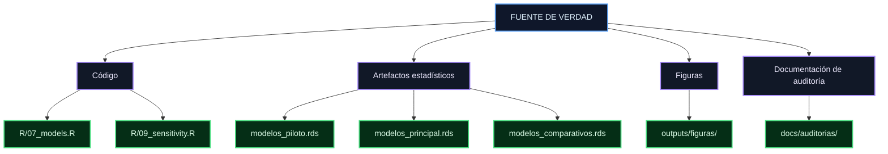

Esta estructura permite distinguir entre **cómo se genera el resultado**, **qué resultado se conserva**, **qué visualizaciones se derivan de él** y **dónde se documenta su trazabilidad**.

---

## 22. Principio de trazabilidad científica

El criterio rector del repositorio es mantener una cadena explícita y verificable entre los datos de origen y la interpretación científica.

La cadena conceptual es:


Cada transición debe poder justificarse mediante uno o más elementos de evidencia:

```text id="f8q7c6"
Código
Objetos persistidos
Documentación
Nombres de archivo
Estructura de directorios
Hashes, cuando se requiere verificar equivalencia física
```

### 22.1 Qué significa trazabilidad

La trazabilidad no significa únicamente conocer dónde se encuentra un archivo.

Implica poder responder, para un resultado concreto:

```text
¿De qué dato procede?
        ↓
¿Cómo fue procesado?
        ↓
¿Qué variable se generó?
        ↓
¿Qué modelo la utilizó?
        ↓
¿Qué resultado estadístico produjo?
        ↓
¿Dónde se representa?
        ↓
¿Cómo se interpreta?
```

### 22.2 Trazabilidad frente a documentación

La documentación cumple una función de **mapa**, pero no sustituye la evidencia primaria.

Por ello:

> **La documentación no sustituye al código ni a los datos. Su función es hacer explícita la relación entre ellos y facilitar la reconstrucción del recorrido analítico.**

### 22.3 Evidencia de cada transición

Cuando una transición requiere una comprobación adicional, esta debe basarse en la evidencia correspondiente:

| Transición                  | Evidencia principal                           |
| --------------------------- | --------------------------------------------- |
| Dato → variable             | Código de procesamiento                       |
| Variable → modelo           | Fórmula / objeto de modelo                    |
| Modelo → resultado          | Objeto estadístico / salida inferencial       |
| Resultado → figura          | Función generadora / documentación de figura  |
| Archivo → copia equivalente | SHA-256                                       |
| Resultado → interpretación  | Resultado estadístico + contexto metodológico |

Este principio permite mantener separadas tres dimensiones que no deben confundirse:

```text
Evidencia computacional
        +
Evidencia estadística
        +
Interpretación científica
```

---

## 23. Estado actual

Los modelos canónicos del análisis se encuentran preservados como **artefactos RDS** dentro de la estructura documentada del repositorio.

La migración controlada de artefactos fue verificada mediante **comparación de SHA-256 entre los archivos de origen y destino**, de acuerdo con el procedimiento de trazabilidad establecido.

La estructura actual no tiene como objetivo conservar indiscriminadamente todos los archivos históricos. Su propósito es preservar una **versión seleccionada, trazable y científicamente interpretable del estado analítico**.

El estado documentado puede resumirse en:

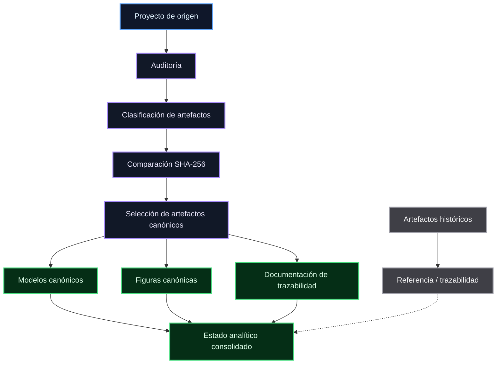

El resultado de esta organización es una estructura en la que los artefactos actuales pueden distinguirse de sus antecedentes históricos y en la que cada resultado puede relacionarse con su correspondiente código, objeto estadístico, figura o tabla y documentación.

### 23.1 Criterio final

El principio que resume esta estructura es:

> **Preservar no significa conservar todos los archivos; significa conservar de manera identificable el estado analítico que se considera canónico, junto con la evidencia necesaria para comprender su origen, relacionarlo con sus resultados y reconstruir, dentro de los límites de los datos disponibles, el proceso que lo produjo.**

---

# Documento técnico de trazabilidad de modelos estadísticos

**Proyecto:** `experimento-nlp`

Este documento establece la estructura de trazabilidad de los modelos estadísticos, sus resultados derivados, sus relaciones con figuras y tablas, los artefactos históricos y los criterios utilizados para distinguir entre resultados canónicos y copias o generaciones anteriores.

