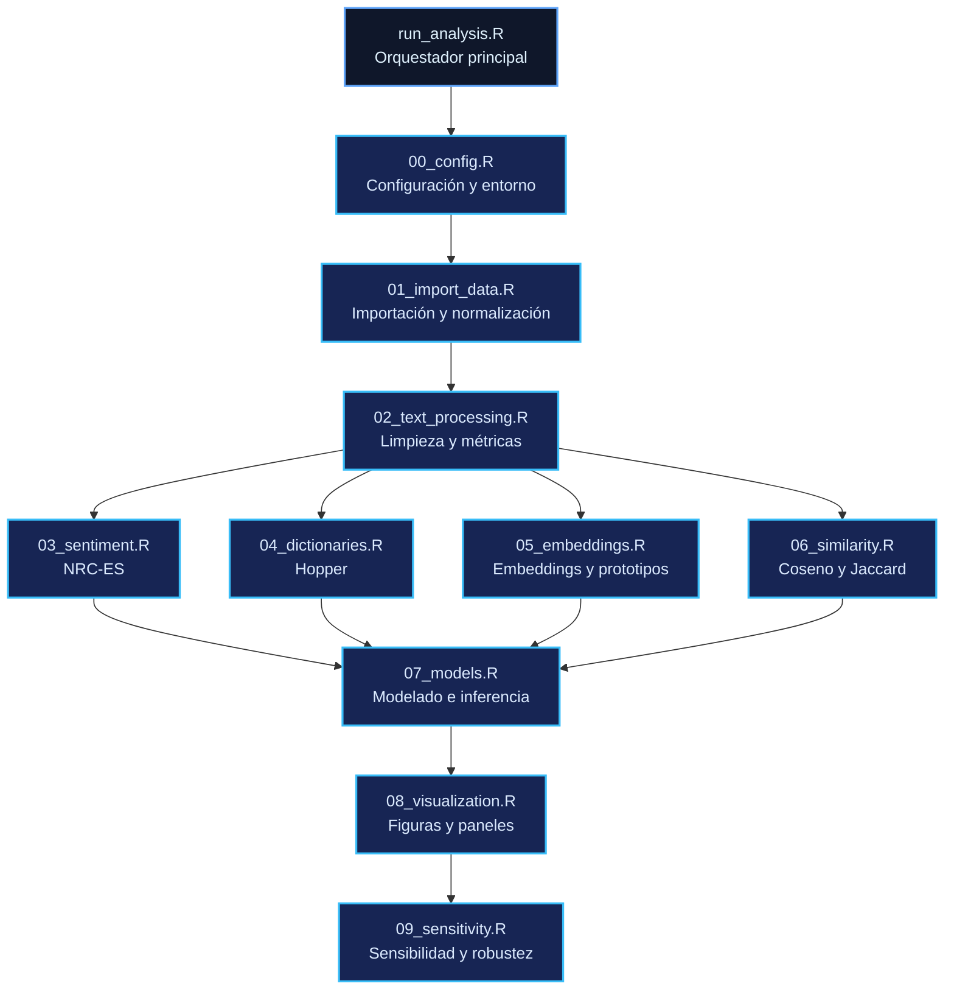
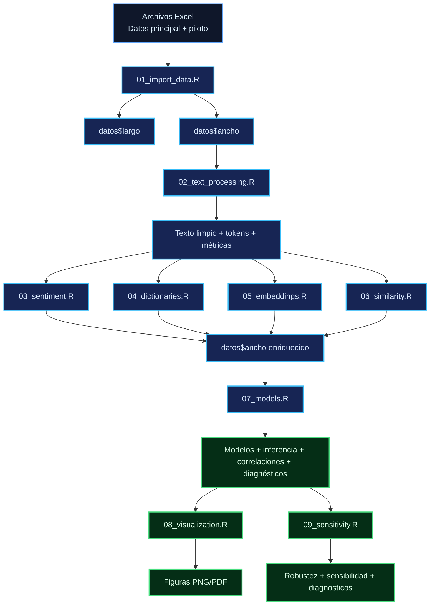
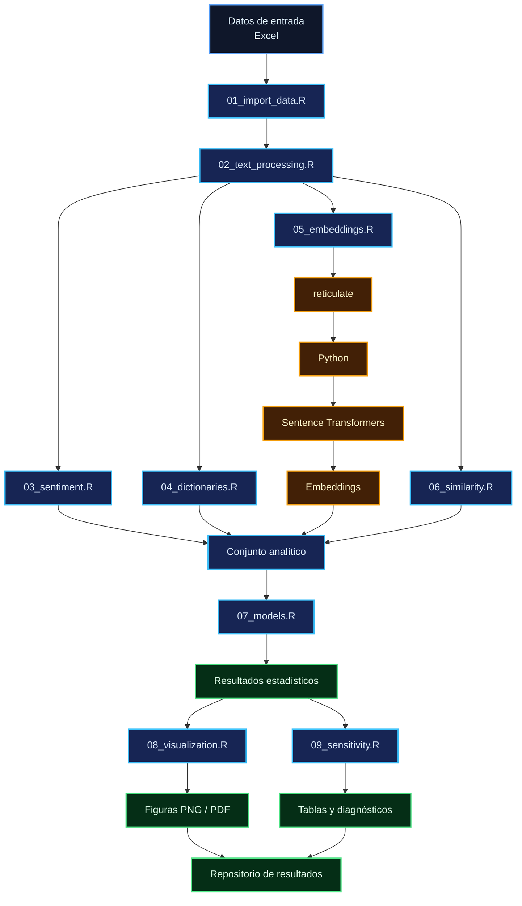

# R/ — Módulos analíticos del experimento NLP

Este directorio contiene los módulos R que constituyen el núcleo analítico del pipeline del experimento NLP longitudinal. Cada archivo `.R` encapsula una etapa funcional específica del procesamiento, desde la configuración e importación de los datos hasta los análisis de sensibilidad y robustez.

La ejecución integrada del pipeline se realiza mediante el script principal `run_analysis.R`, ubicado en la raíz del repositorio. Dicho script carga secuencialmente los módulos mediante `source()` y coordina la transferencia de objetos entre las distintas etapas del análisis.

---

## 1. Propósito del directorio

El directorio `R/` reúne las funciones, configuraciones y procedimientos necesarios para implementar las principales etapas del pipeline:

* importación, normalización y validación de los datos;
* procesamiento y transformación de textos;
* tokenización y cálculo de métricas lingüísticas;
* análisis léxico de emociones mediante NRC-ES;
* construcción y aplicación de diccionarios temáticos basados en Hopper;
* generación y procesamiento de embeddings semánticos;
* cálculo de similitudes textuales y semánticas;
* ajuste de modelos lineales mixtos y procedimientos inferenciales;
* generación de figuras y materiales gráficos;
* análisis de sensibilidad y evaluación de robustez.

Los módulos se organizan por responsabilidad funcional. En términos generales, cada módulo utiliza objetos y funciones definidos previamente en el flujo de ejecución o dependencias externas explícitamente declaradas.

---

## 2. Arquitectura general del pipeline

La secuencia conceptual y operativa de los módulos es:

```text
00_config.R
Configuración global, librerías, logging e integración Python
       ↓
01_import_data.R
Importación, normalización y validación
       ↓
02_text_processing.R
Limpieza, tokenización y métricas lingüísticas
       ↓
03_sentiment.R
Procesamiento léxico de emociones
       ↓
04_dictionaries.R
Diccionarios Hopper, enriquecimiento y aplicación
       ↓
05_embeddings.R
Funciones para embeddings y prototipos semánticos
       ↓
06_similarity.R
Similitudes textuales: coseno y Jaccard
       ↓
07_models.R
Modelado estadístico, inferencia, bootstrap y diagnóstico
       ↓
08_visualization.R
Generación y exportación de figuras
       ↓
09_sensitivity.R
Análisis de sensibilidad y robustez
```

Esta secuencia debe distinguirse de la arquitectura interna de algunos módulos. En particular:

* `05_embeddings.R` proporciona funciones para generar embeddings, construir prototipos y calcular similitudes, pero la ejecución concreta de dichas operaciones se coordina desde `run_analysis.R`.
* `09_sensitivity.R` utiliza funciones de modelado definidas en `07_models.R` y recursos gráficos definidos en `08_visualization.R`.
* `run_analysis.R` actúa como orquestador de la ejecución completa y constituye el punto de entrada del pipeline.

### Organización funcional



---

## 3. Inventario de módulos

| Módulo                | Archivo                | Responsabilidad principal                                            | Entradas                              | Salidas                                                   | Dependencias                                       | Estado                       |
| --------------------- | ---------------------- | -------------------------------------------------------------------- | ------------------------------------- | --------------------------------------------------------- | -------------------------------------------------- | ---------------------------- |
| Configuración         | `00_config.R`          | Configuración del entorno, librerías, logging e integración Python   | Ninguna                               | Opciones, funciones y configuración global                | Ninguna                                            | **IMPLEMENTADO**             |
| Importación           | `01_import_data.R`     | Importación, normalización, validación e integración de fuentes      | Archivos Excel principal y piloto     | `datos_maestros_long`, `datos_maestros_ancho` y funciones | `00_config.R`                                      | **IMPLEMENTADO**             |
| Procesamiento textual | `02_text_processing.R` | Limpieza, tokenización y métricas lingüísticas                       | Objeto `datos` con textos             | Datos enriquecidos con texto limpio, tokens y métricas    | `00_config.R`                                      | **IMPLEMENTADO**             |
| Sentimiento           | `03_sentiment.R`       | Preparación y aplicación del léxico NRC-ES                           | Datos con texto procesado             | Variables de emociones                                    | `00_config.R`, `02_text_processing.R`              | **IMPLEMENTADO**             |
| Diccionarios          | `04_dictionaries.R`    | Definición, enriquecimiento y aplicación de diccionarios Hopper      | Datos largos y diccionarios base      | Diccionarios enriquecidos y scores                        | `00_config.R`, `02_text_processing.R`              | **IMPLEMENTADO**             |
| Embeddings            | `05_embeddings.R`      | Generación de embeddings, prototipos y similitud coseno              | Textos y frases prototípicas          | Matrices de embeddings y centroides                       | `00_config.R`, Python/Sentence Transformers        | **IMPLEMENTADO** (funciones) |
| Similitud textual     | `06_similarity.R`      | Cálculo de similitud coseno y Jaccard por tokens                     | Tokens T1/T2/T3                       | Variables de similitud y distancia                        | `00_config.R`                                      | **IMPLEMENTADO**             |
| Modelado              | `07_models.R`          | Modelado mixto, inferencia, bootstrap y diagnóstico                  | `datos$ancho`                         | Modelos, tablas, correlaciones y diagnósticos             | `00_config.R`                                      | **IMPLEMENTADO**             |
| Visualización         | `08_visualization.R`   | Generación de figuras científicas y exportaciones                    | Datos, modelos y resultados           | Objetos `ggplot`, PNG y PDF                               | `00_config.R`, `07_models.R`                       | **IMPLEMENTADO**             |
| Sensibilidad          | `09_sensitivity.R`     | Evaluación de sensibilidad, robustez y especificaciones alternativas | `datos$ancho` y resultados auxiliares | Tablas, modelos y diagnósticos                            | `00_config.R`, `07_models.R`, `08_visualization.R` | **IMPLEMENTADO**             |

---

# 4. Documentación individual de los módulos

## 4.1 `00_config.R`

### Propósito

Establecer la configuración global del entorno de ejecución, incluyendo opciones de R, carga de dependencias, semilla aleatoria, logging e integración con Python mediante `reticulate`.

### Responsabilidades

* establecer opciones globales de R;
* fijar la semilla de reproducibilidad;
* comprobar e instalar paquetes requeridos cuando corresponde;
* cargar las dependencias del pipeline;
* definir el sistema de logging;
* configurar el entorno Python utilizado por el componente de embeddings.

### Paquetes utilizados

```text
tidyverse
tidytext
readxl
stringr
stringi
tokenizers
stopwords
text2vec
proxy
tm
syuzhet
lme4
lmerTest
emmeans
performance
effectsize
rstatix
effsize
car
topicmodels
ggplot2
cowplot
viridis
corrplot
RColorBrewer
ggraph
igraph
wordcloud
readr
scales
writexl
ggpubr
gridExtra
broom.mixed
patchwork
see
FSA
rcompanion
```

### Opciones globales

```text
stringsAsFactors = FALSE
scipen = 999
max.print = 1000
warn = 1
digits = 4
set.seed(20260526)
```

### Objetos y funciones principales

```text
instalar_paquetes
paquetes_necesarios
registrar_log
```

Funciones:

```text
instalar_paquetes(pkgs, repo)
registrar_log(mensaje, nivel = "INFO", archivo = "experimento_log.txt")
```

### Parámetros relevantes

```text
venv_path
python_exe
```

Estos parámetros identifican el entorno Python utilizado por `reticulate`.

### Entradas y salidas

**Entrada:** ninguna entrada de datos del estudio.

**Salida:** opciones globales, funciones de utilidad, configuración del entorno Python y, opcionalmente, archivos de log.

### Dependencias

Ninguna. Constituye el primer módulo del pipeline.

### Estado

**IMPLEMENTADO.**

### Consideraciones técnicas

La configuración del entorno Python debe mantenerse portable entre sistemas. Las rutas específicas del entorno de ejecución deberían gestionarse mediante configuración parametrizable y no formar parte de la lógica analítica del módulo.

La instalación dinámica de paquetes durante la ejecución facilita la preparación inicial del entorno, pero puede incrementar el tiempo de arranque y generar dependencia de conectividad y permisos de instalación.

---

## 4.2 `01_import_data.R`

### Propósito

Importar, normalizar y validar las fuentes de datos principal y piloto, transformándolas a un esquema canónico común para su integración posterior.

### Responsabilidades

* derivar `n_estimulos` a partir de `iteracion`;
* importar las fuentes principal y piloto;
* normalizar ambas fuentes al esquema canónico;
* validar columnas, tipos y estructura;
* integrar las fuentes en un único conjunto longitudinal;
* generar la representación en formato ancho.

### Esquema canónico

```text
fuente
participante
id_participante
id_observacion
condicion
demora
iteracion
texto
n_palabras
n_palabras_calculado
n_estimulos
```

### Funciones

```text
derivar_n_estimulos(iteracion)
importar_principal(ruta, hoja = "Datos_Largo")
importar_piloto(ruta, hoja = "Hoja1")
normalizar_principal(raw)
normalizar_piloto(raw)
validar_esquema(df, nombre = "dataset")
validar_dataset_maestro(df)
integrar_fuentes(lista_dfs)
generar_ancho(df_long)
validar_datos(datos)
```

### Entradas

* archivo Excel correspondiente a la muestra principal;
* archivo Excel correspondiente al estudio piloto.

### Salidas

* `datos$largo`;
* `datos$ancho`;
* funciones de validación e integración.

### Dependencias

`00_config.R`.

### Estado

**IMPLEMENTADO.**

### Consideraciones técnicas

Las funciones de importación dependen de la estructura prevista de los archivos Excel. Cambios en la disposición de hojas o columnas pueden requerir ajustes de normalización.

Las validaciones estructurales utilizan criterios explícitos y pueden detener la ejecución ante incumplimientos. Esta característica es adecuada para control de calidad, pero debe mantenerse sincronizada con el esquema canónico vigente.

---

## 4.3 `02_text_processing.R`

### Propósito

Realizar la preparación lingüística de los textos, incluyendo limpieza, tokenización y cálculo de métricas lingüísticas básicas.

### Responsabilidades

* normalizar el texto;
* realizar transliteración cuando corresponde;
* eliminar dígitos y puntuación;
* tokenizar;
* eliminar stopwords;
* aplicar filtros de longitud mínima;
* calcular métricas lingüísticas;
* procesar las tres iteraciones temporales.

### Funciones

```text
limpiar_texto(texto)
tokenizar(texto, min_chars = 3)
preprocesar_textos(datos)
calcular_metricas_linguisticas(texto_orig, tokens)
agregar_metricas(datos)
```

### Métricas principales

```text
n_tokens
número de oraciones
TTR
longitud media de palabra
palabras por oración
```

### Dependencias

`00_config.R`.

### Estado

**IMPLEMENTADO.**

### Consideraciones técnicas

La transliteración mediante `iconv(..., to = "ASCII//TRANSLIT")` puede modificar determinados caracteres lingüísticos. Esta transformación debe considerarse conjuntamente con el funcionamiento del léxico NRC-ES y de los demás componentes que consumen los tokens resultantes.

El conteo de oraciones basado en límites lingüísticos puede presentar restricciones en textos con abreviaturas u otras construcciones no estándar.

---

## 4.4 `03_sentiment.R`

### Propósito

Preparar y aplicar el léxico NRC-ES para obtener variables léxicas de emociones a partir de los textos procesados.

### Responsabilidades

* definir las constantes y recursos del léxico;
* descargar y preparar el recurso cuando no existe localmente;
* normalizar las entradas léxicas;
* validar la estructura del léxico;
* inicializar el objeto léxico;
* calcular conteos por categoría emocional;
* integrar las variables resultantes al conjunto analítico.

### Funciones

```text
normalizar_palabra_lexico(palabra)
validar_lexico_nrc_es(lexico, detener = TRUE)
preparar_lexico_nrc_es()
inicializar_lexico()
analizar_sentimiento_es(texto)
calcular_sentimientos(datos)
```

### Recurso local

```text
data/lexicons/nrc_es.rds
```

### Dependencias

```text
00_config.R
02_text_processing.R
```

### Estado

**IMPLEMENTADO.**

### Consideraciones técnicas

La primera preparación del léxico puede requerir acceso a internet. Una vez generado el recurso local, el procesamiento puede realizarse a partir del archivo almacenado.

El proceso depende también de la correspondencia entre la normalización aplicada al léxico y la utilizada durante el procesamiento de los textos.

---

## 4.5 `04_dictionaries.R`

### Propósito

Definir y aplicar diccionarios temáticos basados en la organización conceptual asociada con Hopper y enriquecerlos mediante evidencia empírica del corpus.

### Responsabilidades

* definir los diez diccionarios base;
* construir un corpus tokenizado;
* extraer candidatos mediante PMI;
* aplicar filtros de frecuencia, documento y participante;
* integrar candidatos aceptados;
* calcular cobertura;
* identificar solapamientos;
* generar scores brutos y tasas normalizadas.

### Funciones

```text
preparar_corpus(datos_long)
extraer_candidatos(corpus, diccionarios, min_freq, min_doc, min_part)
enriquecer_diccionarios(base_dict, candidatos_aceptados)
calcular_cobertura(corpus, diccionario, nombre)
detectar_solapamientos(diccionarios)
aplicar_diccionarios_long(datos_long, diccionarios)
```

### Parámetros relevantes

```text
min_freq
min_doc
min_part
candidatos_aceptados
```

### Dependencias

```text
00_config.R
02_text_processing.R
```

### Estado

**IMPLEMENTADO.**

### Consideraciones técnicas

La extracción de candidatos mediante PMI puede aumentar considerablemente el costo computacional a medida que crece el corpus.

Los términos aceptados manualmente deberían mantenerse como una configuración externalizada y versionada para separar la lógica analítica de las decisiones de enriquecimiento léxico.

---

## 4.6 `05_embeddings.R`

### Propósito

Proporcionar las funciones necesarias para generar embeddings semánticos mediante Sentence Transformers, construir prototipos y calcular similitud coseno.

### Responsabilidades

* inicializar el modelo Python;
* generar embeddings mediante `reticulate`;
* aplicar normalización L2 cuando corresponde;
* mantener una caché de embeddings;
* definir frases prototípicas;
* construir centroides semánticos;
* calcular similitud coseno entre matrices.

### Funciones

```text
obtener_embeddings(textos, normalize = TRUE, batch_size = 32L)
construir_centroide(frases, model = embedding_model, normalize = TRUE)
calcular_similitud_coseno(emb1, emb2)
calcular_proximidad_prototipos(emb_mat, centroides)
```

### Objetos principales

```text
embedding_model
.emb_cache
prototipos_hopper
prototipos_clinicos
prototipos
```

### Dependencias

```text
00_config.R
reticulate
sentence-transformers
torch
numpy
```

### Modelo

```text
paraphrase-multilingual-MiniLM-L12-v2
```

### Estado

**IMPLEMENTADO — funciones.**

La ejecución concreta de la generación de embeddings y del PCA es coordinada por `run_analysis.R`.

### Consideraciones técnicas

El módulo depende de la configuración correcta del entorno Python y del funcionamiento de `reticulate`.

La primera carga del modelo puede requerir conectividad para descargar los archivos correspondientes.

La caché de embeddings reduce cálculos repetidos, pero debe mantenerse asociada a una clave suficientemente robusta para evitar reutilización incorrecta de representaciones.

---

## 4.7 `06_similarity.R`

### Propósito

Calcular medidas de similitud textual basadas en la frecuencia y composición de tokens entre los distintos momentos temporales.

### Funciones

```text
similitud_coseno(t1, t2)
similitud_jaccard(t1, t2)
calcular_similitudes(datos)
```

### Variables generadas

```text
cos_*
jac_*
div_*
```

donde `div_*` representa la distancia derivada de la similitud coseno.

### Dependencias

`00_config.R`.

### Estado

**IMPLEMENTADO.**

### Consideraciones técnicas

Las funciones devuelven `NA` cuando las representaciones de entrada no permiten calcular una similitud válida, por ejemplo, cuando el conjunto de tokens está vacío.

El procesamiento mediante operaciones fila a fila puede limitar la escalabilidad frente a corpus considerablemente mayores.

---

## 4.8 `07_models.R`

### Propósito

Implementar los principales procedimientos estadísticos del pipeline, incluyendo cálculo de cambios, scores heurísticos, pruebas inferenciales, modelos lineales mixtos, bootstrap y diagnóstico.

### Responsabilidades

* calcular diferencias y porcentajes de cambio;
* calcular scores heurísticos;
* ejecutar pruebas pareadas;
* ejecutar pruebas de Friedman;
* ajustar modelos lineales mixtos;
* obtener ANOVA con aproximación de Satterthwaite;
* calcular R²;
* obtener EMMs y contrastes post-hoc;
* calcular correlaciones de Spearman;
* identificar observaciones con residuos elevados;
* ejecutar bootstrap;
* generar tablas de resultados.

### Funciones principales

```text
config_scores_default()
calcular_cambios_y_scores(ancho, config_scores)
realizar_pruebas_pareadas(ancho, variables, metodo_ajuste)
realizar_friedman(ancho, variables, metodo_ajuste)
realizar_pruebas_inferenciales(ancho, config)
construir_largo(ancho, variable_base, incluir_demora)
ajustar_modelo(ancho, variable_base, incluir_demora)
extraer_resultados(modelo_obj)
calcular_correlaciones_cambios(ancho)
diagnostico_outliers(modelo_obj, umbral_resid)
bootstrappear(modelo_obj, nsim, seed)
diagnosticar(modelo_obj, nombre)
tabla_resumen(resultados)
tabla_contrastes(resultados)
```

Funciones auxiliares para análisis de sensibilidad:

```text
construir_largo_para_modelo()
ajustar_modelo_sensibilidad()
extraer_info_modelo()
```

### Parámetros relevantes

```text
umbral_resid = 2.5
nsim = 500
seed = 123
```

### Dependencias

Principalmente:

```text
00_config.R
lme4
lmerTest
emmeans
performance
effectsize
```

### Estado

**IMPLEMENTADO.**

### Consideraciones técnicas

Los modelos mixtos pueden presentar problemas de convergencia cuando existen tamaños de grupo reducidos, desbalance o escasa información para determinadas combinaciones de factores.

Las funciones destinadas al análisis de sensibilidad permanecen en este módulo porque reutilizan directamente la infraestructura de modelado; su utilización efectiva se realiza desde `09_sensitivity.R`.

---

## 4.9 `08_visualization.R`

### Propósito

Generar y exportar las figuras científicas utilizadas por el estudio, incluyendo versiones bilingües y materiales de alta resolución para publicación.

### Responsabilidades

* definir paletas gráficas;
* establecer temas de visualización;
* calcular intervalos de confianza a partir de modelos;
* generar las figuras individuales;
* producir paneles combinados;
* exportar versiones PNG y PDF;
* generar variantes en español e inglés.

### Funciones principales

```text
tema_cientifico(base_size = 11)
theme_q1(base_size = 12)
guardar_figura(plot, filename, width, height, dpi)
crear_figura_bilingue(p_es, p_en, nombre_base, ancho, alto, res)
obtener_ic_modelo(modelo, nuevo_datos)
crear_fig1(...) ... crear_fig15(...)
generar_todas_figuras(datos, modelos, cor_mat, diccionarios_hopper)
```

### Dependencias

```text
00_config.R
07_models.R
```

### Estado

**IMPLEMENTADO.**

### Consideraciones técnicas

Algunas figuras requieren objetos específicos, como matrices de correlación, modelos ajustados o resultados de bootstrap. Cuando dichos objetos no están disponibles, determinadas figuras pueden omitirse de forma controlada.

La generación repetida de réplicas bootstrap dentro de determinadas figuras puede incrementar sustancialmente el tiempo de ejecución.

---

## 4.10 `09_sensitivity.R`

### Propósito

Evaluar la estabilidad de los resultados ante especificaciones alternativas del modelo y distintas decisiones analíticas.

### Responsabilidades

* estimar modelos alternativos;
* evaluar especificaciones con y sin `demora`;
* evaluar transformaciones alternativas;
* comparar resultados con diferentes variables de ajuste;
* reevaluar resultados excluyendo observaciones con residuos elevados;
* producir gráficos de diagnóstico;
* consolidar indicadores de robustez;
* documentar las comparaciones entre especificaciones.

### Función principal

```text
ejecutar_analisis_sensibilidad(
    ancho,
    VD = "n_palabras_calculado",
    output_dir = "outputs"
)
```

### Especificaciones contempladas

```text
modelo con demora
modelo logarítmico
modelo con n_tokens
modelo con n_estimulos
modelo sin observaciones identificadas como extremas
```

### Dependencias

```text
00_config.R
07_models.R
08_visualization.R
```

### Estado

**IMPLEMENTADO.**

### Consideraciones técnicas

El modelo logarítmico requiere una variable dependiente compatible con la transformación. Cuando la presencia de ceros impide dicha transformación, la especificación debe omitirse.

La comparación con resultados piloto-principal depende de la disponibilidad de los artefactos externos correspondientes.

---

# 5. Funciones existentes por módulo

La tabla siguiente resume las funciones actualmente documentadas en cada módulo y su papel dentro del pipeline.

| Función                          | Archivo                | Propósito                             | Parámetros principales                                | Retorno           |
| -------------------------------- | ---------------------- | ------------------------------------- | ----------------------------------------------------- | ----------------- |
| `instalar_paquetes`              | `00_config.R`          | Gestionar paquetes requeridos         | `pkgs`, `repo`                                        | `NULL`            |
| `registrar_log`                  | `00_config.R`          | Registrar eventos de ejecución        | `mensaje`, `nivel`, `archivo`                         | `NULL`            |
| `derivar_n_estimulos`            | `01_import_data.R`     | Derivar número de estímulos           | `iteracion`                                           | Entero            |
| `importar_principal`             | `01_import_data.R`     | Importar dataset principal            | `ruta`, `hoja`                                        | Dataframe         |
| `importar_piloto`                | `01_import_data.R`     | Importar dataset piloto               | `ruta`, `hoja`                                        | Dataframe         |
| `normalizar_principal`           | `01_import_data.R`     | Normalizar dataset principal          | `raw`                                                 | Dataframe         |
| `normalizar_piloto`              | `01_import_data.R`     | Normalizar dataset piloto             | `raw`                                                 | Dataframe         |
| `validar_esquema`                | `01_import_data.R`     | Validar esquema de datos              | `df`, `nombre`                                        | Lista             |
| `validar_dataset_maestro`        | `01_import_data.R`     | Validar dataset integrado             | `df`                                                  | Lista             |
| `integrar_fuentes`               | `01_import_data.R`     | Integrar fuentes normalizadas         | `lista_dfs`                                           | Dataframe         |
| `generar_ancho`                  | `01_import_data.R`     | Transformar largo a ancho             | `df_long`                                             | Dataframe         |
| `validar_datos`                  | `01_import_data.R`     | Validar objeto `datos`                | `datos`                                               | `NULL`            |
| `limpiar_texto`                  | `02_text_processing.R` | Normalizar texto                      | `texto`                                               | Texto             |
| `tokenizar`                      | `02_text_processing.R` | Obtener tokens normalizados           | `texto`, `min_chars`                                  | Vector            |
| `preprocesar_textos`             | `02_text_processing.R` | Aplicar preparación textual           | `datos`                                               | Datos modificados |
| `calcular_metricas_linguisticas` | `02_text_processing.R` | Calcular métricas lingüísticas        | `texto_orig`, `tokens`                                | Lista             |
| `agregar_metricas`               | `02_text_processing.R` | Incorporar métricas al dataset        | `datos`                                               | Datos modificados |
| `normalizar_palabra_lexico`      | `03_sentiment.R`       | Normalizar entradas léxicas           | `palabra`                                             | Texto             |
| `validar_lexico_nrc_es`          | `03_sentiment.R`       | Validar léxico                        | `lexico`, `detener`                                   | Lógico            |
| `preparar_lexico_nrc_es`         | `03_sentiment.R`       | Preparar recurso NRC-ES               | —                                                     | Léxico            |
| `inicializar_lexico`             | `03_sentiment.R`       | Cargar o preparar léxico              | —                                                     | `NULL`            |
| `analizar_sentimiento_es`        | `03_sentiment.R`       | Obtener variables emocionales         | `texto`                                               | Vector            |
| `calcular_sentimientos`          | `03_sentiment.R`       | Aplicar análisis al dataset           | `datos`                                               | Datos modificados |
| `preparar_corpus`                | `04_dictionaries.R`    | Preparar corpus                       | `datos_long`                                          | Tibble            |
| `extraer_candidatos`             | `04_dictionaries.R`    | Obtener candidatos por PMI            | `corpus`, `diccionarios`, umbrales                    | Lista             |
| `enriquecer_diccionarios`        | `04_dictionaries.R`    | Incorporar términos aceptados         | `base_dict`, `candidatos_aceptados`                   | Diccionarios      |
| `calcular_cobertura`             | `04_dictionaries.R`    | Medir cobertura                       | `corpus`, `diccionario`, `nombre`                     | Tibble            |
| `detectar_solapamientos`         | `04_dictionaries.R`    | Detectar términos compartidos         | `diccionarios`                                        | Tibble            |
| `aplicar_diccionarios_long`      | `04_dictionaries.R`    | Calcular scores temáticos             | `datos_long`, `diccionarios`                          | Dataframe         |
| `obtener_embeddings`             | `05_embeddings.R`      | Generar embeddings                    | `textos`, `normalize`, `batch_size`                   | Matriz            |
| `construir_centroide`            | `05_embeddings.R`      | Construir prototipo semántico         | `frases`, `model`, `normalize`                        | Vector            |
| `calcular_similitud_coseno`      | `05_embeddings.R`      | Calcular similitud entre embeddings   | `emb1`, `emb2`                                        | Vector            |
| `similitud_coseno`               | `06_similarity.R`      | Similitud por frecuencias             | `t1`, `t2`                                            | Numérico          |
| `similitud_jaccard`              | `06_similarity.R`      | Similitud entre conjuntos             | `t1`, `t2`                                            | Numérico          |
| `calcular_similitudes`           | `06_similarity.R`      | Aplicar similitudes al dataset        | `datos`                                               | Datos modificados |
| `config_scores_default`          | `07_models.R`          | Definir pesos heurísticos             | —                                                     | Lista             |
| `calcular_cambios_y_scores`      | `07_models.R`          | Calcular cambios y scores             | `ancho`, `config_scores`                              | Dataframe         |
| `realizar_pruebas_pareadas`      | `07_models.R`          | Ejecutar pruebas pareadas             | `ancho`, `variables`, `metodo_ajuste`                 | Dataframe         |
| `realizar_friedman`              | `07_models.R`          | Ejecutar Friedman                     | `ancho`, `variables`, `metodo_ajuste`                 | Lista             |
| `realizar_pruebas_inferenciales` | `07_models.R`          | Integrar procedimientos inferenciales | `ancho`, `config`                                     | Lista             |
| `construir_largo`                | `07_models.R`          | Preparar datos para modelado          | `ancho`, `variable_base`, `incluir_demora`            | Dataframe         |
| `ajustar_modelo`                 | `07_models.R`          | Ajustar modelo mixto                  | `ancho`, `variable_base`, `incluir_demora`            | Lista             |
| `extraer_resultados`             | `07_models.R`          | Extraer resultados del modelo         | `modelo_obj`                                          | Lista             |
| `calcular_correlaciones_cambios` | `07_models.R`          | Calcular Spearman                     | `ancho`                                               | Matriz            |
| `diagnostico_outliers`           | `07_models.R`          | Identificar residuos elevados         | `modelo_obj`, `umbral_resid`                          | Lista             |
| `bootstrappear`                  | `07_models.R`          | Ejecutar bootstrap                    | `modelo_obj`, `nsim`, `seed`                          | Lista             |
| `diagnosticar`                   | `07_models.R`          | Generar diagnóstico                   | `modelo_obj`, `nombre`                                | `NULL`            |
| `tabla_resumen`                  | `07_models.R`          | Resumir efectos                       | `resultados`                                          | Dataframe         |
| `tabla_contrastes`               | `07_models.R`          | Resumir contrastes                    | `resultados`                                          | Dataframe         |
| `ajustar_modelo_sensibilidad`    | `07_models.R`          | Ajustar especificaciones alternativas | `ancho`, `variable`, `formula`, `nombre_modelo`       | Lista             |
| `extraer_info_modelo`            | `07_models.R`          | Extraer indicadores de robustez       | `modelo_obj`, `nombre`                                | Dataframe         |
| `tema_cientifico`                | `08_visualization.R`   | Definir tema científico               | `base_size`                                           | Tema              |
| `theme_q1`                       | `08_visualization.R`   | Definir tema alternativo              | `base_size`                                           | Tema              |
| `guardar_figura`                 | `08_visualization.R`   | Exportar figura                       | `plot`, `filename`, `width`, `height`, `dpi`          | `NULL`            |
| `crear_figura_bilingue`          | `08_visualization.R`   | Exportar ES/EN                        | `p_es`, `p_en`, `nombre_base`, `ancho`, `alto`, `res` | `NULL`            |
| `obtener_ic_modelo`              | `08_visualization.R`   | Obtener IC de modelos                 | `modelo`, `nuevo_datos`                               | Dataframe         |
| `crear_fig1`–`crear_fig15`       | `08_visualization.R`   | Crear figuras                         | Variables según figura                                | `ggplot` / `NULL` |
| `generar_todas_figuras`          | `08_visualization.R`   | Orquestar figuras                     | `datos`, `modelos`, `cor_mat`, `diccionarios_hopper`  | Lista             |
| `ejecutar_analisis_sensibilidad` | `09_sensitivity.R`     | Ejecutar análisis de sensibilidad     | `ancho`, `VD`, `output_dir`                           | Lista             |

---

# 6. Flujo de datos entre módulos

El flujo de objetos principales puede representarse como:



### Observaciones sobre el flujo

`05_embeddings.R` proporciona funciones reutilizables y no constituye por sí mismo una etapa de persistencia independiente. La generación efectiva de los embeddings y su incorporación al objeto analítico se realiza desde `run_analysis.R`.

Los resultados generados por `07_models.R` constituyen una fuente de entrada para la visualización y para los análisis de sensibilidad.

---

# 7. Dependencias entre módulos

| Módulo                 | Dependencias directas                              |
| ---------------------- | -------------------------------------------------- |
| `00_config.R`          | Ninguna                                            |
| `01_import_data.R`     | `00_config.R`                                      |
| `02_text_processing.R` | `00_config.R`                                      |
| `03_sentiment.R`       | `00_config.R`, `02_text_processing.R`              |
| `04_dictionaries.R`    | `00_config.R`, `02_text_processing.R`              |
| `05_embeddings.R`      | `00_config.R`, entorno Python                      |
| `06_similarity.R`      | `00_config.R`                                      |
| `07_models.R`          | `00_config.R`                                      |
| `08_visualization.R`   | `00_config.R`, `07_models.R`                       |
| `09_sensitivity.R`     | `00_config.R`, `07_models.R`, `08_visualization.R` |

La arquitectura no requiere dependencias circulares entre módulos.

La separación entre `07_models.R`, `08_visualization.R` y `09_sensitivity.R` responde a la división entre cálculo estadístico, representación gráfica y análisis de robustez.

---

# 8. Contrato de entradas y salidas

Cada módulo establece un contrato funcional de entrada y salida.

| Módulo                 | Entrada principal         | Transformación               | Salida principal               |
| ---------------------- | ------------------------- | ---------------------------- | ------------------------------ |
| `00_config.R`          | Configuración del entorno | Inicialización               | Funciones y objetos globales   |
| `01_import_data.R`     | Excel                     | Importación y normalización  | `datos$largo`, `datos$ancho`   |
| `02_text_processing.R` | Textos                    | Limpieza y tokenización      | Textos procesados y métricas   |
| `03_sentiment.R`       | Textos procesados         | Análisis léxico              | Variables emocionales          |
| `04_dictionaries.R`    | Corpus + diccionarios     | Enriquecimiento y aplicación | Scores temáticos               |
| `05_embeddings.R`      | Textos                    | Representación semántica     | Embeddings y centroides        |
| `06_similarity.R`      | Tokens                    | Similitud textual            | Coseno, Jaccard y distancia    |
| `07_models.R`          | Datos analíticos          | Inferencia y modelado        | Modelos, efectos, diagnósticos |
| `08_visualization.R`   | Resultados y datos        | Visualización                | Figuras y paneles              |
| `09_sensitivity.R`     | Datos y modelos           | Evaluación de robustez       | Tablas y diagnósticos          |

Este contrato permite distinguir entre funciones que **transforman datos**, funciones que **calculan resultados** y funciones que **producen artefactos persistentes**.

---

# 9. Ejecución reproducible

El punto de entrada del pipeline es:

```text
run_analysis.R
```

ubicado en la raíz del repositorio.

La secuencia general de ejecución es:

```text
1. Inicialización del entorno
        ↓
2. Importación y normalización
        ↓
3. Procesamiento textual
        ↓
4. Análisis emocional
        ↓
5. Diccionarios temáticos
        ↓
6. Embeddings y prototipos
        ↓
7. Similitudes textuales
        ↓
8. Modelado estadístico
        ↓
9. Visualización
        ↓
10. Análisis de sensibilidad
```

La ejecución requiere la disponibilidad de los datos de entrada, las dependencias R, el entorno Python cuando se utiliza el componente de embeddings y las configuraciones externas necesarias para cada etapa.

La reproducibilidad computacional debe entenderse en conjunto con `renv.lock`, `requirements.txt`, los scripts de validación y la documentación metodológica del repositorio.

---

# 10. Convenciones de desarrollo

La organización del código sigue, en términos generales, las siguientes convenciones:

### Nomenclatura

* funciones en minúsculas con `snake_case`;
* objetos en minúsculas con `snake_case`;
* argumentos con nombres descriptivos;
* nombres de columnas con una convención temporal consistente.

### Estructura del código

Los módulos se dividen mediante bloques lógicos y comentarios de sección. Algunas funciones utilizan documentación compatible con `roxygen2`.

### Manejo de errores

Se emplean:

```text
stop()
warning()
tryCatch()
```

según la naturaleza del evento y la necesidad de interrumpir o continuar la ejecución.

### Logging

La función:

```text
registrar_log()
```

proporciona un mecanismo común de registro de eventos del pipeline.

### Semillas

La semilla principal del análisis está establecida mediante:

```r
set.seed(20260526)
```

La existencia de semillas específicas adicionales en procedimientos como bootstrap debe documentarse junto con el procedimiento correspondiente.

---

# 11. Recomendaciones de mantenimiento

Las siguientes acciones corresponden a mejoras de ingeniería y mantenimiento, no a cambios en el análisis ya ejecutado:

| Prioridad | Acción                                 | Finalidad                                                      |
| --------- | -------------------------------------- | -------------------------------------------------------------- |
| Alta      | Externalizar rutas y parámetros        | Mejorar portabilidad y separación entre código y configuración |
| Alta      | Incorporar pruebas unitarias           | Detectar regresiones en funciones críticas                     |
| Alta      | Consolidar la gestión de dependencias  | Facilitar restauración del entorno                             |
| Media     | Completar documentación `roxygen2`     | Mejorar mantenibilidad y reutilización                         |
| Media     | Homogeneizar manejo de errores         | Establecer comportamiento consistente                          |
| Media     | Unificar nombres de columnas           | Reducir ambigüedad entre módulos                               |
| Baja      | Revisar funciones no utilizadas        | Reducir código residual                                        |
| Baja      | Incorporar automatización de ejecución | Simplificar la reconstrucción completa del pipeline            |

---

# 12. Estado de implementación

| Módulo                 | Estado           | Funcionalidad documentada                  | Principales pendientes                 |
| ---------------------- | ---------------- | ------------------------------------------ | -------------------------------------- |
| `00_config.R`          | **IMPLEMENTADO** | Configuración, librerías, logging y Python | Portabilidad de configuración          |
| `01_import_data.R`     | **IMPLEMENTADO** | Importación, normalización y validación    | Robustez ante cambios estructurales    |
| `02_text_processing.R` | **IMPLEMENTADO** | Limpieza, tokenización y métricas          | Optimización para volúmenes mayores    |
| `03_sentiment.R`       | **IMPLEMENTADO** | NRC-ES y variables emocionales             | Externalización de recursos            |
| `04_dictionaries.R`    | **IMPLEMENTADO** | Diccionarios, PMI y scores                 | Externalización de decisiones manuales |
| `05_embeddings.R`      | **IMPLEMENTADO** | Embeddings y prototipos                    | Gestión del entorno Python y caché     |
| `06_similarity.R`      | **IMPLEMENTADO** | Coseno y Jaccard                           | Vectorización para escalabilidad       |
| `07_models.R`          | **IMPLEMENTADO** | Inferencia, LMM, bootstrap y diagnóstico   | Evaluación continua de convergencia    |
| `08_visualization.R`   | **IMPLEMENTADO** | Figuras y exportaciones                    | Optimización de cálculos costosos      |
| `09_sensitivity.R`     | **IMPLEMENTADO** | Sensibilidad y robustez                    | Externalización de parámetros          |

El estado anterior describe la implementación funcional documentada de los módulos; no implica que todas las posibles mejoras de portabilidad, pruebas y mantenimiento estén completadas.

---

# 13. Riesgos técnicos y consideraciones

| Riesgo / consideración            | Descripción                                                                                              | Relevancia           |
| --------------------------------- | -------------------------------------------------------------------------------------------------------- | -------------------- |
| **Portabilidad de configuración** | La identificación manual del entorno Python puede requerir adaptación entre sistemas                     | Alta                 |
| **Dependencia Python**            | El componente de embeddings requiere `reticulate` y un entorno Python compatible                         | Alta                 |
| **Disponibilidad del modelo**     | La primera carga puede requerir descarga del modelo y conectividad                                       | Media                |
| **Tamaño muestral**               | Algunas combinaciones de factores presentan tamaños reducidos                                            | Alta para inferencia |
| **Convergencia de modelos**       | Los LMM pueden requerir evaluación ante desbalance o escasa información                                  | Alta                 |
| **Costo computacional**           | Embeddings, bootstrap y extracción de candidatos pueden ser intensivos                                   | Media                |
| **Estado global del léxico**      | `.lexico_nrc_es` se mantiene en el entorno global                                                        | Media                |
| **Cobertura de pruebas**          | La ausencia de una suite exhaustiva de pruebas unitarias limita la detección automatizada de regresiones | Alta                 |
| **Manejo heterogéneo de errores** | No todos los módulos utilizan la misma estrategia de captura                                             | Media                |
| **Persistencia de outputs**       | Los resultados generados dependen de las convenciones de almacenamiento del pipeline                     | Media                |

La valoración anterior debe interpretarse como una caracterización técnica de riesgos de mantenimiento y ejecución, no como una evaluación de la validez científica de los resultados.

---

# 14. Relación con Python

La interacción con Python se concentra en `05_embeddings.R` y se establece mediante `reticulate`.

El flujo general es:

```text
R
 │
 │ vectores de caracteres
 ▼
reticulate
 │
 ▼
Python
 │
 ├── sentence-transformers
 ├── torch
 └── numpy
 │
 ▼
SentenceTransformer
 │
 ▼
paraphrase-multilingual-MiniLM-L12-v2
 │
 ▼
Embeddings
 │
 ▼
R
```

En términos operativos:

1. R proporciona los textos al entorno Python.
2. `reticulate` establece la comunicación entre ambos entornos.
3. Python ejecuta `SentenceTransformer`.
4. El modelo genera representaciones vectoriales.
5. Los arrays NumPy se convierten nuevamente en matrices R.
6. Las matrices se integran en el flujo analítico principal.

### Configuración

El entorno Python se configura desde `00_config.R`.

### Archivo de configuración Python

No se requiere un archivo independiente `python/embeddings_setup.py` para la arquitectura descrita. La gestión reproducible del entorno Python debe quedar definida mediante el mecanismo de dependencias adoptado por el proyecto, de acuerdo con la documentación específica de `requirements.txt` y `reticulate`.

---

# 15. Relación con los resultados y outputs

Los módulos producen o alimentan artefactos en distintas áreas del repositorio:

```text
resultados/
├── figuras/
├── graficos español/
├── graficos ingles/
├── tablas/
└── modelos/

outputs/
└── resultados de sensibilidad

data/
└── processed/
    └── resultados intermedios y embeddings
```

### Principales categorías

**Figuras**

```text
resultados/figuras/
resultados/graficos español/
resultados/graficos ingles/
```

Contienen las representaciones gráficas generadas por `08_visualization.R`.

**Tablas**

```text
resultados/tablas/
```

Contiene tablas descriptivas, inferenciales, de contrastes y otros productos derivados del análisis.

**Modelos**

```text
resultados/modelos/
```

Contiene los objetos de modelo y otros artefactos analíticos que se determinen como parte de los resultados preservados.

**Sensibilidad**

```text
outputs/
```

Contiene tablas, modelos y diagnósticos generados por `09_sensitivity.R`.

**Datos procesados**

```text
data/processed/
```

Contiene materiales intermedios o derivados requeridos por etapas posteriores del pipeline.

La gestión definitiva de qué outputs se versionan, publican o excluyen debe seguir la política documental general del repositorio.

---

# 16. Diagrama de arquitectura del sistema



Este diagrama muestra la arquitectura funcional completa y distingue el procesamiento R del componente especializado de Python.

---

# 17. Principios de organización

La estructura del directorio `R/` responde a cuatro principios:

### Modularidad

Cada archivo concentra una responsabilidad funcional definida.

### Trazabilidad

Las transformaciones principales pueden seguirse desde los datos de entrada hasta los resultados.

### Interoperabilidad

El componente Python se integra mediante `reticulate` sin desplazar a R como entorno analítico principal.

### Reproducibilidad

Las dependencias, semillas, parámetros y procedimientos relevantes deben poder identificarse mediante los archivos de configuración y documentación del repositorio.

---

# 18. Estado general del directorio

Los módulos documentados en `R/` constituyen la infraestructura analítica principal del experimento NLP.

La arquitectura permite separar:

```text
Configuración
      ↓
Importación
      ↓
Procesamiento lingüístico
      ↓
Análisis léxico y temático
      ↓
Representación semántica
      ↓
Similitud
      ↓
Modelado estadístico
      ↓
Visualización
      ↓
Sensibilidad
```

El script `run_analysis.R` constituye el orquestador principal de esta secuencia.

La reproducibilidad del pipeline completo depende de la disponibilidad coordinada de:

```text
Código R
+
renv.lock
+
requirements.txt
+
entorno Python
+
modelo de embeddings
+
datos de entrada autorizados
+
configuración del proyecto
```

---

*Este documento describe la organización funcional y técnica del directorio `R/` y debe interpretarse conjuntamente con `run_analysis.R`, la documentación metodológica del pipeline y los archivos de gestión de dependencias del repositorio.*
