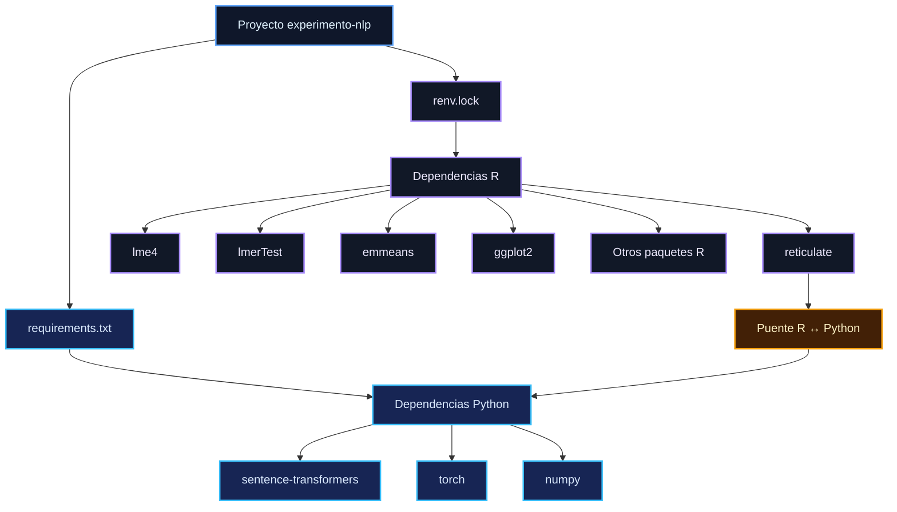

## Requisitos del entorno R + Python

El pipeline de `experimento-nlp` utiliza una arquitectura híbrida en la que **R constituye el entorno principal de análisis estadístico y procesamiento**, mientras que **Python se utiliza específicamente para la generación de embeddings mediante Sentence Transformers**.

La interacción entre ambos entornos se realiza mediante `reticulate`.

La separación de responsabilidades es:

```text
                    PIPELINE EXPERIMENTO-NLP
                              │
                ┌─────────────┴─────────────┐
                │                           │
                ▼                           ▼
          ENTORNO R                    ENTORNO PYTHON
                │                           │
        Análisis principal            Embeddings
        Modelos LMM                   Sentence Transformers
        Visualizaciones               PyTorch
        Tablas                        NumPy
        Sensibilidad
                │                           │
                └──────────┬────────────────┘
                           ▼
                       reticulate
                           │
                           ▼
                 Integración R ↔ Python
```

### 1. Entorno R

El entorno R contiene prácticamente todo el pipeline analítico:

```text
Importación
Procesamiento textual
Sentimiento y emociones
Diccionarios Hopper
Procesamiento de variables
Modelos lineales mixtos
Inferencia estadística
EMMs y contrastes
Análisis de sensibilidad
Visualización
Exportación de resultados
```

La reproducibilidad de este entorno se gestiona mediante:

```text
renv.lock
```

El archivo `renv.lock` constituye la referencia para las dependencias R y sus versiones utilizadas por el proyecto.

Entre las dependencias estructurales del pipeline se encuentra:

```text
reticulate
```

`reticulate` no es una dependencia de Python. Es un paquete de R que proporciona la interfaz entre R y el entorno Python.

---

### 2. Entorno Python

El entorno Python se utiliza específicamente para el componente de embeddings.

La dependencia funcional principal es:

```text
sentence-transformers
```

que proporciona la interfaz `SentenceTransformer` utilizada para cargar el modelo y generar las representaciones vectoriales.

El backend de cálculo es:

```text
torch
```

y el manejo de matrices y arrays numéricos se realiza mediante:

```text
numpy
```

La estructura mínima del entorno es:

```text
Python
 ├── sentence-transformers
 ├── torch
 └── numpy
```

Las dependencias transitivas adicionales son instaladas por el gestor de paquetes a partir de las restricciones de estas librerías y **no necesitan enumerarse manualmente** en el `requirements.txt` salvo que el proyecto utilice alguna de ellas directamente.

La documentación actual de Sentence Transformers recomienda Python 3.10 o superior y PyTorch 2.2 o superior.

---

### 3. Modelo de embeddings

El modelo utilizado por el pipeline es:

```text
paraphrase-multilingual-MiniLM-L12-v2
```

Este nombre identifica el **modelo preentrenado**, no un paquete que deba agregarse al `requirements.txt`.

Conceptualmente:

```text
requirements.txt
        │
        ├── sentence-transformers
        ├── torch
        └── numpy
                │
                ▼
       SentenceTransformer()
                │
                ▼
paraphrase-multilingual-MiniLM-L12-v2
                │
                ▼
       Embeddings de 384 dimensiones
```

El modelo se obtiene durante la ejecución cuando `SentenceTransformer()` lo carga desde el repositorio correspondiente.

---

### 4. Archivo `requirements.txt`

Para el entorno Python del proyecto se propone mantener un `requirements.txt` separado del `renv.lock`.

Una especificación mínima actual sería:

```text
# ============================================================================
# requirements.txt — Python dependencies for experimento-nlp
# ============================================================================
# Python dependencies required by the embeddings component.
#
# R dependencies are managed separately through renv.lock.
# reticulate is an R package and therefore does not belong here.
# ============================================================================

sentence-transformers==6.0.1
torch==2.14.0
numpy
```

Sentence Transformers 6.0.1 requiere Python >=3.10 y documenta compatibilidad con PyTorch moderno; PyPI registra PyTorch 2.14.0 como versión actual y ofrece wheels para Python 3.10–3.14.

> **Nota de reproducibilidad:** `numpy` se deja sin una versión fija en esta especificación inicial porque la compatibilidad concreta debe resolverse conjuntamente con la versión de Python, PyTorch, Sentence Transformers y el entorno utilizado por `reticulate`. Para congelar completamente el entorno Python, se recomienda posteriormente generar un `requirements.txt` derivado del entorno realmente validado.

---

### 5. Compatibilidad R ↔ Python

El pipeline no trata R y Python como dos análisis independientes. Python funciona como una dependencia especializada invocada desde R.

El recorrido funcional es:


Esto implica que un entorno Python correctamente instalado no sustituye al entorno R, y viceversa.

Para ejecutar el pipeline completo se necesitan ambos:

```text
renv.lock
      +
requirements.txt
      +
Python compatible
      +
reticulate
      +
modelo de embeddings
```

---

### 6. Gestión del entorno Python mediante `reticulate`

Las versiones actuales de `reticulate` permiten declarar las dependencias Python directamente desde R mediante `py_require()`, dejando que `reticulate` resuelva un entorno Python compatible. Esta es la estrategia recomendada actualmente por la documentación de `reticulate` frente a depender necesariamente de una instalación Python seleccionada manualmente.

Para un proyecto reproducible, existen dos estrategias posibles:

```text
Estrategia A
renv + requirements.txt
        ↓
entorno Python explícitamente gestionado

Estrategia B
renv + py_require()
        ↓
entorno Python gestionado por reticulate
```

La elección entre ambas debe mantenerse consistente dentro del proyecto. No conviene documentar simultáneamente dos mecanismos como si fueran el mismo sistema de gestión.

La documentación de `reticulate` señala además que, desde la versión 1.41, `py_require()` es la vía recomendada para declarar dependencias Python cuando se permite que `reticulate` gestione el entorno.

---

### 7. Relación entre `renv.lock` y `requirements.txt`

La arquitectura de dependencias queda definida de esta manera:



La división es deliberada:

| Archivo                                 | Entorno | Función                      |
| --------------------------------------- | ------- | ---------------------------- |
| `renv.lock`                             | R       | Congelar dependencias R      |
| `requirements.txt`                      | Python  | Declarar dependencias Python |
| `reticulate`                            | R       | Conectar R con Python        |
| `paraphrase-multilingual-MiniLM-L12-v2` | Modelo  | Generar embeddings           |

---

### 8. Reproducción del pipeline completo

La reproducción debe realizarse en el siguiente orden conceptual:

```text
1. Restaurar entorno R
        ↓
2. Preparar / seleccionar entorno Python
        ↓
3. Instalar dependencias Python
        ↓
4. Verificar reticulate
        ↓
5. Cargar sentence-transformers
        ↓
6. Cargar modelo de embeddings
        ↓
7. Generar embeddings
        ↓
8. Continuar procesamiento y análisis en R
        ↓
9. Ajustar modelos
        ↓
10. Generar tablas y figuras
```

Cuando se utiliza `renv` con un entorno Python administrado mediante `requirements.txt`, la documentación de `renv` indica que el `renv.lock` y el `requirements.txt` deben conservarse conjuntamente para permitir la restauración del proyecto.

---

### 9. CPU y GPU

La especificación base debe permanecer independiente del hardware siempre que sea posible.

Para una instalación CPU, `torch` puede instalarse desde su distribución estándar.

La utilización de GPU requiere una instalación de PyTorch compatible con la plataforma CUDA correspondiente. Por esta razón, **no se debe introducir una variante CUDA específica en el `requirements.txt` genérico** mientras el hardware objetivo no forme parte de la especificación reproducible del proyecto.

La documentación de Sentence Transformers remite a la configuración específica de CUDA cuando se utiliza aceleración GPU.

---

### 10. Principio de dependencias del proyecto

El principio que debe conservar esta estructura es:

```text
R es el entorno analítico principal
        +
Python es una dependencia especializada
        +
reticulate conecta ambos entornos
        +
renv.lock controla R
        +
requirements.txt controla Python
```

De esta manera, el proyecto puede distinguir claramente entre:

**dependencias del análisis estadístico**,
**dependencias del procesamiento NLP**,
**puente de interoperabilidad**,
**modelo preentrenado**
y **artefactos científicos producidos por el pipeline**.

> **Revisión pendiente:** antes de congelar definitivamente las versiones de Python, conviene que el `requirements.txt` final sea generado a partir del entorno Python efectivamente utilizado y validado para este proyecto. La versión de `sentence-transformers` y de PyTorch cambia con el tiempo; por ello, una especificación reproducible definitiva debe reflejar el entorno que haya sido probado, no simplemente las últimas versiones disponibles.
