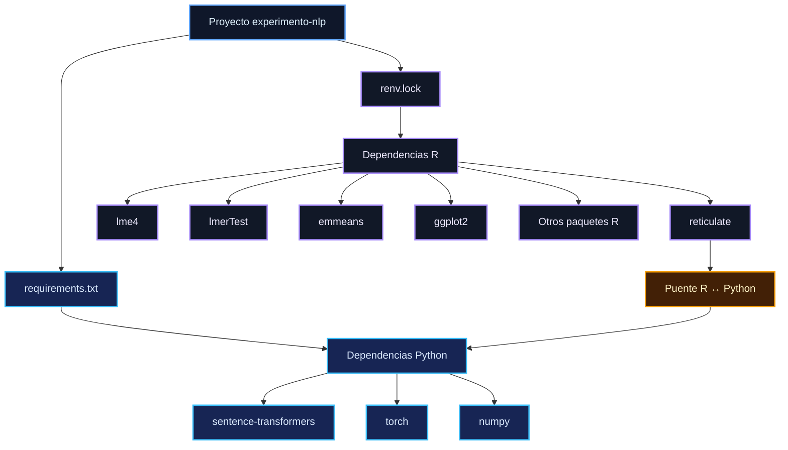

## Requisitos del entorno R y Python

El pipeline de `experimento-nlp` se implementa mediante una arquitectura híbrida en la que **R constituye el entorno principal para el procesamiento y análisis estadístico**, mientras que **Python se emplea de manera especializada para la generación de embeddings mediante Sentence Transformers**.

La interoperabilidad entre ambos entornos se establece mediante `reticulate`. Esta arquitectura permite mantener separadas las responsabilidades computacionales y, al mismo tiempo, integrar los resultados del componente de representación semántica en el flujo analítico principal.

La distribución funcional de los componentes es la siguiente:

```text
                    PIPELINE EXPERIMENTO-NLP
                              │
                ┌─────────────┴─────────────┐
                │                           │
                ▼                           ▼
          ENTORNO R                    ENTORNO PYTHON
                │                           │
        Análisis estadístico            Embeddings
        Modelos lineales mixtos         Sentence Transformers
        Visualizaciones                 PyTorch
        Tablas                          NumPy
        Sensibilidad
                │                           │
                └──────────┬────────────────┘
                           ▼
                       reticulate
                           │
                           ▼
                 Integración R ↔ Python
```

### 1. Entorno R

R constituye el entorno analítico principal del proyecto y concentra las etapas centrales del pipeline:

```text
Importación de datos
Procesamiento textual
Análisis de sentimiento y emociones
Aplicación de diccionarios Hopper
Transformación y derivación de variables
Modelos lineales mixtos
Inferencia estadística
Medias marginales estimadas (EMMs) y contrastes
Análisis de sensibilidad
Visualización
Exportación de resultados
```

La gestión de las dependencias de este entorno se realiza mediante:

```text
renv.lock
```

El archivo `renv.lock` constituye el registro de referencia de los paquetes R y de las versiones utilizadas por el proyecto, y permite reconstruir el entorno analítico dentro de las condiciones de compatibilidad establecidas.

Entre las dependencias estructurales se encuentra:

```text
reticulate
```

`reticulate` es un paquete de R que proporciona la interfaz de interoperabilidad con Python. Por tanto, forma parte de las dependencias del entorno R y **no constituye una dependencia del entorno Python**.

---

### 2. Entorno Python

Python se utiliza exclusivamente en el componente destinado a la generación de embeddings.

La dependencia funcional principal es:

```text
sentence-transformers
```

Esta biblioteca proporciona la interfaz `SentenceTransformer`, empleada para cargar el modelo preentrenado y generar las representaciones vectoriales utilizadas posteriormente por el pipeline.

El backend computacional es:

```text
torch
```

mientras que el manejo de matrices y estructuras numéricas se realiza mediante:

```text
numpy
```

La estructura mínima del entorno Python puede representarse como:

```text
Python
 ├── sentence-transformers
 ├── torch
 └── numpy
```

Las dependencias transitivas adicionales son resueltas por el sistema de instalación a partir de las restricciones definidas por estas bibliotecas. Por esta razón, dichas dependencias no requieren una enumeración manual en `requirements.txt`, salvo cuando alguna de ellas sea utilizada directamente por el código del proyecto.

La especificación propuesta considera Python 3.10 o superior y una versión de PyTorch compatible con la versión seleccionada de Sentence Transformers. La compatibilidad efectiva debe validarse en el entorno de ejecución que se adopte para la versión reproducible del pipeline.

---

### 3. Modelo de embeddings

El modelo de representación semántica utilizado por el pipeline es:

```text
paraphrase-multilingual-MiniLM-L12-v2
```

Este identificador corresponde al **modelo preentrenado** utilizado para generar los embeddings y no debe interpretarse como una dependencia instalable de Python. En consecuencia, no debe incorporarse como una entrada independiente en `requirements.txt`.

La relación funcional puede resumirse de la siguiente manera:

```text
requirements.txt
        │
        ├── sentence-transformers
        ├── torch
        └── numpy
                │
                ▼
       SentenceTransformer()
                │
                ▼
paraphrase-multilingual-MiniLM-L12-v2
                │
                ▼
       Embeddings de 384 dimensiones
```

Durante la ejecución, `SentenceTransformer()` carga el modelo desde el repositorio correspondiente y lo utiliza para producir representaciones vectoriales de 384 dimensiones.

---

### 4. Archivo `requirements.txt`

Las dependencias Python se mantienen en un archivo independiente de `renv.lock`, con el propósito de conservar una separación explícita entre ambos entornos de ejecución.

La especificación mínima propuesta es:

```text
# ============================================================================
# requirements.txt — Python dependencies for experimento-nlp
# ============================================================================
# Python dependencies required by the embeddings component.
#
# R dependencies are managed separately through renv.lock.
# reticulate is an R package and therefore does not belong here.
# ============================================================================

sentence-transformers==6.0.1
torch==2.14.0
numpy
```

En esta especificación, `sentence-transformers` y `torch` se fijan explícitamente, mientras que `numpy` permanece sin una restricción de versión en esta etapa inicial.

Esta decisión responde a la necesidad de resolver la compatibilidad de `numpy` conjuntamente con la versión de Python, PyTorch, Sentence Transformers y el mecanismo de interoperabilidad utilizado por `reticulate`.

Por consiguiente, el archivo anterior debe considerarse una **especificación inicial del entorno Python** y no necesariamente el manifiesto definitivo de reproducibilidad. Para una congelación completa del entorno, se recomienda generar la especificación final a partir de la instalación efectivamente utilizada y validada por el proyecto.

---

### 5. Compatibilidad R ↔ Python

R y Python no constituyen dos pipelines analíticos independientes. Python funciona como un componente especializado que es invocado desde el entorno R y cuyos resultados se reincorporan al flujo analítico principal.

La secuencia funcional es:


En consecuencia, la disponibilidad de un entorno Python funcional no sustituye al entorno R, y la disponibilidad del entorno R no elimina la necesidad del componente Python.

La ejecución completa del pipeline requiere, como mínimo:

```text
renv.lock
      +
requirements.txt
      +
Python compatible
      +
reticulate
      +
modelo de embeddings
```

---

### 6. Gestión del entorno Python mediante `reticulate`

Las versiones actuales de `reticulate` permiten declarar las dependencias Python directamente desde R mediante `py_require()`, de modo que el propio paquete pueda resolver un entorno Python compatible con los requisitos declarados.

En un proyecto orientado a la reproducibilidad se contemplan dos estrategias de gestión:

```text
Estrategia A
renv + requirements.txt
        ↓
entorno Python gestionado explícitamente

Estrategia B
renv + py_require()
        ↓
entorno Python gestionado por reticulate
```

Ambas estrategias son técnicamente diferenciables y deben documentarse de forma consistente. No resulta conveniente presentar simultáneamente dos mecanismos de gestión como si constituyeran un único sistema de resolución de dependencias.

La estrategia adoptada deberá especificar de manera explícita:

1. qué herramienta declara las dependencias Python;
2. qué herramienta crea o administra el entorno;
3. qué versiones se consideran reproducibles;
4. cómo se vincula dicho entorno con `reticulate`.

La documentación de `reticulate` establece `py_require()` como la vía recomendada para declarar dependencias Python cuando se permite que `reticulate` gestione el entorno de ejecución.

---

### 7. Relación entre `renv.lock` y `requirements.txt`

La arquitectura de dependencias del proyecto se organiza mediante una separación explícita entre el entorno R y el entorno Python:



La función de cada elemento es:

| Archivo o componente                    | Entorno | Función                                                             |
| --------------------------------------- | ------- | ------------------------------------------------------------------- |
| `renv.lock`                             | R       | Registrar y reproducir las dependencias R                           |
| `requirements.txt`                      | Python  | Declarar las dependencias del componente Python                     |
| `reticulate`                            | R       | Proporcionar la interoperabilidad entre R y Python                  |
| `paraphrase-multilingual-MiniLM-L12-v2` | Modelo  | Generar las representaciones vectoriales utilizadas por el pipeline |

Esta división permite distinguir entre las dependencias propias del análisis estadístico, las requeridas por el procesamiento NLP, el mecanismo de interoperabilidad y el modelo preentrenado.

---

### 8. Reproducción del pipeline completo

La reconstrucción del entorno y la ejecución del pipeline deben seguir una secuencia coherente de preparación, validación y análisis:

```text
1. Restaurar el entorno R
        ↓
2. Preparar o seleccionar el entorno Python
        ↓
3. Instalar o resolver las dependencias Python
        ↓
4. Verificar la integración mediante reticulate
        ↓
5. Cargar sentence-transformers
        ↓
6. Cargar el modelo de embeddings
        ↓
7. Generar los embeddings
        ↓
8. Reincorporar los embeddings al flujo analítico en R
        ↓
9. Ajustar los modelos estadísticos
        ↓
10. Generar tablas y figuras
```

Cuando se adopta una configuración en la que `renv` y un entorno Python administrado mediante `requirements.txt` participan conjuntamente en la reproducción, ambos archivos deben conservarse como parte de la especificación del proyecto.

La reproducibilidad completa depende, además, de la disponibilidad de las versiones de Python, bibliotecas, modelo preentrenado y demás recursos externos requeridos por el pipeline.

---

### 9. CPU y GPU

La especificación base del proyecto debe mantenerse, en la medida de lo posible, independiente del hardware de ejecución.

Para una instalación basada exclusivamente en CPU, `torch` puede instalarse mediante una distribución compatible con la plataforma utilizada.

La ejecución mediante GPU requiere una instalación de PyTorch compatible con la plataforma CUDA correspondiente. Por esta razón, una variante específica de CUDA no debe incorporarse al `requirements.txt` genérico mientras el hardware objetivo y la plataforma de aceleración no formen parte de la especificación reproducible del proyecto.

Cuando se utilice aceleración GPU, la configuración de CUDA deberá documentarse por separado junto con la plataforma, versión de PyTorch y demás componentes necesarios para garantizar la compatibilidad.

---

### 10. Principio de organización de las dependencias

La arquitectura de dependencias del proyecto se fundamenta en los siguientes principios:

```text
R constituye el entorno analítico principal
        +
Python constituye una dependencia especializada
        +
reticulate proporciona la interoperabilidad
        +
renv.lock gestiona el entorno R
        +
requirements.txt declara el entorno Python
```

Esta organización permite distinguir de manera explícita entre:

**dependencias del análisis estadístico**,
**dependencias del procesamiento NLP**,
**mecanismo de interoperabilidad**,
**modelo preentrenado**
y **artefactos científicos generados por el pipeline**.

> **Revisión pendiente:** antes de establecer la especificación definitiva del entorno Python, las versiones consignadas en `requirements.txt` deberán contrastarse con el entorno efectivamente utilizado y validado para este proyecto. La versión reproducible deberá corresponder a una configuración comprobada, incluyendo la versión de Python, las bibliotecas empleadas, la integración mediante `reticulate` y el modelo de embeddings utilizado.
