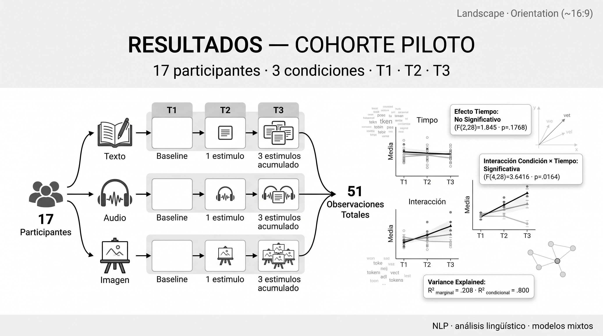
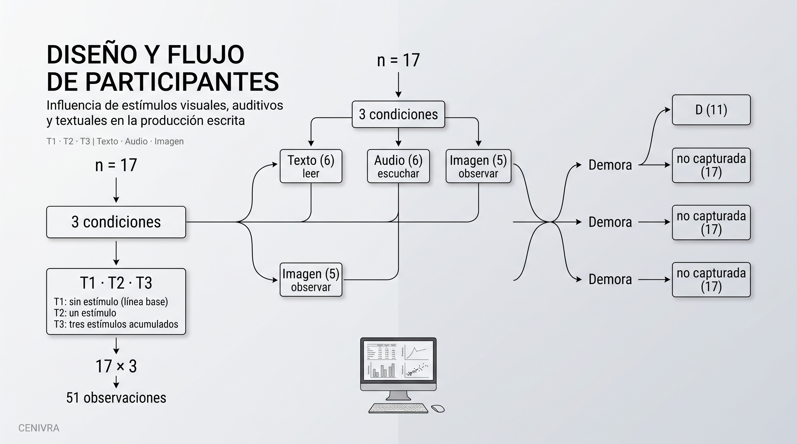
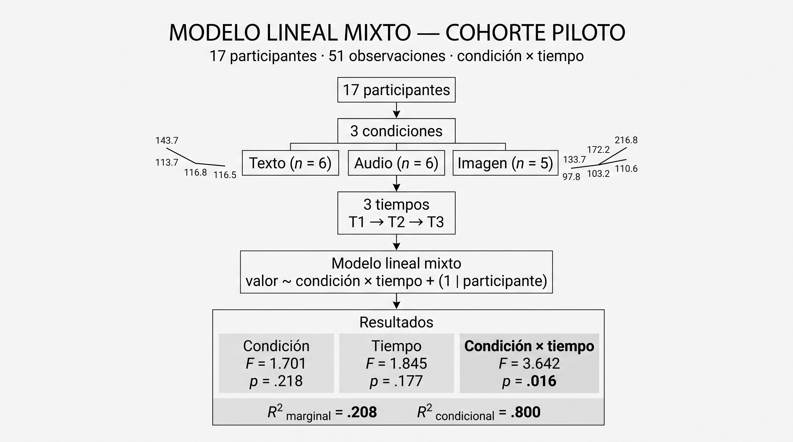

# Informe de resultados — cohorte PILOTO

**Generado:** 2026-09-25 19:16 
**Cohorte:** estudio piloto (17 participantes)  
**Datos de origen:** `Analisis agosto v2/` (corrida del script `Experimento ALC_v5_corregido.R`)  
**Contenido:** solo agregados (n, medias, desviaciones, efectos, p-valores). Este informe **no contiene narrativas** de participantes.  
**Muestra:** 17 (Texto 6 · Audio 6 · Imagen 5)  

---

## 1. Diseño y flujo de participantes

Tres iteraciones por participante: **T1** sin estímulo (línea base), **T2** un estímulo, 
**T3** tres estímulos acumulados. Condiciones: Texto (leer), Audio (escuchar), Imagen (observar).

- Participantes: **17**
- Observaciones por participante: **3** (T1, T2, T3) → total 51 observaciones

Reparto por condición:

| condición | participantes |
| --- | --- |
| Audio | 6 |
| Imagen | 5 |
| Texto | 6 |

Reparto por demora:

| demora | participantes |
| --- | --- |
| (no capturada) | 17 |

## 2. Auditoría de variables: qué se pudo modelar y qué no

Se auditaron **3 variables**. De ellas, **1** pasaron el filtro de calidad (`APTA_PARA_REVISION`) y 2 se excluyeron.

| variable | estado | n_participantes | n_completos | sd_global | motivo |
| --- | --- | --- | --- | --- | --- |
| n_palabras | INSUFICIENTES_PARTICIPANTES | 0.00 | 0.00 | — | Solo 0 participantes con datos completos |
| n_palabras_calculado | APTA_PARA_REVISION | 17.00 | 17.00 | 75.39 | NA |
| n_estimulos | ESTRUCTURAL | 17.00 | 17.00 | 1.26 | Variable de diseño (no es un outcome) |

Variables excluidas del modelado:

_Ninguna variable quedó excluida del modelado en la cohorte piloto._

## 3. Descriptivos por condición e iteración

### `n_palabras_calculado`

| condicion | tiempo | n | media | sd | mediana | minimo | maximo |
| --- | --- | --- | --- | --- | --- | --- | --- |
| Texto | T1 | 6.000 | 143.667 | 53.403 | 140.000 | 79.000 | 234.000 |
| Texto | T2 | 6.000 | 116.833 | 60.654 | 95.500 | 79.000 | 236.000 |
| Texto | T3 | 6.000 | 116.500 | 65.808 | 110.500 | 40.000 | 236.000 |
| Audio | T1 | 6.000 | 133.667 | 62.044 | 116.500 | 79.000 | 245.000 |
| Audio | T2 | 6.000 | 172.167 | 60.018 | 160.500 | 80.000 | 247.000 |
| Audio | T3 | 6.000 | 216.833 | 114.969 | 171.000 | 84.000 | 378.000 |
| Imagen | T1 | 5.000 | 97.800 | 77.354 | 90.000 | 17.000 | 225.000 |
| Imagen | T2 | 5.000 | 103.200 | 80.354 | 80.000 | 37.000 | 242.000 |
| Imagen | T3 | 5.000 | 110.600 | 47.284 | 86.000 | 73.000 | 186.000 |

### `n_estimulos`

| condicion | tiempo | n | media | sd | mediana | minimo | maximo |
| --- | --- | --- | --- | --- | --- | --- | --- |
| Texto | T1 | 6.000 | 0.000 | 0.000 | 0.000 | 0.000 | 0.000 |
| Texto | T2 | 6.000 | 1.000 | 0.000 | 1.000 | 1.000 | 1.000 |
| Texto | T3 | 6.000 | 3.000 | 0.000 | 3.000 | 3.000 | 3.000 |
| Audio | T1 | 6.000 | 0.000 | 0.000 | 0.000 | 0.000 | 0.000 |
| Audio | T2 | 6.000 | 1.000 | 0.000 | 1.000 | 1.000 | 1.000 |
| Audio | T3 | 6.000 | 3.000 | 0.000 | 3.000 | 3.000 | 3.000 |
| Imagen | T1 | 5.000 | 0.000 | 0.000 | 0.000 | 0.000 | 0.000 |
| Imagen | T2 | 5.000 | 1.000 | 0.000 | 1.000 | 1.000 | 1.000 |
| Imagen | T3 | 5.000 | 3.000 | 0.000 | 3.000 | 3.000 | 3.000 |

## 4. Modelos lineales mixtos

Especificación: `valor ~ condición × tiempo + (1 | participante)`, estimación REML, 
grados de libertad Satterthwaite. La condición es un factor **entre** sujetos y el tiempo **intra** sujeto.

Se ajustaron modelos lineales mixtos (`valor ~ condición × tiempo + (1|participante)`, REML, Satterthwaite) para **1 variables** en la cohorte **piloto**: `n_palabras_calculado`.

| fuente | variable | efecto | F | df1 | df2 | p | R2_marginal | R2_condicional |
| --- | --- | --- | --- | --- | --- | --- | --- | --- |
| piloto | n_palabras_calculado | condicion | 1.7007 | 2.0000 | 14.0000 | 0.2182 | 0.2084 | 0.7996 |
| piloto | n_palabras_calculado | tiempo | 1.8448 | 2.0000 | 28.0000 | 0.1768 | 0.2084 | 0.7996 |
| piloto | n_palabras_calculado | condicion:tiempo | 3.6416 | 4.0000 | 28.0000 | 0.0164 | 0.2084 | 0.7996 |

- **n_palabras_calculado**: efecto de tiempo F = 1.845 (p = 0.1768) → significativo: no.
  Interacción condición×tiempo: F = 3.642 (p = 0.0164) → significativa: **sí**.
  R² marginal = 0.208; R² condicional = 0.800.

## Medias marginales estimadas y contrastes — piloto

### `n_palabras_calculado`

Medias marginales (emmeans):

| condicion | tiempo | emmean | SE | df | lower.CL | upper.CL |
| --- | --- | --- | --- | --- | --- | --- |
| Texto | T1 | 143.667 | 29.301 | 19.853 | 82.516 | 204.817 |
| Audio | T1 | 133.667 | 29.301 | 19.853 | 72.516 | 194.817 |
| Imagen | T1 | 97.800 | 32.098 | 19.853 | 30.813 | 164.787 |
| Texto | T2 | 116.833 | 29.301 | 19.853 | 55.683 | 177.984 |
| Audio | T2 | 172.167 | 29.301 | 19.853 | 111.016 | 233.317 |
| Imagen | T2 | 103.200 | 32.098 | 19.853 | 36.213 | 170.187 |
| Texto | T3 | 116.500 | 29.301 | 19.853 | 55.349 | 177.651 |
| Audio | T3 | 216.833 | 29.301 | 19.853 | 155.683 | 277.984 |
| Imagen | T3 | 110.600 | 32.098 | 19.853 | 43.613 | 177.587 |

Contrastes **entre condiciones** en cada tiempo (ajuste Holm):

| contrast | tiempo | estimate | SE | df | t.ratio | p.value |
| --- | --- | --- | --- | --- | --- | --- |
| Texto - Audio | T1 | 10.000 | 41.438 | 19.853 | 0.241 | 0.912 |
| Texto - Imagen | T1 | 45.867 | 43.461 | 19.853 | 1.055 | 0.912 |
| Audio - Imagen | T1 | 35.867 | 43.461 | 19.853 | 0.825 | 0.912 |
| Texto - Audio | T2 | -55.333 | 41.438 | 19.853 | -1.335 | 0.394 |
| Texto - Imagen | T2 | 13.633 | 43.461 | 19.853 | 0.314 | 0.757 |
| Audio - Imagen | T2 | 68.967 | 43.461 | 19.853 | 1.587 | 0.385 |
| Texto - Audio | T3 | -100.333 | 41.438 | 19.853 | -2.421 | 0.072 |
| Texto - Imagen | T3 | 5.900 | 43.461 | 19.853 | 0.136 | 0.893 |
| Audio - Imagen | T3 | 106.233 | 43.461 | 19.853 | 2.444 | 0.072 |

Contrastes **entre tiempos** en cada condición (ajuste Holm):

| contrast | condicion | estimate | SE | df | t.ratio | p.value |
| --- | --- | --- | --- | --- | --- | --- |
| T1 - T2 | Texto | 26.833 | 20.849 | 28.000 | 1.287 | 0.610 |
| T1 - T3 | Texto | 27.167 | 20.849 | 28.000 | 1.303 | 0.610 |
| T2 - T3 | Texto | 0.333 | 20.849 | 28.000 | 0.016 | 0.987 |
| T1 - T2 | Audio | -38.500 | 20.849 | 28.000 | -1.847 | 0.082 |
| T1 - T3 | Audio | -83.167 | 20.849 | 28.000 | -3.989 | 0.001 |
| T2 - T3 | Audio | -44.667 | 20.849 | 28.000 | -2.142 | 0.082 |
| T1 - T2 | Imagen | -5.400 | 22.839 | 28.000 | -0.236 | 1.000 |
| T1 - T3 | Imagen | -12.800 | 22.839 | 28.000 | -0.560 | 1.000 |
| T2 - T3 | Imagen | -7.400 | 22.839 | 28.000 | -0.324 | 1.000 |

## 5. Figuras

Las figuras correspondientes a la cohorte piloto fueron generadas mediante los scripts del pipeline ejecutados en **R/RStudio** y se encuentran disponibles en formatos PNG y PDF de alta resolución. Las versiones en español e inglés se conservan para facilitar la revisión técnica y la preparación de materiales científicos.

### Versión en español

- `outputs/figuras/piloto/PILOTO_n_palabras_calculado_ES_distribucion.pdf`
- `outputs/figuras/piloto/PILOTO_n_palabras_calculado_ES_distribucion.png`
- `outputs/figuras/piloto/PILOTO_n_palabras_calculado_ES_individuales.pdf`
- `outputs/figuras/piloto/PILOTO_n_palabras_calculado_ES_individuales.png`
- `outputs/figuras/piloto/PILOTO_n_palabras_calculado_ES_trayectoria.pdf`
- `outputs/figuras/piloto/PILOTO_n_palabras_calculado_ES_trayectoria.png`

### English version

- `outputs/figuras/piloto/en/PILOT_n_palabras_calculado_EN_distribucion.pdf`
- `outputs/figuras/piloto/en/PILOT_n_palabras_calculado_EN_distribucion.png`
- `outputs/figuras/piloto/en/PILOT_n_palabras_calculado_EN_individuales.pdf`
- `outputs/figuras/piloto/en/PILOT_n_palabras_calculado_EN_individuales.png`
- `outputs/figuras/piloto/en/PILOT_n_palabras_calculado_EN_trayectoria.pdf`
- `outputs/figuras/piloto/en/PILOT_n_palabras_calculado_EN_trayectoria.png`

## 6. Lo que este informe NO permite afirmar

- La cohorte piloto **no tiene `demora`**: cualquier comparación D/ND es del estudio principal.
- En el piloto `n_palabras` está **vacía** en el archivo de captura; la medida usada es
  `n_palabras_calculado` (conteo desde el texto).
- Con 17 participantes y 6/6/5 por condición, los contrastes **entre condiciones** tienen potencia muy baja:
  la ausencia de diferencias no es evidencia de ausencia de efecto.
- Los análisis semánticos, de prototipos y de diccionarios del conjunto de 40 **no** están
  desagregados por cohorte en las tablas conjuntas (ver informe combinado).

## 7. Trazabilidad

Los siguientes artefactos constituyen las fuentes de los valores reportados en este informe. Las rutas se expresan de forma **relativa al directorio de análisis `Analisis agosto v2/`**, sin incorporar rutas locales o absolutas del equipo de análisis.

- `piloto/tablas/auditoria_piloto.csv`
- `piloto/tablas/descriptivos_condicion_tiempo.csv`
- `piloto/tablas/resumen_modelos_validos.csv`
- `piloto/tablas/piloto_<variable>_EMM.csv`
- `piloto/tablas/piloto_<variable>_contrastes_cond.csv`
- `piloto/tablas/piloto_<variable>_contrastes_tiempo.csv`
- `piloto/modelos/modelos_piloto.rds`
- `piloto/...`
